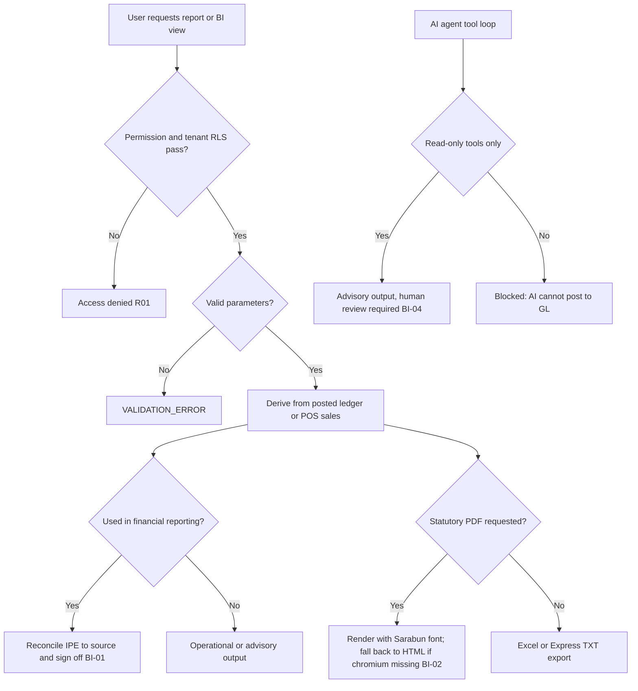

# Process Narrative — Reporting, BI & AI

> **Status: DRAFT v0.1** — contains `<<placeholders>>` pending owner confirmation.

## 1. Document Control

| Field | Value |
|---|---|
| Process ID | PN-26-BI |
| Process owner | `<<Controller / FP&A / IT>>` |
| Approver | `<<approver-name / title>>` |
| Version | **0.1 DRAFT** |
| Revision date | 2026-06-22 |
| Effective date | `<<effective-date>>` |
| Review cadence | Annual + on significant change |
| Related RCM controls | BI-01, BI-02, BI-03, BI-04; cross-ref ITGC-01; SoD rule R01 |
| Related policy | `<<Information Produced by the Entity (IPE) Policy>>`, `<<Reporting & Disclosure Procedure>>`, `<<AI / Analytics Use Policy>>`, `<<Access Control Policy>>` |

## 2. Purpose

This narrative documents the reporting, business-intelligence (BI) and AI/analytics layer. Its overriding theme is **IPE — Information Produced by the Entity: completeness and accuracy**. Reports relied upon for management decisions or financial statements must be complete and accurate, must reconcile to their source ledger, and must be access-controlled and tenant-scoped. Statutory PDF documents (tax invoices, receipts) carry an additional accuracy and numbering control, and AI/analytics outputs are constrained to a **read-only, advisory** boundary — they cannot post to the GL and are not authoritative for financial statements.

## 3. Scope

**In scope**
- Operational and financial reports + Excel/PDF/Express exports (reports, `/api/reports`, `/api/orders/:orderNo/export`).
- BI dashboards, sales cube, finance trend, pipeline trend, snapshots and report subscriptions (bi, `/api/bi`).
- Analytics — replenishment, anomaly detection, insights, dashboard summary (analytics, `/api/analytics`).
- Demand ML — multi-model demand forecasting + walk-forward backtesting (demand-ml, `/api/demand`).
- The AI agent (ai, `agent.service`) — tool-based, read-only, advisory.

**Out of scope**
- The general-ledger close and trial-balance production that these reports reconcile to — see `04-general-ledger-close.md`.
- Statutory tax-document content and numbering authority — see `06-tax-compliance.md`.
- Access provisioning, RLS and IT general controls — see `08-itgc.md`.

## 4. References

- ISO 9001:2015 cl. 4.4 (QMS and its processes); cl. 8.5.1 (Control of provision); cl. 8.6 (Release of products and services — report sign-off).
- Risk & Control Matrix: `compliance/Oshinei_ERP_SOX_RCM_v1.xlsx`.
- Segregation-of-Duties matrix: `compliance/Oshinei_ERP_SoD_Matrix_v1.xlsx`.
- Policies: `<<IPE Policy>>`, `<<Reporting & Disclosure Procedure>>`, `<<AI / Analytics Use Policy>>`, `<<Access Control Policy>>`.
- Code:
  - `apps/api/src/modules/reports/reports.controller.ts`, `reports.service.ts`, `reports-excel.service.ts`, `reports-pdf.service.ts`, `reports-export.service.ts`
  - `apps/api/src/modules/bi/bi.controller.ts`, `bi.service.ts`
  - `apps/api/src/modules/analytics/analytics.controller.ts`, `analytics.service.ts`, `anomalies.service.ts`, `forecasting.service.ts`
  - `apps/api/src/modules/demand-ml/demand-ml.controller.ts`, `demand-forecast.service.ts`, `forecast-algorithms.ts`
  - `apps/api/src/modules/ai/agent.service.ts`

## 5. Definitions & Abbreviations

| Term | Definition |
|---|---|
| IPE | Information Produced by the Entity — a report/extract used in a control or decision, requiring evidenced completeness & accuracy. |
| Daily-sales report | POS sales for a date, as JSON or Excel (xlsx). |
| Monthly P&L | Profit-and-loss export by month/year (Excel). |
| AP aging | Open payables bucketed: Current / 1-30 / 31-60 / 61-90 / 90+. |
| Express export | Fixed-width TXT for Express accounting, with baht amount-in-words and CRLF line endings. |
| Sarabun | Thai font used in the PDF templates. |
| Sales cube | Aggregation of `custPosSales` by period (day/week/month). |
| Finance trend | `journal_lines` aggregated by period and account type (revenue/expense/gross profit), per ledger; default leading ledger (TFRS). |
| Snapshot | A refreshed BI point-in-time dataset. |
| Z-score | Standardised deviation used to flag stock-movement anomalies (threshold 2.5; critical 3.5). |
| Reorder point | `avg_daily_sales × lead_time_days + stdev_daily × 1.5` (safety stock). |
| Demand ML | Multi-model demand forecasting (SMA, SES, Holt, seasonal-naive, Croston) that auto-selects the most accurate model by backtest. |
| Walk-forward backtest | Rolling-origin one-step-ahead evaluation on a held-out window; each model is refit on history up to each test point. |
| WAPE | Weighted absolute percentage error = `Σ|actual − forecast| / Σ|actual|`; scale-free, well-defined with zero demand days. |
| MASE | Mean absolute scaled error = test MAE / in-sample seasonal-naive MAE; `< 1` beats the naive baseline. |
| Croston | Intermittent-demand method: separately smooths demand size and inter-arrival interval; forecast = size / interval. |
| Advisory | Decision-support output requiring human review; not authoritative for financial reporting. |
| RLS | Row-Level Security (tenant isolation). |
| SoD | Segregation of Duties. |

## 6. Roles & Responsibilities (RACI)

The defining SoD rule here is **R01** (access): report and BI access is JWT-scoped to permissions (`dashboard`, `pos`, `exec`, `warehouse`, `creditors`, `planner`, `order_mgt`) and tenant-isolated by RLS. The reviewer/owner who signs off an IPE used in financial reporting must validate its reconciliation to source. The AI agent operates only read-only tools and cannot post — a control boundary, not a duty performer.

| Activity | Report Consumer | Controller / FP&A | IT / Platform | Reviewer | AI Agent |
|---|---|---|---|---|---|
| Run report / export (gated) | R | A | C | I | I |
| Reconcile IPE to source ledger | I | A/R | I | C | I |
| Generate statutory PDF (invoice/receipt) | R | A | C | C | I |
| Validate report parameters | R | C | I | I | I |
| Operate analytics / anomaly review | R | A | I | C | I |
| Invoke AI tools (read-only, advisory) | R | C | A | C | R (read-only) |

A = Accountable, R = Responsible, C = Consulted, I = Informed.

## 7. Process Narrative

1. **Operational & financial reports (perm `dashboard`/`pos`/`exec`/`warehouse`/`creditors`).** `GET /api/reports/daily-sales?date=` returns POS sales (JSON); `GET /api/reports/daily-sales/export` produces Excel xlsx; `GET /api/reports/monthly-pl/export?month=&year=` produces the Excel P&L; `GET /api/reports/stock-summary/export` and `GET /api/reports/ap-aging/export` (buckets Current / 1-30 / 31-60 / 61-90 / 90+) produce their xlsx. A bad month/year on the P&L returns `VALIDATION_ERROR` (400). *Control: BI-01 — report completeness & accuracy (IPE); BI-03 — parameter validation.*

2. **Per-order export — PDF / Express (perm `order_mgt`/`pos`).** `POST /api/orders/:orderNo/export` with `{ format: 'pdf' | 'express_txt' }`. PDF renders HTML to PDF via Playwright/chromium using the Sarabun Thai font; templates include `taxInvoiceHtml` (ใบกำกับภาษี), `receiptHtml` (ใบเสร็จรับเงิน), `salesConfirmationHtml` and `statementHtml`. If chromium is unavailable the renderer returns null and the caller **falls back to HTML**. Express export is a fixed-width TXT for Express accounting, with baht amount-in-words (`bahttext`) and CRLF line endings. An unknown order returns `NOT_FOUND`; a bad format returns `VALIDATION_ERROR`. *Control: BI-02 — PDF tax invoices/receipts are statutory documents; their accuracy & numbering are governed (cross-ref `06-tax-compliance.md`).*

3. **BI dashboards & KPI (perm `exec`).** `GET /api/bi/kpi` returns MTD/YTD sales, open AR/AP and weighted pipeline. The KPI board, sales cube, finance trend and pipeline trend are **read-through cached per tenant for a short TTL** (`BI_CACHE_TTL_MS`, default 30 s; `0` disables) so a burst of dashboard polls collapses to one query set per window; the cache key always includes the tenant id (no cross-tenant bleed) and `POST /api/bi/snapshots/refresh` busts the tenant's cache for an immediate recompute. *Operational; values derive from posted ledger / POS sales and are at most one TTL window stale.*

3a. **Role-based home dashboards (view perm `dashboard`/`exec`; configure perm `users`/`exec`).** The home dashboard exposes a **catalog** of single-metric widgets (`GET /api/dashboard/widgets/catalog` — e.g. today/MTD sales, low stock, open AR/AP, open pipeline, open PRs), each carrying the permissions that may see it. An admin configures, **per role**, the ordered widget list via `GET`/`PUT /api/dashboard/layouts/:role` (validated: `BAD_ROLE`, `BAD_WIDGET`; one layout per tenant+role). At view time `GET /api/dashboard/layout/me` resolves the **caller's** role layout (or a sensible default if unconfigured), **filters it to the widgets the caller's own permissions allow**, and computes each widget's value RLS-scoped over the tenant. The fixed operational dashboard (`GET /api/dashboard`, parity-critical) is unchanged; the role widgets are an additive, permission-filtered layer. *Control: R01 — a role layout can never surface a metric the viewer lacks permission for; values are tenant-scoped (RLS). Operational; no GL, no new RCM control.*

4. **Sales cube & finance trend (perm `exec`).** `GET /api/bi/sales-cube?period=day|week|month` aggregates `custPosSales`. `GET /api/bi/finance-trend?months=&ledger=` aggregates `journal_lines` by period and account type (revenue / expense / gross profit), multi-ledger with the default leading ledger (TFRS). Both are **derived from the posted ledger / POS sales**, so their accuracy depends on source completeness. *Control: BI-01 — finance-trend/P&L tie to trial balance; daily-sales/cube tie to the POS journal.*

5. **Pipeline trend, snapshots & subscriptions (perm `exec`).** `GET /api/bi/pipeline-trend`; `POST /api/bi/snapshots/refresh` and `GET /api/bi/snapshots`; report subscriptions CRUD (`GET`/`POST /api/bi/subscriptions`, `DELETE /api/bi/subscriptions/:id`). A subscription names a report type (`kpi_board`/`sales_cube`/`finance_trend`/`pipeline_trend`, validated `BAD_REPORT_TYPE`), a frequency (`daily`/`weekly`/`monthly`, validated `BAD_FREQUENCY`) and optional email recipients. *Operational.*

5a. **Scheduled-report execution (perm `exec`).** The subscription schedule is acted on by a **cron-callable sweep** `POST /api/bi/subscriptions/run`, which runs every active subscription that is **due** (never run, or `next_run_at` has passed): it generates the named report from the same live aggregations as steps 3–5, delivers it (an in-app notification to the tenant plus best-effort email to each recipient via the messaging provider), records a row in `report_runs` (`status` success/failed, recipient count, the generated payload), and advances `last_run_at`/`next_run_at`. `POST /api/bi/subscriptions/:id/run` runs one subscription on demand (the "Run now" button); `GET /api/bi/runs` is the tenant-scoped delivery history. Generation reuses the read-only BI aggregations and **posts nothing to the GL**; every run is tenant-scoped (RLS) and a report used in financial reporting remains an IPE (step 10). *Control: BI-01 — delivered report ties to the same source as its on-screen view; R01 — tenant-scoped delivery. Operational/advisory; no new RCM control.*

5b. **Saved views (perm any list-screen permission).** `GET`/`POST /api/saved-views`, `DELETE /api/saved-views/:id` persist a user's per-module list presets (filter/sort/columns) as **personal** views or, when `shared`, views visible to the whole tenant. Views are tenant-isolated by RLS; a shared view can only be deleted by its creator (`VIEW_NOT_FOUND` otherwise). *Operational; a convenience layer over existing gated list screens — no change to data access or RCM controls.*

6. **Analytics — replenishment (perm `planner`/`dashboard`/`warehouse`).** `GET /api/analytics/replenishment` returns items with urgency critical/warning; reorder point = `avg_daily_sales × lead_time_days + stdev_daily × 1.5`, with `days_of_stock` and predicted stockout. *Operational / advisory.*

7. **Analytics — anomalies (perm `planner`/`dashboard`/`exec`).** `GET /api/analytics/anomalies?days=` flags stock-movement anomalies by Z-score (threshold 2.5; critical 3.5) and stocktake variance. *Operational / advisory — investigation input, not an authoritative posting.*

8. **Analytics — insight & dashboard summary.** `POST /api/analytics/insight` and `GET /api/analytics/dashboard-summary` provide decision-support summaries. *Operational / advisory.*

8a. **Demand ML — multi-model forecasting + backtesting (perm `planner`/`exec`/`warehouse`).** `POST /api/demand/backtest` builds a dense daily demand series from POS sales and **walk-forward backtests** five classic, explainable models (SMA, SES, Holt linear-trend, seasonal-naive, Croston for intermittent demand), reporting **WAPE / MASE / RMSE / bias** per model on a held-out window. `POST /api/demand/forecast` **auto-selects the lowest-WAPE model** (or honours a pinned `algorithm`), emits the horizon point forecast (clamped non-negative), and persists the run (tenant-scoped) for an accuracy audit trail. `GET /api/demand/forecasts` lists recent runs and `GET /api/demand/accuracy` is the forecast-accuracy KPI (avg WAPE/MASE, overall and per model). Too little history is rejected `INSUFFICIENT_HISTORY`; a bad model name is rejected `UNKNOWN_ALGORITHM`. The forecast is **advisory** — it does not post and is not authoritative for financial statements; it feeds replenishment/planning decisions that a human owns. *Control: BI-04 — advisory boundary (no GL posting); BI-01 — model accuracy is evidenced by the backtest metrics and gated in CI (the `demand-ml` harness asserts the trend-aware/intermittent models beat the naive baseline).* This is a **new** service; the parity-locked `forecasting.service.ts` (reorder points, step 6) is unchanged.

9. **AI agent (read-only, advisory).** A tool-based loop (max 15 turns) exposes a fixed set of **read-only** tools (sales summary, recent orders, stock levels/item, P&L, KPI dashboard/board, accounts payable, replenishment, sales cube, finance trend, pipeline forecast, open opportunities, open quotes, SLA breaches, profitability). Responses can stream; LLM insights are produced via Claude with a **rule-based Thai fallback** when no API key is configured. The AI tools are **read-only — they cannot post to the GL**: this is the control boundary. Forecasts, anomalies and AI insights are advisory decision-support and require human review; they are not authoritative for financial statements. *Control: BI-04 — AI read-only & advisory boundary.*

10. **IPE & access boundary.** Every report and BI endpoint is permission-gated and tenant-scoped by RLS. Anything used in financial reporting must carry the IPE completeness-and-accuracy control: reconcile to source, evidence the parameters, and have a human owner sign off. *Control: BI-01 / R01; ITGC scoping per `08-itgc.md`.*

## 8. Process Flow

**Swimlane narrative.** The *Report Consumer* lane requests reports and exports, gated by permission and RLS under R01. The *Controller / FP&A* lane is accountable for reconciling any IPE used in financial reporting to its source ledger (finance-trend/P&L to trial balance; daily-sales/cube to the POS journal) and signing off. The *IT / Platform* lane operates the rendering and AI infrastructure and enforces the read-only AI boundary. The *Reviewer* lane validates anomaly/forecast outputs as advisory only. The *AI Agent* invokes read-only tools and can never post to the GL.

## 9. Control Matrix

| Step | Risk | Control | Type | RCM ID | Evidence / Record |
|---|---|---|---|---|---|
| 1, 4, 10 | Incomplete / inaccurate report relied upon (IPE) | Reports reconcile to source ledger — finance-trend/P&L to trial balance, daily-sales to POS journal; owner sign-off | Detective | BI-01 | Reconciliation working papers; sign-off |
| 2 | Statutory PDF (tax invoice/receipt) inaccurate or mis-numbered | Statutory templates governed; accuracy & numbering controlled (cross-ref `06-tax-compliance.md`) | Preventive | BI-02 | Issued documents; numbering register |
| 1, 2 | Invalid report parameters produce misleading output | Parameter validation (`VALIDATION_ERROR` on bad month/year/format) | Preventive | BI-03 | Validation rejection log |
| 8a, 9 | AI/analytics output treated as authoritative or able to post | AI/forecast outputs read-only & advisory; demand forecast does not post to GL; human review of forecasts/anomalies | Preventive | BI-04 | Tool-definition (read-only); persisted forecast runs; review notes |
| 8a | Demand forecast inaccurate / model not validated | Walk-forward backtest (WAPE/MASE) selects the model; accuracy gated in CI (`demand-ml` harness asserts trend/intermittent models beat naive) | Detective | BI-01 | Backtest metrics per run (`demand_forecasts`); CI gate result |
| 3-8, 10 | Cross-tenant or unauthorised report access | Permission gating + RLS tenant isolation on all endpoints | Preventive | ITGC-01 / R01 | Access logs; RLS policy (cross-ref `08-itgc.md`) |

## 10. Inputs & Outputs

**Inputs:** posted `journal_lines` and `custPosSales`; report parameters (date, month/year, period, ledger, days); order and tenant master for PDF/Express; user JWT (tenant + permissions); optional LLM API key.

**Outputs:** JSON/Excel reports (daily-sales, monthly P&L, stock summary, AP aging); statutory PDFs (tax invoice, receipt, sales confirmation, statement) or HTML fallback; Express fixed-width TXT; BI KPI/cube/finance-trend/pipeline datasets and snapshots; analytics replenishment/anomaly/insight outputs; AI advisory responses. Any output used in financial reporting is an IPE requiring the completeness-and-accuracy control. **PDF generation** is centralised in one renderer that either offloads to an external PDF microservice (`PDF_SERVICE_URL` — Chromium runs outside the API process) or uses a pooled in-process Chromium, and degrades to HTML when neither is available; the rendered content (and thus the IPE) is unchanged by the rendering strategy. **SaaS business metrics** for the platform operator are exposed at `GET /api/billing/saas-metrics` (perm `exec`): MRR/ARR/ARPU and the plan mix from `subscriptions ⋈ plans` (active subscriptions × monthly price), 30-day churn (cancellations vs base), and engagement DAU/MAU + stickiness derived from distinct `audit_log` actors (no new tracking table). HQ/Admin (RLS bypass) sees the whole book; read-only/advisory (no GL).

## 11. Records & Retention

| Record | Retention |
|---|---|
| Financial reports & IPE reconciliations (P&L, AP aging, daily-sales) | `<<7 years / per Thai law>>` |
| Statutory PDF documents (tax invoice / receipt) | `<<7 years / per Thai law>>` |
| Express export files | `<<7 years / per Thai law>>` |
| BI snapshots, subscriptions & dashboards | `<<retention per policy>>` |
| Analytics / AI advisory outputs & review notes | `<<retention per policy>>` |

## 12. KPIs / Metrics

- IPE reconciliation differences — finance-trend/P&L to trial balance; daily-sales to POS journal (target: 0).
- Statutory PDF accuracy / numbering exceptions (target: 0).
- Report parameter validation rejection rate.
- PDF render fallback-to-HTML rate (chromium availability).
- AI tool-boundary violations — any attempt to post (target: 0); proportion of AI outputs human-reviewed before use.
- Demand-forecast accuracy — avg WAPE / MASE across persisted runs (`GET /api/demand/accuracy`); trend over time and per model.

## 13. Exception & Error Handling

| Error code | Trigger | Handling |
|---|---|---|
| VALIDATION_ERROR (400) | Bad month/year on P&L export, or unsupported export format | Reject; supply valid parameters (BI-03). |
| NOT_FOUND | Per-order export for an unknown order | Reject; verify order number. |
| Chromium unavailable | PDF renderer returns null | Caller falls back to HTML; statutory-PDF control still applies on re-issue (BI-02). |
| No API key | AI agent invoked without LLM credentials | Rule-based Thai fallback message returned; no failure of the stream. |
| INSUFFICIENT_HISTORY (400) | Demand forecast/backtest with < 14 days of demand history | Reject; accumulate more sales history before forecasting (step 8a). |
| UNKNOWN_ALGORITHM (400) | Demand forecast pins an unrecognised `algorithm` | Reject; use one of sma / ses / holt / seasonal_naive / croston, or omit to auto-select. |
| BAD_REPORT_TYPE (400) | Report subscription names an unknown report type | Reject; use kpi_board / sales_cube / finance_trend / pipeline_trend (step 5). |
| BAD_FREQUENCY (400) | Report subscription frequency not daily/weekly/monthly | Reject; supply a supported cadence (step 5). |
| VIEW_NOT_FOUND (404) | Deleting a saved view the caller does not own | Block; only the creator can delete their view (step 5b). |
| BAD_ROLE (400) | Dashboard layout set for an unknown role | Reject; use a valid role from the catalog (step 3a). |
| BAD_WIDGET / BAD_WIDGETS (400) | Dashboard layout references an unknown widget key / non-array body | Reject; pick widget keys from `GET /api/dashboard/widgets/catalog` (step 3a). |
| Access denied | Permission/RLS check fails | Block; report access is gated and tenant-scoped (R01, cross-ref `08-itgc.md`). |

## 14. Revision History

| Version | Date | Author | Notes |
|---|---|---|---|
| 0.1 DRAFT | 2026-06-22 | `<<author>>` | Initial draft. |
| 0.2 | 2026-06-23 | Platform | D4: added step 8a — demand ML (multi-model forecasting + walk-forward backtesting, `/api/demand/*`), WAPE/MASE definitions, control rows (BI-01 backtest accuracy gate, BI-04 advisory boundary), accuracy KPI and `INSUFFICIENT_HISTORY`/`UNKNOWN_ALGORITHM` error codes. Verified by the `demand-ml` harness. |
| 0.3 | 2026-06-23 | Platform | Doc-drift fix: §5 — BI report-subscription delete corrected to `DELETE /api/bi/subscriptions/:id` (route is keyed by id). |
| 0.4 | 2026-06-24 | Platform | Platform Phase 4: §7 — added step 5a (scheduled-report execution engine: `POST /api/bi/subscriptions/run` sweep, `:id/run`, `report_runs` history, in-app + email delivery) and step 5b (saved views, `/api/saved-views`); §5 — subscription type/frequency validation; §13 — `BAD_REPORT_TYPE`/`BAD_FREQUENCY`/`VIEW_NOT_FOUND` error codes. Both operational (no GL, no new RCM control); verified by the `ext` harness. |
| 0.5 | 2026-06-24 | Platform | Platform Phase 5: §7 — added step 3a (role-based home dashboards: widget catalog `/api/dashboard/widgets/catalog`, per-role layouts `/api/dashboard/layouts/:role`, permission-filtered resolution `/api/dashboard/layout/me`); §13 — `BAD_ROLE`/`BAD_WIDGET` error codes. Additive layer over the parity-critical fixed dashboard; operational (no GL, no new RCM control); verified by the `ext` harness. |
| 0.6 | 2026-06-25 | Platform | **Insights UI surfaced** — new screen `/insights` (ERP nav → วางแผน & BI) wires the previously UI-less analytics outputs: `/api/analytics/dashboard-summary`, `/anomalies`, `/replenishment` (+ per-item drill) and the AI `/insight` narrative. UI-only addition over existing advisory endpoints; outputs stay **read-only/advisory** (no GL, no order auto-raised) — control boundary **BI-04** unchanged. See user manual `09-reports-and-analytics.md` §4 and UAT `09-reports-analytics-uat.md`. |
| 0.7 | 2026-06-26 | Platform | **BI drill-down + KPI alert metrics (T2-A).** (1) Sales-cube bar chart is now clickable: clicking a bar opens a side sheet (`/api/bi/sales-cube/top-items?start=…&end=…`) showing the top-20 items by revenue for that month — powered by `custPosItems ⋈ custPosSales` in `BiService.salesCubeTopItems()`. (2) KPI alert engine extended with three BI-domain metrics (`mtd_sales`, `overdue_ar_amount`, `open_pipeline_value`) in `AlertsService.evaluateMetric()` — same RLS-scoped pattern as existing inventory/workflow metrics. (3) BI dashboard now shows the last 5 fired alert events and a "Create KPI Alert" dialog (POST `/api/alerts/rules`, channel defaults to `notification`). No new DB tables or migrations; no GL impact; advisory/read-only boundary unchanged (BI-04). Relevant controls: BI-01 (IPE completeness — drill-down scoped to caller's tenant via RLS + `tid` filter); BI-03 (completeness gate — `salesCubeTopItems` validated). |
| 0.8 | 2026-06-29 | Platform | **BI dashboard read-through cache (performance).** §7 step 3 — the KPI board, sales cube, finance trend and pipeline trend are now cached per tenant for a short TTL (`BI_CACHE_TTL_MS`, default 30 s; `0` disables) so dashboard polling doesn't re-scan sales/AR/AP/GL/pipeline on every load. Cache key always includes the tenant id (no cross-tenant bleed); `POST /api/bi/snapshots/refresh` busts the tenant cache. **No control change** — read-only/advisory boundary (BI-04) and IPE/RLS scoping (BI-01) unchanged; values are at most one TTL window stale. ToE: `bi-cache` harness (hit within TTL; `=0` disables; tenant-isolated key; refresh busts). |
| 0.9 | 2026-06-29 | Platform | **PDF rendering centralised + out-of-process offload (performance/availability).** §10 outputs. The four PDF paths (reports, tax-docs, tax-reports, QR labels) previously each launched a Chromium browser **per request** in the API process (event-loop block + memory spike, OOM risk under load). All now delegate to one `PdfRenderer` that (1) offloads to an external PDF microservice when `PDF_SERVICE_URL` is set — Chromium entirely outside the API — or (2) reuses a single pooled Chromium (bounded by `PDF_MAX_CONCURRENCY`, default 2) instead of launch-per-request, and (3) falls back to HTML when neither is available (unchanged behaviour). **No control change** — rendered document content/IPE identical; env: `PDF_SERVICE_URL`, `PDF_MAX_CONCURRENCY`, `PDF_SERVICE_TIMEOUT_MS` (ops `railway-setup.md` §2). ToE: `pdf-render` harness (offload returns bytes + `{html,options}` contract; offload-error/empty/no-service → null HTML fallback). Existing `taxdocs`/`etax`/`module-qr` harnesses green (no regression). |
| 1.0 | 2026-06-29 | Platform | **SaaS business metrics (investor instrumentation).** §10 outputs. New `GET /api/billing/saas-metrics` (perm `exec`): MRR/ARR/ARPU + plan mix from `subscriptions ⋈ plans`, 30-day churn, and DAU/MAU + stickiness derived from distinct `audit_log` actors (no new table/migration). Cross-tenant for HQ/Admin (RLS bypass); read-only/advisory (no GL) — no new control. ToE: `saas-metrics` harness (MRR 6,790 / ARR 81,480 / ARPU; 3 active/1 trial/1 canceled; churn 25%; Pro mix 5,800; DAU 3 / MAU 4 / stickiness 75%). |
| 1.1 | 2026-07-02 | Platform | **Anomaly detector corrected (docs/24 R4-2 / AUD-AI-02).** The legacy port compared the recent-window **sum** against a **per-day** baseline (unit mismatch → any steadily-active item false-positives) and let the baseline include the recent window (a spike contaminates its own reference). Default math now compares the recent **peak daily** magnitude against the **pre-window** per-day baseline; the historical behavior is preserved verbatim behind `ANOMALY_PARITY_MODE=legacy`, which the `analytics` parity harness pins. ToE: parity `analytics` 17 — legacy still false-positives the steady item (preserved), corrected eliminates it while still flagging the real spike as critical. Thresholds unchanged (z 2.5/3.5). UAT-RPT-014 expected result updated. |
