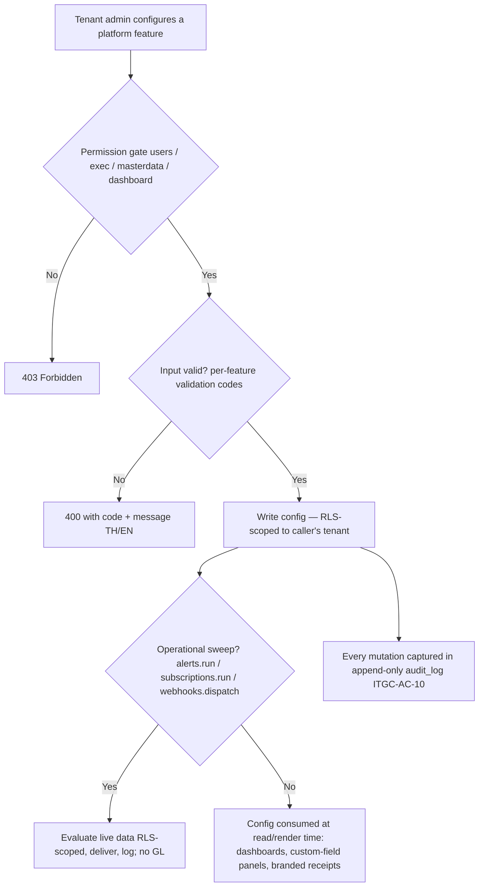

# Platform Customization & Extensibility — Process Narrative

## 1. Document control

| Field | Value |
|---|---|
| Process ID | PN-27-PLAT |
| Process owner | `<<Platform Admin / Controller>>` |
| Approver | `<<CFO / Head of IT>>` |
| Version | **1.0 DRAFT · 2026-06-24** |
| Review cadence | Annual + on significant change |
| Related RCM controls | No new RCM control (operational/configuration features); reinforces ITGC-AC-03 (RLS), ITGC-AC-04 (secrets at rest), ITGC-AC-10 (audit trail), MDM-02 (master-data validation) |
| Related policy | `compliance/policies/` (Access Control; IPE; Change Management) |

## 2. Purpose

This is an **umbrella narrative** for the cross-cutting *platform-customization* capabilities that let a tenant adapt the ERP to its business **without code** — added incrementally as Platform Phases 1–19 (custom fields … continuous controls monitoring), plus three consolidation capabilities (the notification inbox, the public REST API, and enterprise identity SSO+SCIM). It exists so an auditor or new administrator can see, in one place, **what is configurable, who may configure it, through which endpoint, and under which controls**, and then follow the link to the owning cycle narrative for detail. None of these features posts to the general ledger, and each is **tenant-isolated by Row-Level Security (RLS)** and gated by an explicit permission.

> **Design invariants** (verified by the `ext` control/integration harness for every feature): (a) **no GL impact** — configuration and operational features never post journal entries; (b) **tenant isolation** — every tenant-scoped table is RLS-scoped so one tenant can never read or write another's configuration; (c) **least privilege** — each surface is gated by a specific permission (`users`, `exec`, `masterdata`, or `dashboard`); (d) **documentation-as-done** — each feature updated its owning cycle narrative, the user manual, and UAT in the same change.

## 3. Scope

**In scope:** the twenty-two platform-customization capabilities (§7). **Out of scope:** the financially-significant business cycles they extend (see the per-feature cross-references), and the global, code-governed **module on/off** feature flags (`module_configs`, a platform-wide switch — see `08-itgc.md` / user manual §11.3).

## 4. References

- ISO 9001:2015 cl. 4.4 (process approach), cl. 7.5 (documented information).
- `compliance/Oshinei_ERP_SOX_RCM_v1.xlsx`; `compliance/policies/`.
- Permissions / SoD model: `packages/shared/src/permissions.ts`. Web navigation: `apps/web/src/lib/nav.ts`.
- Control/integration harness: `tools/cutover/src/ext.ts` (the cross-feature suite — 208 checks at time of writing).
- Per-feature owning narratives: `02` (workflows), `08` (audit viewer, webhooks), `17` (custom fields, alerts, bulk import), `23` (branding), `26` (scheduled reports, saved views, role dashboards).

## 5. Definitions & abbreviations

| Term | Meaning |
|---|---|
| UDF | User-defined (custom) field |
| RLS | Row-Level Security (PostgreSQL `tenant_isolation` policy) |
| Dry-run | Validation that reports all errors **without** writing to the database |
| HMAC | Hash-based message authentication code (SHA-256), for webhook payload signing |
| IPE | Information Produced by the Entity (a report relied upon in a control/decision) |
| Egress | Outbound delivery to an external system (webhooks) |

## 6. Roles & responsibilities (RACI)

| Activity | Tenant Admin (`users`) | Exec (`exec`) | MasterData Admin (`masterdata`) | Dashboard user (`dashboard`) | System |
|---|---|---|---|---|---|
| Define custom fields | C | C | **A/R** | I | I |
| Configure approval workflows | **A/R** | C | I | I | enforces SoD/SLA |
| Define alert rules | C | C | **A/R** | C | runs sweep |
| Schedule reports / saved views | I | **A/R** | I | C | runs sweep / delivers |
| Configure role dashboards | **A/R** | C | I | R (views own) | resolves + permission-filters |
| Review audit trail | **A/R** | I | I | I | append-only, RLS-scoped |
| Bulk-import master data | I | I | **A/R** | I | validates per-row |
| Register outbound webhooks | **A/R** | I | I | I | signs + delivers + retries |
| Brand the org (logo/tagline) | **A/R** | I | I | I | renders on receipts |
| Customize document templates | **A/R** | C | I | I | renders on documents (presentation only) |
| Define custom objects & records | C | C | **A/R** | I | reuses the custom-fields typed store |
| Design object form layouts | C | C | **A/R** | I | resolved against live field defs, per role |
| Configure automation rules | C | C | **A/R** | I | runs on events; actions are non-GL |
| Build self-service reports | I | **A/R** | C | C | governed measures × dimensions, RLS-scoped |
| Use the copilot (KB Q&A) | I | R | C | R | cite-or-refuse, read-only |
| Extract a document to an AP draft | I | **A/R** | C | I | extract-only; a human posts via AP |
| Ask data in natural language | I | **A/R** | C | R | governed semantic layer |
| Suggest a Studio config | C | C | **A/R** | I | review before applying |
| Monitor controls (review findings) | C | **A/R** | I | I | detective, read-only |

## 7. Process narrative — the twenty-two capabilities

Each entry: **what it does · endpoint(s) · permission · storage/migration · controls · owning narrative.**

1. **Custom fields (UDFs) — Phase 1.** Tenant-defined typed fields on any entity (customer, item, order, …). `POST/GET /api/custom-fields/defs`, `PUT /api/custom-fields/values`, `POST /values/bulk`. Perm `masterdata`/`users`/`exec`. Tables `custom_field_defs` + `custom_field_values` (typed columns), migration `0078`; RLS-scoped. Server-side validation: `UNKNOWN_FIELD`, `REQUIRED_FIELD`, `BAD_OPTION`, `BAD_NUMBER`, `BAD_DATE`. Web `/custom-fields` + a reusable `<CustomFields>` panel. *Detail: `17-master-data-management.md` §7.9.*
2. **Configurable approval workflows — Phase 2.** No-code, multi-level approval definitions with **SLA + escalation + dimension routing** and maker-checker/SoD enforcement. `GET/POST/PUT /api/workflow/definitions`, `POST /api/workflow/run-escalations`; wired into PO approval. Perm `exec`/`users`/approvals. Additive columns migration `0079`. *Detail: `02-procure-to-pay.md` §7.3; user manual `10-approvals.md`.*
3. **Alert / notification rules engine — Phase 3.** No-code rules over a **built-in metric catalog** (`low_stock_count`, `approvals_overdue`, `open_pr_count`); a cron-callable sweep fires in-app notifications and optional LINE/SMS/email with a cooldown, logging each fire. `GET /api/alerts/metrics|preview|events`, `GET/POST/PATCH/DELETE /api/alerts/rules`, `POST /api/alerts/run`. Perm `masterdata`/`users`/`exec`/`dashboard`. Tables `alert_rules` + `alert_events`, migration `0080`. Errors `BAD_METRIC`/`BAD_OPERATOR`/`BAD_CHANNEL`/`NO_TARGET`. Web `/alerts`. *Detail: `17-master-data-management.md` §7.10.*
4. **Scheduled reports + saved views — Phase 4.** A cron-callable sweep generates due report subscriptions (kpi_board / sales_cube / finance_trend / pipeline_trend) and delivers them (in-app + email), recording each run; plus per-user/per-module saved list views (personal or shared). `POST /api/bi/subscriptions/run`, `/:id/run`, `GET /api/bi/runs|report-types`; `GET/POST/DELETE /api/saved-views`. Perm `exec` (reports), any list perm (views). Tables `report_runs` + `saved_views`, migration `0081`. Errors `BAD_REPORT_TYPE`/`BAD_FREQUENCY`/`VIEW_NOT_FOUND`. Web `/scheduled-reports`, `/saved-views`. *Detail: `26-reporting-bi-ai.md` §5a/§5b.*
5. **Role-based dashboards — Phase 5.** An admin configures, **per role**, which KPI widgets appear on the home dashboard, drawn from an 11-metric catalog; at view time each user gets their role's layout **filtered to the widgets their own permissions allow**, with live values. `GET /api/dashboard/widgets/catalog`, `GET/PUT /api/dashboard/layouts/:role`, `GET /api/dashboard/layout/me`. Perm `users`/`exec` (configure), `dashboard`/`exec` (view). Table `dashboard_layouts`, migration `0082`. Errors `BAD_ROLE`/`BAD_WIDGET`. Web `/dashboard-designer` + a permission-filtered "role KPIs" strip on `/dashboard`. *Detail: `26-reporting-bi-ai.md` §3a.*
6. **Audit-trail viewer — Phase 6.** A read-only, paginated, filterable view + CSV export over the append-only `audit_log` (the immutability trigger is untouched). `GET /api/admin/audit`, `GET /api/admin/audit/export`. Perm `users`. SELECT-only; **RLS-scoped** (a tenant admin sees only its tenant's events; HQ/Admin sees all). Query indexes migration `0083`. Web `/audit`. *Control: **ITGC-AC-10** (detective review of the tamper-evident trail). Detail: `08-itgc.md` §7.A.8.*
7. **Validated bulk import — Phase 7.** A **dry-run validate → preview → commit** flow over the existing master-data import (8 entities), accumulating per-row errors instead of failing fast, with an optional skip-errors partial commit. `POST /api/admin/master-data/:entity/import/validate` and `/import/checked`. Perm `masterdata`. No schema change. Errors `REQUIRED_EMPTY`/`BAD_NUMBER`/`BAD_DATE`/`DUP_IN_FILE`/`EXISTS`. Web `/master-data` preview. *Control: **MDM-02** (master-data validation). Detail: `17-master-data-management.md` §7.3a.*
8. **Outbound webhooks — Phase 8.** Tenants register endpoints and subscribe to business events (`po.approved`, `po.rejected`, `alert.fired`); a dispatcher delivers **HMAC-SHA256-signed** payloads (10s-bounded) with a capped retry, recording every attempt. `GET/POST/DELETE /api/platform/webhooks`, `GET /api/platform/webhooks/events|deliveries`, `POST /api/platform/webhooks/deliveries/:id/redeliver`, `POST /api/platform/webhooks/dispatch`. Perm `users`. Signing secret **AES-256-GCM encrypted at rest** (shown once). Additive migration `0084`; the `webhook_deliveries` egress log is tenant-scoped via its FK to the (RLS-scoped) `webhooks`. Web `/webhooks`. *Controls: **ITGC-AC-04** (secret at rest); reuses the inbound HMAC scheme. Detail: `08-itgc.md` §7.A.9.*
9. **Tenant branding — Phase 9.** A tenant admin sets a **logo + tagline** (and a `branding_prefs` blob) on the org profile; these are **genuinely rendered** on the customer-facing receipt header. `GET/PATCH /api/tenant/profile` (extended). Perm `users`. Additive `tenants` columns, migration `0086`; RLS self-scoped to the caller's own tenant. Logo accepted as an `https` URL or a small image data-URI (other schemes rejected; **attribute-encoded** on output). Web `/setup` Branding card. *Detail: `23-customer-onboarding-provisioning.md` §7.6a.*
10. **Notification inbox — Phase #2 (consolidation).** A **per-user** in-app inbox unifying the notifications already produced by the alert engine (#3), scheduled reports (#4), and workflow escalations — each row targets a `(tenant, role)` pair or is a tenant-wide broadcast (`target_role` NULL). **Any authenticated user** gets a personal inbox scoped server-side to their own tenant + role; read state is tracked **per user** (so one recipient marking-read never affects another). `GET /api/notifications/inbox` (paginated, unread-first; `unread_only` filter), `GET /api/notifications/unread-count`, `POST /api/notifications/:id/read`, `POST /api/notifications/mark-all-read`. No `@Permissions` gate (universal); the `notifications` table is **not** RLS-scoped, so every query filters by `target_tenant_id` explicitly. New table `notification_reads` (per-user read markers, unique `(notification_id, username)`), migration `0087`; mark-read is **guarded** so a user can only ever mark a notification actually visible to them. Web: a header **bell** (unread badge, 30s poll) + a full `/notifications` page. *Consumes the producers in #3/#4 and `20`/`02` workflow escalations; no new RCM control.*
11. **Public REST API (v1) — Phase #3.** A stable, versioned, **scope-limited read API** for third-party integrators, built on the existing API-key auth (a `Bearer ierp_…` key, issued at `/api/platform/api-keys`, verified by the global guard into an `apikey:<prefix>` machine principal carrying its granted scopes). `GET /api/v1` (discovery) + `GET /api/v1/openapi.json` are **open**; `GET /api/v1/me` identifies the key; `GET /api/v1/items` (`catalog:read`), `/inventory` (`inventory:read`), `/orders` (`orders:read`), `/invoices` (`invoices:read`) return a paginated `{data, pagination}` envelope. **API-key only** (human JWTs → `403 API_KEY_REQUIRED`); a dedicated `PublicApiGuard` enforces **scope** (`403 INSUFFICIENT_SCOPE`, legacy `read`/`write`/`*` aliases honoured) and a **per-key fixed-window rate limit** (`429 RATE_LIMITED`, env-tunable). Tenant isolation is the **same RLS** the rest of the app uses — the key's `tenant_id` scopes every row (the shared `items` catalog has no tenant_id and is returned in full). **No schema change** (pure surface over existing tables); curated OpenAPI 3.1 document. *Controls: scope-gating + rate-limiting are **preventive** access controls reinforcing ITGC-AC-07 (key issuance/auth); no new RCM control.*
12. **Enterprise identity — SSO + SCIM — Phase #4.** Per-tenant **OIDC single sign-on** and **SCIM 2.0** automated user provisioning, so an enterprise tenant connects its IdP (Azure AD / Okta / Google). Config is per tenant (`GET/PUT /api/platform/identity`, `POST /api/platform/identity/scim-token`, perm `users`): the OIDC client secret is **AES-256-GCM encrypted at rest** and the SCIM bearer token stored only as a `sha256` hash (shown once). **SSO:** `GET /api/auth/sso/authorize?tenant=CODE` builds the IdP URL; `POST /api/auth/sso/callback` (both `@Public`; the assertion travels in the **body**, never a URL/log) verifies the `id_token` (HS256 against the client secret; RS256/JWKS is a documented follow-on), **JIT-provisions** the user by `sso_subject` within the tenant, and mints the **same session JWT** as a password login. **SCIM:** `/scim/v2/Users` (GET/POST/PUT/PATCH/DELETE) + `ServiceProviderConfig`, authenticated by the per-tenant `scim_…` bearer (a `ScimAuthGuard` mirroring the api-key path) — create/role-change **reuse `AdminUsersService` so the same SoD checks apply**, and deprovisioning (`DELETE`/`active=false`) **deactivates** (`users.is_active=false`) rather than deleting, preserving the audit trail. A deactivated account **cannot authenticate** (password or SSO). New table `tenant_identity` (RLS-scoped) + `users.is_active`, migration `0088`. Web: a **“Sign in with SSO”** entry + `/sso/callback` page, and a settings **SSO/SCIM** card. *Controls: **preventive**, reinforcing **ITGC-AC-01** (authentication), **ITGC-AC-02** (authorization), **ITGC-AC-09** (SoD on provisioning) and federated **deprovisioning**; secrets at rest reuse ITGC-AC-04. No new RCM control.*
13. **Document templates — Phase 10.** A no-code, **presentation-only** designer for customer-facing documents — the **receipt** is live; abbreviated/full tax invoices, quotations, POs and payslips are authorable now and rendered as their wiring lands. A tenant defines templates with header/body/footer/paper knobs (show logo, extra header note, show/hide branch·address·tax-id, accent colour, body font scale, thank-you text + extra footer lines, paper width); one per (tenant, doc_type) is the **default** consumed at render time. A template can **never change amounts** and can **never blank the document's core** (the seller name + the total always render, and mandatory tax-document fields are never omitted); it posts **nothing** to the GL. `GET /api/document-templates` (+ `/doc-types`, `/active?doc_type=`), `POST /api/document-templates`, `PUT /:id`, `POST /:id/default`, `DELETE /:id`, `POST /preview` (live sample render). Perm `users`/`exec`. Table `document_templates`, migration `0088`; RLS-scoped. The active receipt template is resolved inside the `printing` module via a shared pure renderer (`printing/receipt-render.ts`, used by both the live render and the preview). Web `/document-templates`. *Verified by the `ext` harness (catalog/create/default/active/preview/core-integrity/RLS/no-GL); extends Phase 9 branding.*
14. **Custom objects — Phase 11.** Tenant-defined record types ("custom apps") with no code: define an object, give it fields, capture records — without us shipping a module. An object's fields and typed values **reuse the Phase 1 custom-fields store** (entity = `object_key`), so the same validation (type/required/select-option) applies; records get their own registry (`custom_object_records`) so they can be enumerated and carry a display name. Pure metadata — **no GL**, RLS-scoped, audited. `GET/POST /api/custom-objects`, `GET/DELETE /api/custom-objects/:key`, `GET/POST /api/custom-objects/:key/records`, `GET/PUT/DELETE /api/custom-objects/:key/records/:id`; field defs are managed through the existing `/api/custom-fields` API. Perm `masterdata`/`users`/`exec`. Tables `custom_objects` + `custom_object_records`, migration `0089`; RLS-scoped. Web `/custom-objects`. *Verified by the `ext` harness (define/dup/fields/record CRUD/reused validation/RLS/no-GL).*
15. **Object layouts — Phase 12.** A no-code form/layout designer for a custom object (Phase 11): arrange fields into **sections**, set a 1- or 2-**column** layout, **reorder**, **hide** fields, and optionally target a **role** — stored as presentation-only config and **resolved against the object's live field defs** at render time, so a newly-added field always surfaces (appended) and stale references drop. The custom-object data-entry form renders by the resolved layout. `GET /api/object-layouts` (+ `/resolve?object_key=&role=`), `POST /api/object-layouts`, `PUT /:id`, `POST /:id/default`, `DELETE /:id`, `POST /preview`. Perm `masterdata`/`users`/`exec`. Table `object_layouts`, migration `0090`; RLS-scoped; **no GL**. Web `/object-layouts`. *Verified by the `ext` harness (built-in fallback/create/resolve/hide/auto-surface-new-field/preview/RLS/no-GL).*
16. **Automation rules — Phase 13.** A no-code **"when EVENT [and CONDITION] then ACTION"** engine over the events the app already emits (`po.approved`, `po.rejected`, `alert.fired`). A rule has an event, an optional condition (`{field, op, value}` against the event payload) and an action — an in-app **notification**, a LINE/SMS/email **message**, or a **log** entry — all **non-GL, non-destructive**. Rules are evaluated by the webhook dispatcher when an event fires (the hook is guarded so it can never break emit) and on demand via `/run-event`; every evaluation is logged. `GET /api/automation/events`, `GET/POST /api/automation/rules`, `PUT /:id`, `DELETE /:id`, `GET /api/automation/executions`, `POST /api/automation/run-event`. Perm `masterdata`/`users`/`exec`. Tables `automation_rules` + `automation_executions`, migration `0091`; RLS-scoped. Web `/automation`. *Verified by the `ext` harness (catalog/create/bad-event/bad-action/match/skip/executions/RLS/no-GL); generalizes the alert (#3) + webhook (#8) engines.*
17. **Semantic layer + report builder — Phase 14.** A **governed self-service analytics** surface: a curated whitelist of **measures × dimensions** over the POS-sales fact, exposed as a model and queried by a safe, **RLS-scoped** aggregate. Callers pick a dimension to group by + optional date filters; the measure/dimension keys map to **fixed SQL** (user input never reaches the SQL text — only filter values are parameterized). Read-only; posts **nothing** to the GL; saved reports reuse `/api/saved-views`. `GET /api/query/model`, `POST /api/query/run`. Perm `exec`/`dashboard`/`masterdata`. No schema change. Web `/query`. *Verified by the `ext` harness (model/run-aggregate/bad-dimension/RLS); the governed foundation NL-analytics (B3) builds on.*

### Pillar B — AI-native (Phases 15–19)

> The AI features share one safety spine: each **degrades deterministically when no `ANTHROPIC_API_KEY` is set** (so CI runs offline), and each is **read-only, suggestion-only, or human-in-the-loop** — none post to the GL or write config on their own.

18. **Embedded copilot — Phase 15 (B1).** A context-aware Q&A surface for any screen. It answers **only** from the tenant's own knowledge base (RAG, **cite-or-refuse**) — when no source clears the similarity threshold it declines rather than fabricating. With a key it synthesizes the reply via the existing agent; with no key it returns a KB-cited answer (deterministic). Read-only, **RLS-scoped** (the RAG corpus is per-tenant), no GL. `POST /api/copilot/ask`. Perm `ai_chat`/`dashboard`. Web `/copilot`. *Reuses the Phase-D2 KnowledgeService + agent; verified by `ext` (grounded-cite + no-key fallback).*
19. **Document-AI intake — Phase 16 (B2).** Turns pasted vendor-invoice text into a **structured AP draft** (vendor, tax ID, invoice no, date, amount). Claude extracts when keyed; otherwise deterministic regex heuristics. **Extract-only** — it returns a draft for a human to review and post through the normal AP cycle; it never creates a bill or touches the GL. `POST /api/doc-ai/extract`. Perm `procurement`/`creditors`/`exec`. Web `/doc-ai`. *Verified by `ext` (field extraction).*
20. **NL analytics — Phase 17 (B3).** Ask in plain language; the question is mapped to a query over the **A5 semantic layer** (Claude when keyed, deterministic keyword mapping otherwise) and executed by the **same governed, RLS-scoped, whitelist-only** engine — natural language never produces raw SQL. Read-only, no GL. `POST /api/nl-analytics/ask`. Perm `exec`/`dashboard`/`masterdata`. Web `/nl-analytics`. *Reuses A5 QueryService; verified by `ext` (NL→dimension + run, Thai + English).*
21. **AI configuration assistant — Phase 18 (B4).** Describe a Studio object (custom object / alert / automation rule / document template) in plain language and get a **proposed config JSON** to review and apply through the normal Studio screen — it **never auto-applies**. Claude drafts when keyed; deterministic starter templates otherwise. Suggestion-only — no writes, no GL. `GET /api/ai-config/targets`, `POST /api/ai-config/suggest`. Perm `masterdata`/`users`/`exec`. Web `/ai-config`. *Verified by `ext` (object + alert proposals, `BAD_TARGET`).*
22. **Continuous controls monitoring — Phase 19 (B5).** A **detective-control monitor** that scans tenant-scoped books for red flags — duplicate vendor invoices (vendor + invoice no), possible duplicate payments (vendor + amount), and ghost/duplicate vendors (shared tax ID) — and raises **findings** for human review (open → reviewed/dismissed). Every detector runs over RLS-scoped tables so findings never cross tenants; re-scans **upsert by fingerprint** (no duplicates). Read-only, posts **nothing** to the GL. Table `control_findings` (migration `0092`). `GET /api/controls/catalog`, `POST /api/controls/scan`, `GET /api/controls/findings`, `POST /api/controls/findings/:id/review`. Perm `exec`/`users`/`creditors`. Web `/controls`. *Strengthens the SOX/ICFR detective-control story (formal RCM control-ID assignment is a planned follow-up); verified by `ext` (scan/findings/review/RLS/no-GL).*

23. **Synced UI preferences — sidebar personalization.** Per-user sidebar **favourites** (★ pins) and the
    nav **sub-section fold-state** follow the user **across devices** via a personal preference store, so a
    layout set on one browser is restored on the next. A single per-user row holds a small JSON blob
    (`{favorites, navFold}`); the web caches it in `localStorage` for instant paint and an offline
    fallback, then reconciles to the server as source of truth on load (first use migrates the device's
    local prefs up). The auto-tracked **"recent" list deliberately stays per-device** (it means *recent on
    this device*) and is **not** stored server-side. Endpoint `GET`/`PUT /api/user-prefs` — **no
    `@Permissions`**: every authenticated user reads/writes only their **own** row (service scopes by
    username, RLS by tenant); the customer portal does not call it. Personal, presentation-only — posts
    **nothing** to the GL and changes **no** data-access path. Table `user_prefs` (migration `0119`);
    RLS-scoped. *No new RCM control and no RACI/control-matrix change (a personal preference store): the new
    table is covered by the `tenant-isolation` RLS harness and the behaviour by the `web-e2e`
    `workspace-split` Playwright suite.*

## 8. Process flow

**Swimlane note.** The *Tenant Admin / MasterData Admin / Exec* lanes configure their respective surfaces under least-privilege permissions; the *system* enforces RLS isolation, per-feature input validation, and the append-only audit trail, and runs the cron-callable sweeps (alerts, scheduled reports, webhook dispatch) that operate on **live, tenant-scoped** data without posting to the GL.

## 9. Control matrix

| Capability | Risk | Control | Type | RCM ID | Evidence |
|---|---|---|---|---|---|
| All | Cross-tenant config read/write | RLS tenant isolation on every config table; self-scoped tenant edits | Preventive | ITGC-AC-03 | `ext` isolation checks; RLS policies |
| All | Unauthorized configuration | Permission gate (`users`/`exec`/`masterdata`/`dashboard`) | Preventive | ITGC-AC-02 | 403 checks in `ext` |
| Audit viewer | Undetected/tampered change record | Append-only `audit_log` (trigger) + detective read/export | Detective | ITGC-AC-10 | `compliance.ts`, `ext` |
| Webhooks | Forged/replayed egress; secret disclosure | HMAC-SHA256 signed payload + timestamp; secret AES-256-GCM at rest | Preventive | ITGC-AC-04 | `ext` webhook checks |
| Bulk import | Bad master data loaded silently | Dry-run + per-row validation; block-or-skip commit | Preventive | MDM-02 | `ext` bulk-import checks |
| Role dashboards | KPI leakage to under-privileged role | Resolved layout filtered to the viewer's permissions | Preventive | ITGC-AC-02 | `ext` dashboard checks |
| Public API | Over-broad machine access; key abuse | API-key-only surface + per-endpoint **scope** gate (`INSUFFICIENT_SCOPE`); per-key **rate limit** (`RATE_LIMITED`); RLS scopes every row to the key's tenant | Preventive | ITGC-AC-07 | `ext` public-API checks (scope-deny, isolation, 429) |
| SSO/SCIM | Unauthorized federated access; **login-CSRF / account-fixation**; orphaned/over-privileged accounts; **privilege escalation to Admin**; secret disclosure | OIDC `id_token` verified (sig/iss/aud/exp/**nonce**) and **rejected when the client secret is empty** (no empty-key HMAC); the callback requires a **server-persisted, single-use `state`** minted by `authorize()` (forged/replayed/expired → `BAD_STATE`) with **PKCE** on the code exchange; SCIM create/role-change run the **SoD** check **and the Admin-grant guard** (only an Admin may grant the `Admin` role → `ADMIN_GRANT_DENIED`, so a tenant-scoped `AccessAdmin`/SCIM principal cannot mint a bypass-capable Admin); deprovision **deactivates** (login blocked); IdP secrets encrypted/hashed at rest; per-tenant SCIM token + RLS isolation | Preventive | ITGC-AC-01/02/09 | `ext` SSO+SCIM checks (state/forged/replay reject, id_token reject, SoD path, deactivate-login-block, isolation) |
| Document templates | Tampered/blanked customer document; amount or mandatory-field manipulation | Presentation-only config (carries no amounts); core fields (seller, total) always render; mandatory tax-document fields never omitted; no GL post | Preventive | (operational) | `ext` doc-template checks (core integrity + no-GL) |
| Custom objects | Cross-tenant record read/write; untyped/invalid data | RLS on objects + records; field values validated via the reused custom-fields machinery (type/required/option); no GL post | Preventive | (operational) | `ext` custom-object checks |
| Object layouts | A field silently dropped from a form; cross-tenant config | Presentation-only config resolved against live field defs (new fields auto-surface, none silently lost); RLS on layouts; no GL post | Preventive | (operational) | `ext` object-layout checks |
| Automation rules | Unauthorized / looping side effects from events | Actions are non-GL + non-destructive (notify/message/log); RLS-scoped rules + executions; the webhook→automation hook is guarded so it can't break emit or loop; every run logged | Preventive | (operational) | `ext` automation checks |
| Semantic layer / reports | Cross-tenant data exposure; unsafe ad-hoc SQL | Whitelisted measures × dimensions (no user-supplied SQL); only filter values parameterized; RLS scopes every row; read-only, no GL | Preventive | (operational) | `ext` query checks (aggregate, bad-dimension, RLS) |
| Embedded copilot | Fabricated or cross-tenant answers | Cite-or-refuse over the per-tenant RAG corpus (declines without a source); RLS-scoped; read-only, no GL | Preventive | (operational) | `ext` copilot checks |
| Document-AI intake | Auto-posting an unverified bill | Extract-only — returns a draft; a human posts via the normal AP cycle; no GL write | Preventive | (operational) | `ext` doc-ai check |
| NL analytics | Unsafe ad-hoc SQL from free text | NL maps only to whitelisted measures × dimensions (the A5 engine); RLS-scoped; read-only | Preventive | (operational) | `ext` NL-analytics checks |
| AI config assistant | Unreviewed auto-configuration | Suggestion-only — proposes JSON; a human applies it via Studio; no writes | Preventive | (operational) | `ext` ai-config checks |
| Continuous controls monitoring | Duplicate payments / ghost vendors going unnoticed | Detective scans (duplicate invoice/amount, shared tax ID); findings reviewed; RLS-scoped; read-only, no GL | Detective | (operational) | `ext` controls checks |

## 10. Inputs & outputs

**Inputs:** admin configuration (field definitions, workflow/alert rules, report subscriptions, dashboard layouts, webhook endpoints, branding); the caller's JWT (tenant + permissions). **Outputs:** stored, RLS-scoped configuration; operational side-effects with **no GL impact** — in-app notifications (surfaced in a per-user inbox with per-user read state in `notification_reads`), emailed reports + a `report_runs` log, signed webhook deliveries + a `webhook_deliveries` log, branded receipts; and an append-only `audit_log` entry per mutation.

## 11. Records & retention

| Record | Retention |
|---|---|
| Configuration tables (fields, rules, layouts, subscriptions, webhooks, branding) | `<<retention per policy>>` |
| Operational logs (`alert_events`, `report_runs`, `webhook_deliveries`) | `<<retention per policy>>` |
| `audit_log` (append-only) | `<<7 years / per ITGC-AC-10>>` |

## 12. KPIs / metrics

- Configuration-validation rejection rate (data-quality signal across features).
- Alert/report/webhook delivery success vs failure (operational health).
- Webhook retry exhaustion count; audit-viewer usage in UARs.

## 13. Exception & error handling

Per-feature validation codes are consolidated here (all `400` unless noted): UDFs — `UNKNOWN_FIELD`/`REQUIRED_FIELD`/`BAD_OPTION`/`BAD_NUMBER`/`BAD_DATE`; alerts — `BAD_METRIC`/`BAD_OPERATOR`/`BAD_CHANNEL`/`NO_TARGET`; scheduled reports/views — `BAD_REPORT_TYPE`/`BAD_FREQUENCY`/`VIEW_NOT_FOUND` (404); dashboards — `BAD_ROLE`/`BAD_WIDGET`; bulk import — `REQUIRED_EMPTY`/`BAD_NUMBER`/`BAD_DATE`/`DUP_IN_FILE`/`EXISTS`; webhooks — `WEBHOOK_NOT_FOUND` (404)/`DELIVERY_NOT_FOUND` (404); branding — invalid `logo_url` rejected; document templates — `BAD_DOC_TYPE`/`NAME_REQUIRED`/`NAME_EXISTS`/`TEMPLATE_NOT_FOUND` (404); custom objects — `BAD_OBJECT`/`BAD_LABEL`/`OBJECT_EXISTS`/`OBJECT_NOT_FOUND` (404)/`RECORD_NOT_FOUND` (404) (record field values reuse the custom-fields codes); object layouts — `BAD_OBJECT`/`NAME_REQUIRED`/`NAME_EXISTS`/`LAYOUT_NOT_FOUND` (404); public API — `API_KEY_REQUIRED` (`403`, human JWT on `/api/v1`), `INSUFFICIENT_SCOPE` (`403`, missing scope), `RATE_LIMITED` (`429`, per-key window exceeded); SSO/SCIM — `SSO_NOT_CONFIGURED` (`503`), `BAD_ID_TOKEN`/`BAD_ISSUER`/`BAD_AUDIENCE`/`TOKEN_EXPIRED`/`USER_DEACTIVATED` (`401`), `SCIM_UNAUTHORIZED` (`401`), SCIM `USER_EXISTS` (`409`), and SCIM `404` for an unknown user; automation — `NAME_REQUIRED`/`BAD_EVENT`/`BAD_ACTION`/`BAD_OPERATOR`/`RULE_NOT_FOUND` (404); analytics studio — `BAD_DIMENSION` (400); AI config — `BAD_TARGET` (400); continuous controls — `FINDING_NOT_FOUND` (404). Unauthorized access → `403` (missing key/token → `401`); cross-tenant access is silently RLS-filtered (no leak).

## 14. Revision history

| Version | Date | Author | Notes |
|---|---|---|---|
| 0.1 DRAFT | 2026-06-24 | Platform | Initial umbrella narrative consolidating Platform Phases 1–9 (custom fields, approval workflows, alert rules, scheduled reports + saved views, role dashboards, audit viewer, validated bulk import, outbound webhooks, tenant branding). Cross-references the owning cycle narratives; no new RCM control. |
| 0.2 DRAFT | 2026-06-24 | Platform | Added capability #10 — the **notification inbox** (per-user read state over the existing `notifications` table; new `notification_reads`, migration `0087`; bell + `/notifications` page). Unifies the notifications produced by #3/#4 and workflow escalations; no new RCM control. |
| 0.3 DRAFT | 2026-06-24 | Platform | Added capability #11 — the **public REST API (v1)** (`/api/v1` items/inventory/orders/invoices, API-key-only, scope-gated, per-key rate-limited, OpenAPI 3.1 doc). No schema change; scope + rate limiting are preventive access controls reinforcing ITGC-AC-07; no new RCM control. |
| 0.4 DRAFT | 2026-06-24 | Platform | Added capability #12 — **enterprise identity (SSO + SCIM)**: per-tenant OIDC SSO with JIT provisioning + SCIM 2.0 user lifecycle (new `tenant_identity` table + `users.is_active`, migration `0088`). SCIM create/role-change reuse the SoD-checked admin path; deprovisioning deactivates (login blocked). Reinforces ITGC-AC-01/02/09; no new RCM control. |
| 0.5 DRAFT | 2026-06-24 | Platform | Added **Platform Phase 10 — document templates**: no-code, presentation-only customization of customer-facing documents (receipt live; other doc types authorable, rendered as wiring lands). Template carries no amounts, never blanks the core / omits mandatory fields, posts nothing to the GL; RLS-scoped (migration `0088`). New §7.13, RACI + control-matrix rows, error codes; `ext` harness +11 checks. No new RCM control (operational). |
| 0.6 DRAFT | 2026-06-24 | Platform | Added **Platform Phase 11 — custom objects**: tenant-defined record types reusing the Phase 1 custom-fields typed store (entity = object_key); records get a registry with a display name. No GL, RLS-scoped (migration `0089`). New §7.14, RACI + control-matrix rows, error codes; `ext` harness +13 checks. No new RCM control (operational). |
| 0.7 DRAFT | 2026-06-24 | Platform | Added **Platform Phase 12 — object layouts**: no-code form/layout designer for custom objects (sections/columns/order/hide, per role) resolved against live field defs so new fields auto-surface. No GL, RLS-scoped (migration `0090`). New §7.15, RACI + control-matrix rows, error codes; `ext` harness +9 checks. No new RCM control (operational). |
| 0.8 DRAFT | 2026-06-24 | Platform | Added **Platform Phase 13 — automation rules engine**: no-code when-event/condition→action over the existing event stream (po.approved/rejected, alert.fired); actions = notification/message/log (non-GL), triggered via a guarded webhook-dispatcher hook + on-demand `/run-event`, every run logged. RLS-scoped (migration `0091`). New §7.16, RACI + control-matrix rows, error codes; `ext` +9 checks (189). No new RCM control (operational). |
| 0.9 DRAFT | 2026-06-24 | Platform | Added **Platform Phase 14 — semantic layer + report builder**: a governed self-service analytics surface (curated measures × dimensions over POS sales; safe RLS-scoped aggregate; saved reports reuse saved-views). Read-only, no GL, no schema change. New §7.17, RACI + control-matrix rows, `BAD_DIMENSION`; `ext` +4 checks (193). No new RCM control (operational). |
| 1.2 | 2026-06-28 | Security | **Security-audit remediation — full batch (Critical/High/Medium + perf).** Builds on rev 1.1. **C1:** SSO callback now requires a server-persisted, **single-use `state`** (new `sso_login_state` table, migration `0177`) minted by `authorize()`, with an OIDC **`nonce`** bound into the id_token and **PKCE** (S256) on the code exchange — closes the login-CSRF / account-fixation gap (`BAD_STATE`/`BAD_NONCE`). **H1 (ITGC-AC-07):** per-account **login lockout/throttle** — `login_attempts` table (migration `0176`) written on an autocommit path so failures survive the 401 rollback; 10 fails → 15-min lockout (`LOGIN_LOCKED`, 429). **H3:** member JWTs now carry a `jti` (revocable) + 7-day life, and the guard re-checks `pos_members.active` each request (`MEMBER_DEACTIVATED`). **H4:** password KDF hardened to a self-describing, higher-cost scrypt (`scrypt$N$r$p$…`) with transparent rehash-on-login. **H6:** large-refund requests now sum settled **and** pending under a payment row lock (no queued over-refund). **M3:** tenant-registered webhook URLs are SSRF-guarded (https-only in prod; private/loopback/metadata rejected at register **and** re-checked at send → `SSRF_BLOCKED`). **Perf:** opt-in multi-process clustering (`WEB_CONCURRENCY`), `DB_POOL_MAX` default 10→20, and the per-request RLS `set_config` collapsed to one round-trip — clustered 100-session throughput ~2.3× with ~2.6× lower p50 latency, 0 errors. ToE: `ext` +3 (SSRF block, forged-state, state-replay) → 253; `compliance` 106 / `basics` 210 / `restaurant` 162 green. RCM `ITGC-AC-07` readiness item updated + xlsx regenerated; no RCM control added. |
| 1.1 | 2026-06-28 | Security | **Identity/auth hardening (security-audit remediation).** Closed an authorization gap in user provisioning: `AdminUsersService.create/update` now enforce an **Admin-grant guard** — only an `Admin` actor may grant the `Admin` role (`ADMIN_GRANT_DENIED`, 403) — so a tenant-scoped `AccessAdmin` (or the SCIM principal, which now passes its actor through) can no longer mint a bypass-capable Admin within its own tenant. SSO callback now **fails closed on an empty client secret** (`SSO_SECRET_MISSING`) to prevent empty-key HS256 `id_token` forgery; the session `JwtModule` **pins `algorithms: ['HS256']`** (alg-confusion defence); the delivery-aggregator/channel webhooks now compare their shared secret in **constant time** (`safeEqualStr`, length-independent) instead of `!==`; and `AllExceptionsFilter` no longer echoes raw `exception.message` to clients (logged server-side only). Reinforces ITGC-AC-02/09; no new RCM control, no schema change. Verified live + harnesses green (`compliance` 106, `restaurant` 162). Deferred to dedicated workstreams (need migrations): per-account login lockout (ITGC-AC-07), SSO `state`/nonce/PKCE, member-token revocation. |
| 1.0 | 2026-06-26 | Platform | **Feature flags / Labs (operating-spine PR10).** New `feature_flags` table (migration `0171`, RLS) + `FeatureFlagsModule` (`GET /api/feature-flags`, `PUT /api/feature-flags/:key`). A default registry in code marks the thin demo-grade modules (consolidation, intercompany, manufacturing_mrp, sourcing_rfq, gamification, referrals, wheels, custom_objects) as **LABS-tier, disabled by default**; a tenant overrides individual flags, and a `labs_visible` master switch controls whether the Labs nav section shows — so diligence sees a tight, deep core and modules re-enable per real demand. Read open to workspace users; toggling gated **`md_config`/`exec`**. New `/settings/labs` admin screen + nav link. ToE: `onboarding` harness (+4: LABS default-off, enable override, UNKNOWN_FLAG 400, tenant-isolated). No new RCM control (platform/UX config — no GL, no financial assertion; access already SoD-gated). UAT `08-admin-sod-uat.md` updated. |
| 1.0 DRAFT | 2026-06-24 | Platform | Added **Pillar B (AI-native) — Platform Phases 15–19**: embedded copilot (§7.18, KB cite-or-refuse), document-AI intake (§7.19, extract-only AP draft), NL analytics (§7.20, over the A5 semantic layer), AI configuration assistant (§7.21, suggestion-only), continuous controls monitoring (§7.22, detective scans → findings; migration `0092`). All read-only / suggestion-only / human-in-the-loop, RLS-scoped, **no GL**; AI features degrade deterministically with no API key (CI offline-safe). New §7.18–7.22, five RACI + control-matrix rows, `BAD_TARGET`/`FINDING_NOT_FOUND`; `ext` +15 checks (208). B5 is a detective-control aid (formal RCM control-ID assignment is a planned follow-up). |
| 1.1 DRAFT | 2026-06-25 | Platform | Housekeeping — removed the **dead `platform/oidc.service.ts` scaffold** (unused; threw `NOT_CONFIGURED`/TODO and duplicated the live per-tenant SSO in `modules/identity/sso.service.ts`, §12). No behaviour/endpoint/control change — the live SSO path (`/api/auth/sso/*`, ITGC-AC-01/02/09) is unchanged. Also added `docs/ops/integration-providers-status.md` documenting the **env-gated mock providers** (billing/PSP/terminal/e-invoice/e-tax/LINE/messaging/connectors/channel adapters) — working-as-designed defaults + the variables to set for go-live (no RCM change). |
| 1.1 DRAFT | 2026-06-25 | Web | Added capability #23 — **synced UI preferences**: per-user sidebar favourites + nav fold-state follow the user across devices via `GET`/`PUT /api/user-prefs` (no `@Permissions`; owner-scoped + RLS); recents stay per-device. Table `user_prefs` (migration `0119`), presentation-only, **no GL**, no data-access change. New §7.23; no RACI/control-matrix change and no new RCM control (personal preference store). Covered by the `tenant-isolation` RLS harness + `web-e2e` `workspace-split` suite. See `docs/15-ui-ux-menu-restructure-plan.md`. |
