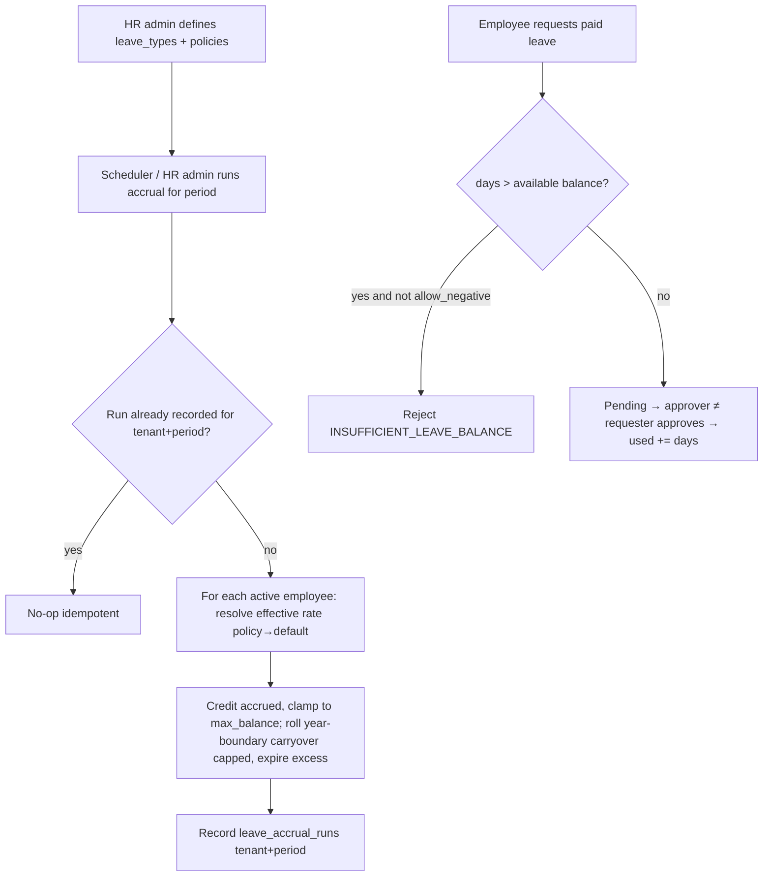
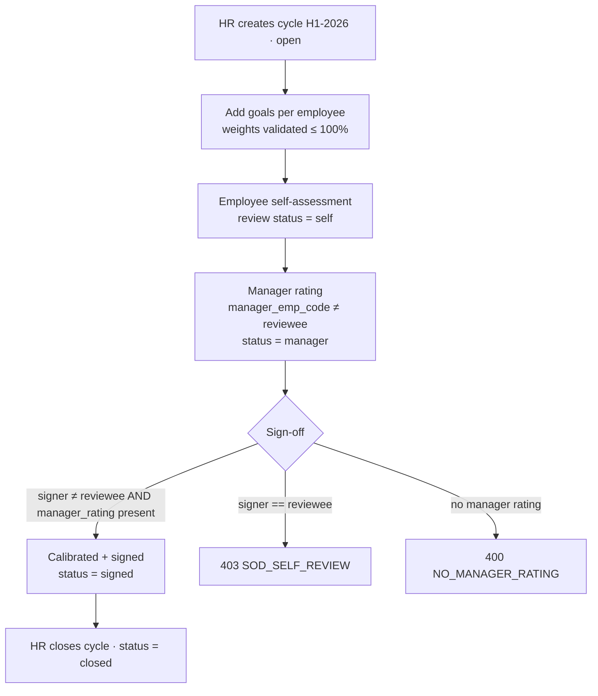

# Human Resources (HCM) — Process Narrative

> HCM depth cycle (docs/42). This narrative is built up wave-by-wave; each HR feature owns a self-contained
> section so parallel PRs merge keep-both. HR-2 (leave accrual) is documented in §7; the HR-3 performance-
> management section is appended self-contained below.

## 1. Document control

| Field | Value |
|---|---|
| Process ID | PN-29-HR |
| Process owner | `<
>` |
| Approver | `<<CHRO / CFO>>` |
| Version | **0.1 DRAFT** |
| Effective date | `<<effective-date>>` |
| Review cadence | Annual + on policy change |
| Related RCM controls | HR-02 (leave accrual + entitlement gate); see also PAY-01..06 |
| Related policy | `compliance/policies/03-delegation-of-authority.md` |

## 2. Purpose

To control the human-capital lifecycle on the `payroll.employees` master so that leave entitlement,
org structure, performance and the rest of the HCM suite are administered **accurately, consistently and
with maker-checker segregation**, feeding payroll and the statutory record.

## 3. Scope

**In scope:** leave types/policies and the accrual engine (HR-2). Further HCM waves (org structure,
performance, recruiting, onboarding, compensation) attach their own sections as they land.

**Out of scope:** gross-to-net payroll computation and statutory filings (see `05-payroll.md`).

## 4. References

- `compliance/Oshinei_ERP_SOX_RCM_v1.xlsx` — HR-02.
- Code: `apps/api/src/modules/hcm/` (`hcm-leave.service.ts`, `hcm.service.ts`), `apps/api/src/database/schema/hcm-leave.ts`.
- Migration `apps/api/drizzle/0321_hcm_leave_accrual.sql`.
- ToE harness: `tools/cutover/src/hcm-leave.ts` (17 checks).

## 5. Definitions & abbreviations

| Term | Meaning |
|---|---|
| Leave type | A category of leave (ANNUAL/SICK/PERSONAL/…) carrying an accrual method + caps |
| Accrual method | `monthly` (per period), `anniversary` (in the hire month), or `none` |
| Policy override | A higher accrual rate for a given job grade and/or minimum tenure |
| Carryover | Prior-year remaining balance rolled forward, capped at `carryover_cap_days` |
| Available balance | `entitled + accrued + carryover − used − expired` |

## 6. Roles & permissions

| Duty | Permission | Notes |
|---|---|---|
| View HR workspace / balances | `hr`, `hr_admin`, `exec`, `ess` (own) | reads only |
| Configure leave types / policies | `hr_admin`, `exec` | master-data maintenance |
| Run leave accrual | `hr_admin`, `exec` | privileged batch |
| Approve a leave request | `exec` / `users` / `creditors` (≠ requester) | maker-checker, SOD_SELF_APPROVAL |

## 7. HR-2 — Leave accrual engine + policies (control HR-02)

### 7.1 Narrative

Leave balances were previously static (`entitled`/`used` only, entitled defaulting to 0). HR-2 turns them
into a real accrual model:

1. **Leave-type master** (`leave_types`) — per tenant: `code`, `name`, `accrual_method`
   (`monthly`|`anniversary`|`none`), `accrual_rate_days` (days per period), `carryover_cap_days`,
   `max_balance_days` (0 = uncapped), `allow_negative`.
2. **Policy overrides** (`leave_policies`) — raise the base rate for a `job_grade` and/or a
   `min_tenure_months` threshold. The effective rate is the **highest matching** policy, else the type default.
3. **Accrual run** (`POST /api/hcm/leave/accrual/run {period}`, or the schedulable `hr_leave_accrual` BI
   action job) — for each **active** employee it credits `accrued` on the `(employee, type, year)` balance,
   clamped so the balance never exceeds `max_balance_days`. At the **year boundary** the prior year's
   remaining balance rolls into `carryover` (capped at `carryover_cap_days`); the excess is recorded as
   `expired` on the prior-year row. The run is **idempotent per `(tenant, period)`** — a re-run is a no-op
   guarded by `leave_accrual_runs`.
4. **Entitlement gate (HR-02)** — `requestLeave` blocks a **paid** request whose days exceed the available
   balance with `INSUFFICIENT_LEAVE_BALANCE`, unless the leave type is unconfigured (legacy back-compat) or
   allows a negative balance. Unpaid leave is not gated. Approval remains maker-checker (approver ≠ requester,
   `SOD_SELF_APPROVAL`).

### 7.2 Endpoints

| Method | Route | Permission |
|---|---|---|
| GET | `/api/hcm/leave/types` | hr / hr_admin / exec / ess |
| POST | `/api/hcm/leave/types` | hr_admin / exec |
| GET | `/api/hcm/leave/policies` | hr / hr_admin / exec |
| POST | `/api/hcm/leave/policies` | hr_admin / exec |
| GET | `/api/hcm/leave/balances?emp_code=` | hr / hr_admin / exec / ess |
| POST | `/api/hcm/leave/accrual/run` | hr_admin / exec |

### 7.3 Workflow

### 7.4 Control matrix

| Control | Type | Assertion | Test |
|---|---|---|---|
| HR-02 | Preventive/Automated | Accrual is policy/grade/tenure-driven and idempotent per period; a paid request beyond available balance is blocked | `tools/cutover/src/hcm-leave.ts` (17 checks); UAT-HR-01..08 |

## 8. Revision history

| Version | Date | Author | Change |
|---|---|---|---|
| 0.1 DRAFT | 2026-07-11 | HR-2 | Initial HR narrative; HR-2 leave accrual engine + entitlement gate (control HR-02, migration 0321). |

---

# HR-3 — Performance management (control HR-03) — appended section

> Self-contained HR-3 performance-management narrative; kept on merge alongside the HR-2 leave section above.

## PM.1 Document control (HR-3)

| Field | Value |
|---|---|
| Process ID | PN-29-HR (HR-3 performance) |
| Process owner | `<
>` |
| Approver | `<<CHRO / CFO>>` |
| Version | **0.1 DRAFT** |
| Effective date | `<<effective-date>>` |
| Review cadence | Each appraisal cycle + annual |
| Related RCM controls | HR-03; SoD (maker-checker on review sign-off) |
| Related plan | `docs/42-hcm-depth-plan.md` |

## 2. Purpose

To control the performance-appraisal cycle so that employee goals are set coherently, ratings are made
independently of the person being rated, and the final appraisal is signed off by someone **other than the
reviewee** — protecting the integrity of the ratings that drive pay rises, bonuses and promotions.

## 3. Scope

**In scope:** appraisal cycles (`perf_cycles`), OKR-style goals with weightings (`perf_goals`), and the
self → manager → calibration → sign-off review workflow (`perf_reviews`). Employee master is
`payroll.employees` (by `emp_code`).

**Out of scope:** payroll computation/posting (see `05-payroll.md`), time & attendance and leave (see
`25-hcm-time-labor.md`).

## 4. Roles & permissions

| Duty | Permission | Notes |
|---|---|---|
| View cycles / goals / reviews | `hr`, `hr_admin`, `exec` (or `ess` self-scoped to own rows) | Reads |
| Create cycle, goals, self/manager review | `hr`, `hr_admin` | Writes |
| Close cycle, sign off appraisal | `hr_admin`, `exec` | Elevated HR duty |

## 5. Workflow

## 6. Control matrix

| Control | Assertion | What it prevents | Enforcement |
|---|---|---|---|
| **HR-03** | Authorization / Segregation of Duties | A self-rated / self-signed appraisal inflating ratings that drive pay; incoherent goal weightings | `managerRate` rejects `manager_emp_code == emp_code` (`SOD_SELF_REVIEW`); `signReview` rejects a signer whose linked employee `== emp_code` (`SOD_SELF_REVIEW`) or a review with no manager rating (`NO_MANAGER_RATING`); `createGoal` rejects weights summing `> 100%` (`WEIGHT_EXCEEDED`) |

## 7. Endpoints (application)

| Endpoint | Permission | Purpose |
|---|---|---|
| `GET /api/hcm/performance/cycles` | read | List appraisal cycles |
| `POST /api/hcm/performance/cycles` | `hr`/`hr_admin` | Create a cycle (`open`) |
| `POST /api/hcm/performance/cycles/:id/close` | `hr_admin`/`exec` | Close a cycle |
| `GET/POST /api/hcm/performance/goals` | read / `hr`,`hr_admin` | List / add goals (weights ≤ 100%) |
| `PATCH /api/hcm/performance/goals/:id` | `hr`/`hr_admin` | Update progress / status |
| `POST /api/hcm/performance/reviews` | `hr`/`hr_admin` | Self-assessment (status `self`) |
| `POST /api/hcm/performance/reviews/:id/manager` | `hr`/`hr_admin` | Manager rating (HR-03 SoD) |
| `POST /api/hcm/performance/reviews/:id/sign` | `hr_admin`/`exec` | Calibrate + sign off (HR-03 SoD) |

## 8. Error codes

| Code | HTTP | Meaning |
|---|---|---|
| `SOD_SELF_REVIEW` | 403 | Manager rating / sign-off attempted by the reviewee |
| `NO_MANAGER_RATING` | 400 | Sign-off attempted before a manager rating exists |
| `WEIGHT_EXCEEDED` | 400 | Goal weights for an employee/cycle would exceed 100% |
| `CYCLE_CLOSED` | 400 | Goal/review create attempted on a closed cycle |

## 9. System references

- Service/controller: `apps/api/src/modules/hcm/hcm-perf.service.ts`, `hcm-perf.controller.ts`
- Schema: `apps/api/src/database/schema/hcm-perf.ts`; migration `apps/api/drizzle/0322_hcm_performance.sql`
- Web: `apps/web/src/app/(internal)/hcm/performance/page.tsx` (`/hcm/performance`)
- ToE harness: `tools/cutover/src/hcm-perf.ts` (17 checks)

## 10. Revision history

| Version | Date | Author | Change |
|---|---|---|---|
| 0.1 DRAFT | 2026-07-11 | HR-3 | Initial performance-management narrative + HR-03 control matrix |
