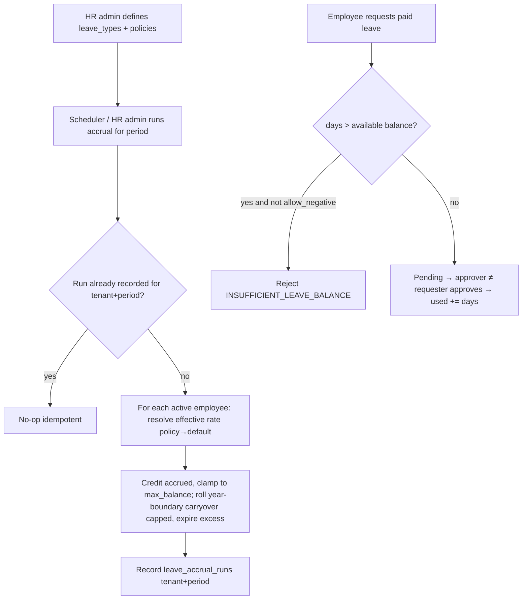
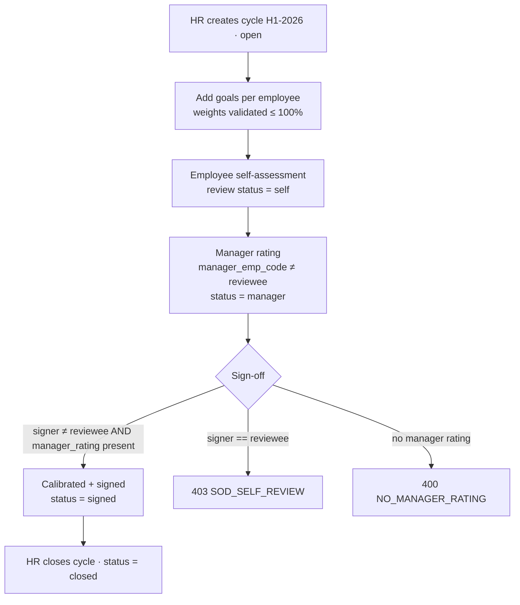
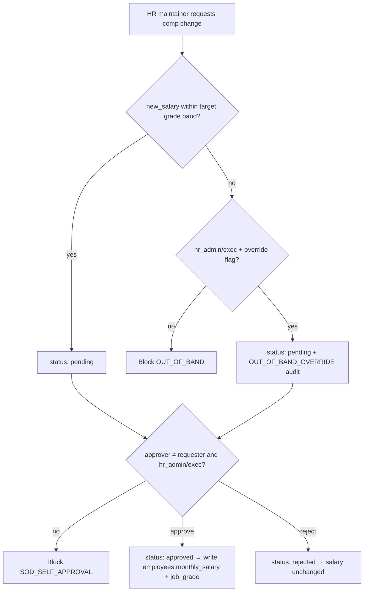
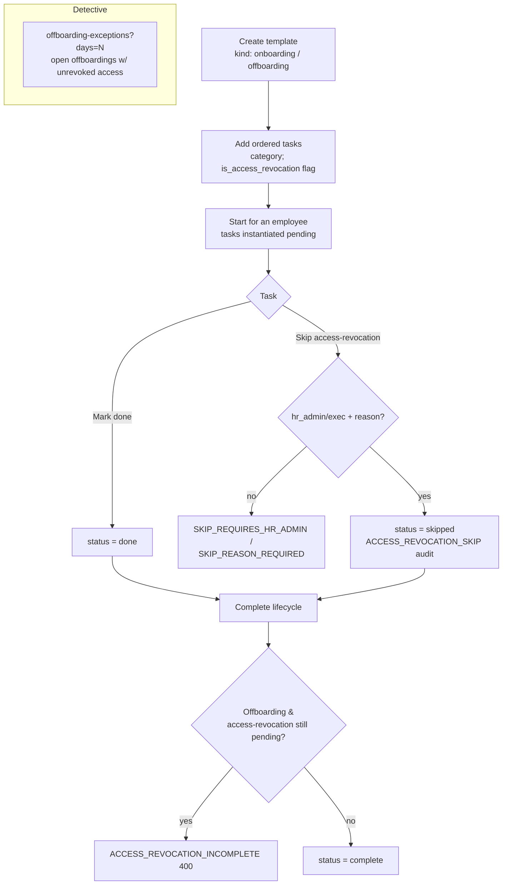
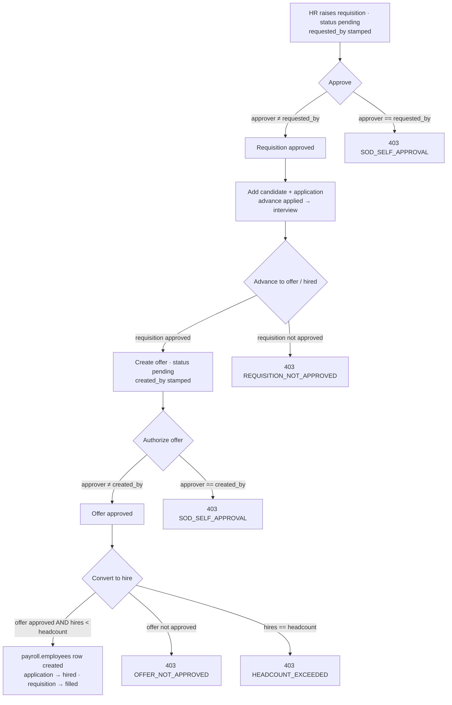
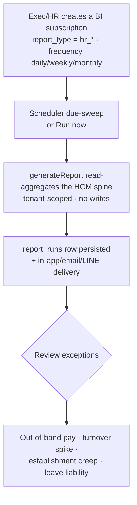

# Human Resources (HCM) — Process Narrative

> HCM depth cycle (docs/42). This narrative is built up wave-by-wave; each HR feature owns a self-contained
> section so parallel PRs merge keep-both. HR-2 (leave accrual) is documented in §7; the HR-3 performance-
> management section is appended self-contained below.

## 1. Document control

| Field | Value |
|---|---|
| Process ID | PN-29-HR |
| Process owner | `<
>` |
| Approver | `<<CHRO / CFO>>` |
| Version | **0.1 DRAFT** |
| Effective date | `<<effective-date>>` |
| Review cadence | Annual + on policy change |
| Related RCM controls | HR-02 (leave accrual + entitlement gate); see also PAY-01..06 |
| Related policy | `compliance/policies/03-delegation-of-authority.md` |

## 2. Purpose

To control the human-capital lifecycle on the `payroll.employees` master so that leave entitlement,
org structure, performance and the rest of the HCM suite are administered **accurately, consistently and
with maker-checker segregation**, feeding payroll and the statutory record.

## 3. Scope

**In scope:** leave types/policies and the accrual engine (HR-2). Further HCM waves (org structure,
performance, recruiting, onboarding, compensation) attach their own sections as they land.

**Out of scope:** gross-to-net payroll computation and statutory filings (see `05-payroll.md`).

## 4. References

- `compliance/Oshinei_ERP_SOX_RCM_v1.xlsx` — HR-02.
- Code: `apps/api/src/modules/hcm/` (`hcm-leave.service.ts`, `hcm.service.ts`), `apps/api/src/database/schema/hcm-leave.ts`.
- Migration `apps/api/drizzle/0321_hcm_leave_accrual.sql`.
- ToE harness: `tools/cutover/src/hcm-leave.ts` (17 checks).

## 5. Definitions & abbreviations

| Term | Meaning |
|---|---|
| Leave type | A category of leave (ANNUAL/SICK/PERSONAL/…) carrying an accrual method + caps |
| Accrual method | `monthly` (per period), `anniversary` (in the hire month), or `none` |
| Policy override | A higher accrual rate for a given job grade and/or minimum tenure |
| Carryover | Prior-year remaining balance rolled forward, capped at `carryover_cap_days` |
| Available balance | `entitled + accrued + carryover − used − expired` |

## 6. Roles & permissions

| Duty | Permission | Notes |
|---|---|---|
| View HR workspace / balances | `hr`, `hr_admin`, `exec`, `ess` (own) | reads only |
| Configure leave types / policies | `hr_admin`, `exec` | master-data maintenance |
| Run leave accrual | `hr_admin`, `exec` | privileged batch |
| Approve a leave request | `exec` / `users` / `creditors` (≠ requester) | maker-checker, SOD_SELF_APPROVAL |

## 7. HR-2 — Leave accrual engine + policies (control HR-02)

### 7.1 Narrative

Leave balances were previously static (`entitled`/`used` only, entitled defaulting to 0). HR-2 turns them
into a real accrual model:

1. **Leave-type master** (`leave_types`) — per tenant: `code`, `name`, `accrual_method`
   (`monthly`|`anniversary`|`none`), `accrual_rate_days` (days per period), `carryover_cap_days`,
   `max_balance_days` (0 = uncapped), `allow_negative`.
2. **Policy overrides** (`leave_policies`) — raise the base rate for a `job_grade` and/or a
   `min_tenure_months` threshold. The effective rate is the **highest matching** policy, else the type default.
3. **Accrual run** (`POST /api/hcm/leave/accrual/run {period}`, or the schedulable `hr_leave_accrual` BI
   action job) — for each **active** employee it credits `accrued` on the `(employee, type, year)` balance,
   clamped so the balance never exceeds `max_balance_days`. At the **year boundary** the prior year's
   remaining balance rolls into `carryover` (capped at `carryover_cap_days`); the excess is recorded as
   `expired` on the prior-year row. The run is **idempotent per `(tenant, period)`** — a re-run is a no-op
   guarded by `leave_accrual_runs`.
4. **Entitlement gate (HR-02)** — `requestLeave` blocks a **paid** request whose days exceed the available
   balance with `INSUFFICIENT_LEAVE_BALANCE`, unless the leave type is unconfigured (legacy back-compat) or
   allows a negative balance. Unpaid leave is not gated. Approval remains maker-checker (approver ≠ requester,
   `SOD_SELF_APPROVAL`).

### 7.2 Endpoints

| Method | Route | Permission |
|---|---|---|
| GET | `/api/hcm/leave/types` | hr / hr_admin / exec / ess |
| POST | `/api/hcm/leave/types` | hr_admin / exec |
| GET | `/api/hcm/leave/policies` | hr / hr_admin / exec |
| POST | `/api/hcm/leave/policies` | hr_admin / exec |
| GET | `/api/hcm/leave/balances?emp_code=` | hr / hr_admin / exec / ess |
| POST | `/api/hcm/leave/accrual/run` | hr_admin / exec |

### 7.3 Workflow

### 7.4 Control matrix

| Control | Type | Assertion | Test |
|---|---|---|---|
| HR-02 | Preventive/Automated | Accrual is policy/grade/tenure-driven and idempotent per period; a paid request beyond available balance is blocked | `tools/cutover/src/hcm-leave.ts` (17 checks); UAT-HR-01..08 |

## 8. Revision history

| Version | Date | Author | Change |
|---|---|---|---|
| 0.1 DRAFT | 2026-07-11 | HR-2 | Initial HR narrative; HR-2 leave accrual engine + entitlement gate (control HR-02, migration 0321). |

---

# HR-3 — Performance management (control HR-03) — appended section

> Self-contained HR-3 performance-management narrative; kept on merge alongside the HR-2 leave section above.

## PM.1 Document control (HR-3)

| Field | Value |
|---|---|
| Process ID | PN-29-HR (HR-3 performance) |
| Process owner | `<
>` |
| Approver | `<<CHRO / CFO>>` |
| Version | **0.1 DRAFT** |
| Effective date | `<<effective-date>>` |
| Review cadence | Each appraisal cycle + annual |
| Related RCM controls | HR-03; SoD (maker-checker on review sign-off) |
| Related plan | `docs/42-hcm-depth-plan.md` |

## 2. Purpose

To control the performance-appraisal cycle so that employee goals are set coherently, ratings are made
independently of the person being rated, and the final appraisal is signed off by someone **other than the
reviewee** — protecting the integrity of the ratings that drive pay rises, bonuses and promotions.

## 3. Scope

**In scope:** appraisal cycles (`perf_cycles`), OKR-style goals with weightings (`perf_goals`), and the
self → manager → calibration → sign-off review workflow (`perf_reviews`). Employee master is
`payroll.employees` (by `emp_code`).

**Out of scope:** payroll computation/posting (see `05-payroll.md`), time & attendance and leave (see
`25-hcm-time-labor.md`).

## 4. Roles & permissions

| Duty | Permission | Notes |
|---|---|---|
| View cycles / goals / reviews | `hr`, `hr_admin`, `exec` (or `ess` self-scoped to own rows) | Reads |
| Create cycle, goals, self/manager review | `hr`, `hr_admin` | Writes |
| Close cycle, sign off appraisal | `hr_admin`, `exec` | Elevated HR duty |

## 5. Workflow

## 6. Control matrix

| Control | Assertion | What it prevents | Enforcement |
|---|---|---|---|
| **HR-03** | Authorization / Segregation of Duties | A self-rated / self-signed appraisal inflating ratings that drive pay; incoherent goal weightings | `managerRate` rejects `manager_emp_code == emp_code` (`SOD_SELF_REVIEW`); `signReview` rejects a signer whose linked employee `== emp_code` (`SOD_SELF_REVIEW`) or a review with no manager rating (`NO_MANAGER_RATING`); `createGoal` rejects weights summing `> 100%` (`WEIGHT_EXCEEDED`) |

## 7. Endpoints (application)

| Endpoint | Permission | Purpose |
|---|---|---|
| `GET /api/hcm/performance/cycles` | read | List appraisal cycles |
| `POST /api/hcm/performance/cycles` | `hr`/`hr_admin` | Create a cycle (`open`) |
| `POST /api/hcm/performance/cycles/:id/close` | `hr_admin`/`exec` | Close a cycle |
| `GET/POST /api/hcm/performance/goals` | read / `hr`,`hr_admin` | List / add goals (weights ≤ 100%) |
| `PATCH /api/hcm/performance/goals/:id` | `hr`/`hr_admin` | Update progress / status |
| `POST /api/hcm/performance/reviews` | `hr`/`hr_admin` | Self-assessment (status `self`) |
| `POST /api/hcm/performance/reviews/:id/manager` | `hr`/`hr_admin` | Manager rating (HR-03 SoD) |
| `POST /api/hcm/performance/reviews/:id/sign` | `hr_admin`/`exec` | Calibrate + sign off (HR-03 SoD) |

## 8. Error codes

| Code | HTTP | Meaning |
|---|---|---|
| `SOD_SELF_REVIEW` | 403 | Manager rating / sign-off attempted by the reviewee |
| `NO_MANAGER_RATING` | 400 | Sign-off attempted before a manager rating exists |
| `WEIGHT_EXCEEDED` | 400 | Goal weights for an employee/cycle would exceed 100% |
| `CYCLE_CLOSED` | 400 | Goal/review create attempted on a closed cycle |

## 9. System references

- Service/controller: `apps/api/src/modules/hcm/hcm-perf.service.ts`, `hcm-perf.controller.ts`
- Schema: `apps/api/src/database/schema/hcm-perf.ts`; migration `apps/api/drizzle/0322_hcm_performance.sql`
- Web: `apps/web/src/app/(internal)/hcm/performance/page.tsx` (`/hcm/performance`)
- ToE harness: `tools/cutover/src/hcm-perf.ts` (17 checks)

## 10. Revision history

| Version | Date | Author | Change |
|---|---|---|---|
| 0.1 DRAFT | 2026-07-11 | HR-3 | Initial performance-management narrative + HR-03 control matrix |

---

## HR-6 — Compensation bands + benefits (control HR-06)

> Self-contained HCM Wave 2 section (docs/42). Compensation control on the `payroll.employees` identity
> (emp_code). Merges keep-both with the other HR waves.

### HR6.1 Document control (HR-6)

| Field | Value |
|---|---|
| Process ID | PN-29-HR / HR-6 |
| Process owner | `<
>` |
| Approver | `<<CHRO / CFO>>` |
| Version | **0.1 DRAFT** |
| Related RCM control | HR-06 (comp-change maker-checker within band) |
| Related policy | `compliance/policies/03-delegation-of-authority.md` |

### HR6.2 Narrative

Compensation is administered on a per-tenant **pay-grade band register** (`pay_grades`) — each grade carries a
`[min, mid, max]` salary band and a currency (default THB). A salary or grade change to an employee is a
**comp change** (`comp_changes`) with a `change_type` of `hire` / `merit` / `promotion` / `adjustment`,
subject to the **HR-06 control**:

1. **Within-band validation at request time.** When the change names a target grade (`new_grade`), the proposed
   `new_salary` must fall inside that grade's `[min, max]` band. A salary outside the band is **blocked**
   (`OUT_OF_BAND`, 400) unless an `hr_admin`/`exec` sets an explicit **override flag** — the override is
   **audit-logged** (a `doc_status_log` `COMPCHG` row carrying `OUT_OF_BAND_OVERRIDE`) in addition to the
   append-only `audit_log`.
2. **Maker-checker on approval.** A comp change is created `pending` and writes **nothing** to the employee
   record. Approval requires a **different** user (`approved_by` ≠ `requested_by` → `SOD_SELF_APPROVAL`, 403)
   holding `hr_admin`/`exec`. The employee master (`payroll.employees.monthly_salary` + `job_grade`) is written
   **only on approval**; a **reject** leaves the salary unchanged.

**Benefits.** `benefit_plans` catalogues offerings (category `health`/`dental`/`life`/`provident_fund`/
`allowance`, with employer/employee monthly cost). `benefit_enrollments` link an employee to a plan
(effective-dated, end-datable; a duplicate active enrolment on the same plan is rejected `ALREADY_ENROLLED`).
Enrolment reads are `ess` **own-scoped** (an employee sees only their own). All four tables are tenant-scoped
(RLS) so bands, comp history and benefits never leak across companies.

### HR6.3 Workflow

### HR6.4 Endpoints (application)

| Endpoint | Permission | Purpose |
|---|---|---|
| `GET/POST /api/hcm/comp/grades` | read `hr`/`hr_admin`/`exec`; write `hr`/`hr_admin` | List / create pay-grade bands |
| `GET/POST /api/hcm/comp/changes` | read `hr`/`hr_admin`/`exec`; write `hr`/`hr_admin` | List / request comp changes (HR-06 band check) |
| `POST /api/hcm/comp/changes/:id/approve` | `hr_admin`/`exec` | Approve (≠ requester) → write employee master |
| `POST /api/hcm/comp/changes/:id/reject` | `hr_admin`/`exec` | Reject (salary unchanged) |
| `GET/POST /api/hcm/comp/benefit-plans` | read `hr`/`hr_admin`/`exec`; write `hr`/`hr_admin` | List / create benefit plans |
| `GET/POST /api/hcm/comp/enrollments` | read `hr`/`hr_admin`/`exec`/`ess` (own); write `hr`/`hr_admin` | List / create enrolments |
| `POST /api/hcm/comp/enrollments/:id/end` | `hr`/`hr_admin` | End an enrolment |

### HR6.5 Error codes

| Code | HTTP | Meaning |
|---|---|---|
| `OUT_OF_BAND` | 400 | `new_salary` outside the target grade band (no valid override) |
| `SOD_SELF_APPROVAL` | 403 | The requester attempted to approve their own comp change |
| `GRADE_EXISTS` / `PLAN_EXISTS` | 400 | Duplicate `grade_code` / `plan_code` for the tenant |
| `ALREADY_ENROLLED` | 400 | Duplicate active enrolment on the same plan |
| `GRADE_NOT_FOUND` / `PLAN_NOT_FOUND` / `EMP_NOT_FOUND` | 404 | Referenced grade / plan / employee not found |

### HR6.6 Control matrix

| Control | Assertion | What it prevents | Enforcement |
|---|---|---|---|
| **HR-06** | Authorization / Segregation of Duties | A salary set outside the sanctioned pay band or a self-approved raise, growing the payroll base without independent authorisation | `createChange` blocks `new_salary` outside `[min,max]` (`OUT_OF_BAND`) unless `hr_admin`/`exec` + override (audit-logged `OUT_OF_BAND_OVERRIDE`); `approveChange` rejects `approved_by == requested_by` (`SOD_SELF_APPROVAL`) and writes the employee master only on approval |

### HR6.7 System references

- Service/controller: `apps/api/src/modules/hcm/hcm-comp.service.ts`, `hcm-comp.controller.ts`
- Schema: `apps/api/src/database/schema/hcm-comp.ts`; migration `apps/api/drizzle/0325_hcm_comp.sql`
- Web: `apps/web/src/app/(internal)/hcm/comp/page.tsx` (`/hcm/comp`)
- ToE harness: `tools/cutover/src/hcm-comp.ts` (23 checks)

### HR6.8 Revision history

| Version | Date | Author | Change |
|---|---|---|---|
| 0.1 DRAFT | 2026-07-11 | HR-6 | Initial compensation-bands & benefits narrative + HR-06 control matrix |
# HR-5 — Onboarding / offboarding lifecycle (control HR-05) — appended section

> Self-contained HR-5 onboarding/offboarding narrative; kept on merge alongside the HR-2/HR-3 sections above.

## L.1 Document control (HR-5)

| Field | Value |
|---|---|
| Process ID | PN-29-HR (HR-5 lifecycle) |
| Version | **0.1 DRAFT** |
| Related RCM control | **HR-05** (offboarding access-revocation completeness — joiner-mover-leaver) |
| Related policy | `compliance/policies/03-delegation-of-authority.md` |

## L.2 Purpose & scope

Govern the employee **joiner-mover-leaver** lifecycle on the `payroll.employees` master with enforced
checklists, so that (a) new hires are provisioned consistently and (b) — the SOX control — a **terminated
employee's access is provably removed** before the offboarding is closed. In scope: checklist templates,
per-employee lifecycles, task completion, the access-revocation completion gate, and an exception register.
Out of scope: the identity-provider integration that physically disables accounts (the checklist records
that the removal was done/waived; it does not itself call the IdP).

## L.3 Roles & permissions

| Action | Permission |
|---|---|
| List templates / lifecycles / exceptions | `hr` / `hr_admin` / `exec` |
| Create templates & tasks, start a lifecycle, mark a task done, complete a lifecycle | `hr` / `hr_admin` |
| **Skip an access-revocation task** (with a reason) | `hr_admin` / `exec` (audit-logged) |

## L.4 Workflow

## L.5 Control matrix

| Control | Type | Description | Evidence |
|---|---|---|---|
| **HR-05** | Preventive/Detective, Automated | An **offboarding** lifecycle cannot be marked complete while any `is_access_revocation` task is still `pending` (`ACCESS_REVOCATION_INCOMPLETE`). Skipping such a task requires `hr_admin`/`exec` + a reason (`SKIP_REQUIRES_HR_ADMIN` / `SKIP_REASON_REQUIRED`) and is audit-logged (`doc_status_log` `EMPLIFECYCLE`, `ACCESS_REVOCATION_SKIP`). A detective read lists open offboardings with unrevoked access past N days. | `tools/cutover/src/hcm-onboarding.ts` (27 checks); UAT-HR-5xx |

## L.6 Endpoints (application)

| Endpoint | Permission | Purpose |
|---|---|---|
| `GET /api/hcm/lifecycle/templates` | read | List templates (+ their tasks); `?kind=` filter |
| `POST /api/hcm/lifecycle/templates` | `hr`/`hr_admin` | Create a template (`onboarding`/`offboarding`) |
| `POST /api/hcm/lifecycle/templates/:id/tasks` | `hr`/`hr_admin` | Add an ordered task (category; `is_access_revocation`) |
| `POST /api/hcm/lifecycle/start` | `hr`/`hr_admin` | Instantiate a template for an employee |
| `GET /api/hcm/lifecycle?emp_code=` | read | List an employee's lifecycles + tasks |
| `PATCH /api/hcm/lifecycle/tasks/:id` | `hr`/`hr_admin` | Mark a task `done`/`skipped` |
| `POST /api/hcm/lifecycle/:id/complete` | `hr`/`hr_admin` | Complete (HR-05 gate for offboarding) |
| `GET /api/hcm/lifecycle/offboarding-exceptions?days=N` | read | Detective: open offboardings with unrevoked access |

## L.7 Error codes

| Code | HTTP | Meaning |
|---|---|---|
| `ACCESS_REVOCATION_INCOMPLETE` | 400 | Offboarding completion attempted while an access-revocation task is pending |
| `SKIP_REQUIRES_HR_ADMIN` | 403 | An `hr`-only user tried to skip an access-revocation task |
| `SKIP_REASON_REQUIRED` | 400 | Skip of an access-revocation task without a reason |
| `TEMPLATE_EXISTS` | 400 | Duplicate template code |
| `TEMPLATE_EMPTY` | 400 | Start attempted on a template with no tasks |
| `EMP_NOT_FOUND` | 404 | Unknown `emp_code` on start |

## L.8 System references

- Service/controller: `apps/api/src/modules/hcm/hcm-lifecycle.service.ts`, `hcm-lifecycle.controller.ts`
- Schema: `apps/api/src/database/schema/hcm-lifecycle.ts`; migration `apps/api/drizzle/0324_hcm_lifecycle.sql`
- Web: `apps/web/src/app/(internal)/hcm/onboarding/` (`/hcm/onboarding`)
- ToE harness: `tools/cutover/src/hcm-onboarding.ts` (27 checks)

## L.9 Revision history

| Version | Date | Author | Change |
|---|---|---|---|
| 0.1 DRAFT | 2026-07-11 | HR-5 | Initial onboarding/offboarding lifecycle narrative + HR-05 access-revocation-completeness control (migration 0324). |
# HR-4 — Recruiting / ATS (control HR-04) — appended section

> Self-contained HR-4 recruiting/ATS narrative; kept on merge alongside the HR-2/HR-3 sections above.

## RC.1 Document control (HR-4)

| Field | Value |
|---|---|
| Process ID | PN-29-HR (HR-4 recruiting) |
| Process owner | `<
>` |
| Approver | `<<CHRO / CFO>>` |
| Version | **0.1 DRAFT** |
| Effective date | `<<effective-date>>` |
| Review cadence | Per requisition + annual |
| Related RCM controls | HR-04; SoD (maker-checker on requisition approval + offer authorization); headcount-bound hiring |
| Related plan | `docs/42-hcm-depth-plan.md` (Wave 2) |

## 2. Purpose

To control recruiting end-to-end so that no one can both request headcount and authorise it, no candidate
becomes an employee without an independently authorised offer, and the number of hires never exceeds the
approved requisition establishment — protecting the payroll base and the org plan from unbudgeted or
un-reviewed hires.

## 3. Scope

**In scope:** job requisitions (`job_requisitions`), the candidate talent pool (`candidates`), the
application pipeline (`applications`, stages applied → screen → interview → offer → hired/rejected), and
employment offers (`offers`). A hire converts an accepted+approved offer into a `payroll.employees` row
(by `emp_code`); positions link `hr_positions` (HR-1).

**Out of scope:** payroll computation/posting (see `05-payroll.md`), org establishment maintenance
(`hcm-org`, HR-1), onboarding after hire.

## 4. Roles & permissions

| Duty | Permission | Notes |
|---|---|---|
| View requisitions / candidates / applications / offers | `hr`, `hr_admin`, `exec` | Reads |
| Create requisition / candidate / application, advance stage, create offer | `hr`, `hr_admin` | Writes |
| Approve/reject requisition, authorize offer, convert offer to hire | `hr_admin`, `exec` | Elevated HR duty; approver ≠ maker (HR-04) |

## 5. Workflow

## 6. Control matrix

| Control | Assertion | What it prevents | Enforcement |
|---|---|---|---|
| **HR-04** | Authorization / Segregation of Duties | A self-authorised requisition, a self-approved offer, an unauthorised hire, or hiring beyond the approved establishment | `approveRequisition` rejects `requested_by == approver` (`SOD_SELF_APPROVAL`); the offer/hired stages require an `approved` requisition (`REQUISITION_NOT_APPROVED`); `approveOffer` rejects `created_by == approver` (`SOD_SELF_APPROVAL`); `convertOffer` requires an `approved` offer (`OFFER_NOT_APPROVED`) and blocks hires beyond `headcount` (`HEADCOUNT_EXCEEDED`) |

## 7. Endpoints (application)

| Endpoint | Permission | Purpose |
|---|---|---|
| `GET /api/hcm/recruiting/requisitions` | read | List job requisitions (with hired vs headcount) |
| `POST /api/hcm/recruiting/requisitions` | `hr`/`hr_admin` | Raise a requisition (`pending`) |
| `POST /api/hcm/recruiting/requisitions/:reqNo/approve` | `hr_admin`/`exec` | Approve (HR-04 maker-checker) |
| `POST /api/hcm/recruiting/requisitions/:reqNo/reject` | `hr_admin`/`exec` | Reject a requisition |
| `GET/POST /api/hcm/recruiting/candidates` | read / `hr`,`hr_admin` | List / add candidates |
| `GET/POST /api/hcm/recruiting/applications` | read / `hr`,`hr_admin` | List / create pipeline applications |
| `PATCH /api/hcm/recruiting/applications/:id/stage` | `hr`/`hr_admin` | Advance stage (HR-04 gates) |
| `GET/POST /api/hcm/recruiting/offers` | read / `hr`,`hr_admin` | List / create offers |
| `POST /api/hcm/recruiting/offers/:id/approve` | `hr_admin`/`exec` | Authorize offer (HR-04 SoD) |
| `POST /api/hcm/recruiting/offers/:id/convert` | `hr_admin`/`exec` | Convert to a `payroll.employees` hire |

## 8. Error codes

| Code | HTTP | Meaning |
|---|---|---|
| `SOD_SELF_APPROVAL` | 403 | Requisition/offer approved by its own maker |
| `REQUISITION_NOT_APPROVED` | 403 | Offer/hire stage attempted before the requisition is approved |
| `OFFER_NOT_APPROVED` | 403 | Convert attempted before the offer is authorized |
| `HEADCOUNT_EXCEEDED` | 403 | Hire attempted beyond the requisition headcount |
| `REQUISITION_EXISTS` / `CANDIDATE_EXISTS` | 400 | Duplicate `req_no` / `cand_no` for the tenant |

## 9. System references

- Service/controller: `apps/api/src/modules/hcm/hcm-recruiting.service.ts`, `hcm-recruiting.controller.ts`
- Schema: `apps/api/src/database/schema/hcm-recruiting.ts`; migration `apps/api/drizzle/0323_hcm_recruiting.sql`
- Web: `apps/web/src/app/(internal)/hcm/recruiting/page.tsx` (`/hcm/recruiting`)
- ToE harness: `tools/cutover/src/hcm-recruiting.ts` (20 checks)

## 10. Revision history

| Version | Date | Author | Change |
|---|---|---|---|
| 0.1 DRAFT | 2026-07-11 | HR-4 | Initial recruiting/ATS narrative + HR-04 control matrix (migration 0323) |

# HR-9 — Workforce analytics (control HR-09) — appended section

> Self-contained HR-9 workforce-analytics narrative; kept on merge alongside the HR-2/3/4/5/6 sections above.

## WA.1 Document control (HR-9)

| Field | Value |
|---|---|
| Process ID | PN-29-HR (HR-9 workforce analytics) |
| Process owner | `<
>` |
| Approver | `<<CHRO / CFO>>` |
| Version | **0.1 DRAFT** |
| Effective date | `<<effective-date>>` |
| Review cadence | Monthly / quarterly workforce review |
| Related RCM controls | HR-09 (detective — monitoring / analytical review) |
| Related plan | `docs/42-hcm-depth-plan.md` (Wave 3) |

## WA.2 Purpose & scope

To give management a recurring, independent analytical review over the workforce base so that establishment
creep, above-tolerance attrition, out-of-band pay and understated leave liability are detected on a cadence
rather than only on an ad-hoc pull.

**In scope:** five read-only, schedulable, tenant-scoped BI report types aggregating the existing HCM spine —
`payroll.employees`, `hr_assignments`/`hr_positions`/`hr_departments` (HR-1), `employee_lifecycle` (HR-5),
`pay_grades` (HR-6) and `leave_balances` (HR-2). No new tables and no writes.

**Out of scope:** the transactional HR controls themselves (headcount governance HR-01, leave accrual HR-02,
performance HR-03, recruiting HR-04, lifecycle HR-05, comp-change HR-06) — the analytics *review* their output,
they do not replace those preventive/maker-checker controls.

## WA.3 Report types

| Report type | What it aggregates | Key outputs |
|---|---|---|
| `hr_headcount_trend` | Active headcount by department & position from the CURRENT org assignments (`end_date IS NULL`), plus a hire-cohort trend | `total_active`, `by_department[]`, `by_position[]`, `by_hire_month[]` |
| `hr_turnover` | Attrition over a window (default 12 months). Separations = completed HR-5 **offboarding** lifecycles ÷ average headcount | `separations`, `active_headcount`, `avg_headcount`, `turnover_pct` |
| `hr_tenure_distribution` | Tenure buckets from `start_date` (<1y, 1-3y, 3-5y, 5-10y, 10y+, unknown) | `total`, `avg_tenure_months`, `buckets[]` |
| `hr_comp_ratio` | Each active employee's salary vs the HR-6 `pay_grades` `[min,mid,max]` band; comp ratio = salary ÷ midpoint; flags OUT-OF-BAND (above max / below min) | `count_rated`, `ungraded`, `avg_comp_ratio`, `employees_out_of_band`, `by_grade[]`, `out_of_band[]` |
| `hr_leave_liability` | Accrued-but-untaken days (`entitled+accrued+carryover−used−expired`) valued at salary ÷ working-days (default 22) | `total_untaken_days`, `total_liability`, `by_leave_type[]`, `by_employee[]` |

Each is an idempotent read-aggregation, runs through the existing BI subscription scheduler
(`POST /api/bi/subscriptions` + a `daily`/`weekly`/`monthly` frequency → each run persists to `report_runs`,
deliverable by email/LINE/in-app), and is tenant-scoped (explicit tenant filter + RLS) so one company's
workforce metrics never leak to another. Optional filters: `window_months` (turnover), `working_days`
(leave liability).

## WA.4 Workflow

## WA.5 Control matrix

| Control | Assertion | What it detects | Enforcement |
|---|---|---|---|
| **HR-09** | Monitoring / analytical review (detective) | Establishment creep, above-tolerance attrition, out-of-band pay, understated leave liability going unreviewed | Five schedulable read-only report types persist headcount/turnover/tenure/comp-ratio/leave-liability to `report_runs` on a cadence; each is tenant-scoped (RLS) and idempotent; `hr_comp_ratio` flags salaries outside the `pay_grades` band and `hr_leave_liability` values untaken leave for the provision review |

## WA.6 Endpoints (application)

| Endpoint | Permission | Purpose |
|---|---|---|
| `GET /api/bi/report-types` | `exec` | Catalog exposes the five `hr_*` workforce-analytics report types |
| `POST /api/bi/subscriptions` | `exec` | Schedule a workforce-analytics report (`report_type`, `frequency`, `filters`) |
| `POST /api/bi/subscriptions/:id/run` | `exec` | Run now; persists the aggregate to `report_runs` |
| `GET /api/bi/runs` | `exec` | Review persisted report runs |

## WA.7 System references

- Report registry: `apps/api/src/modules/bi/report-registry.ts` (`hr_headcount_trend`, `hr_turnover`, `hr_tenure_distribution`, `hr_comp_ratio`, `hr_leave_liability`)
- Generation branches: `apps/api/src/modules/bi/bi-generate.service.ts` (`generateReport`)
- Web: `apps/web/src/app/(internal)/scheduled-reports/page.tsx` (`/scheduled-reports` — data-driven from the report-type catalog; no new page)
- ToE harness: `tools/cutover/src/hcm-analytics.ts` (23 checks)

## WA.8 Revision history

| Version | Date | Author | Change |
|---|---|---|---|
| 0.1 DRAFT | 2026-07-11 | HR-9 | Initial workforce-analytics narrative + HR-09 detective control matrix (five BI report types; no migration) |
