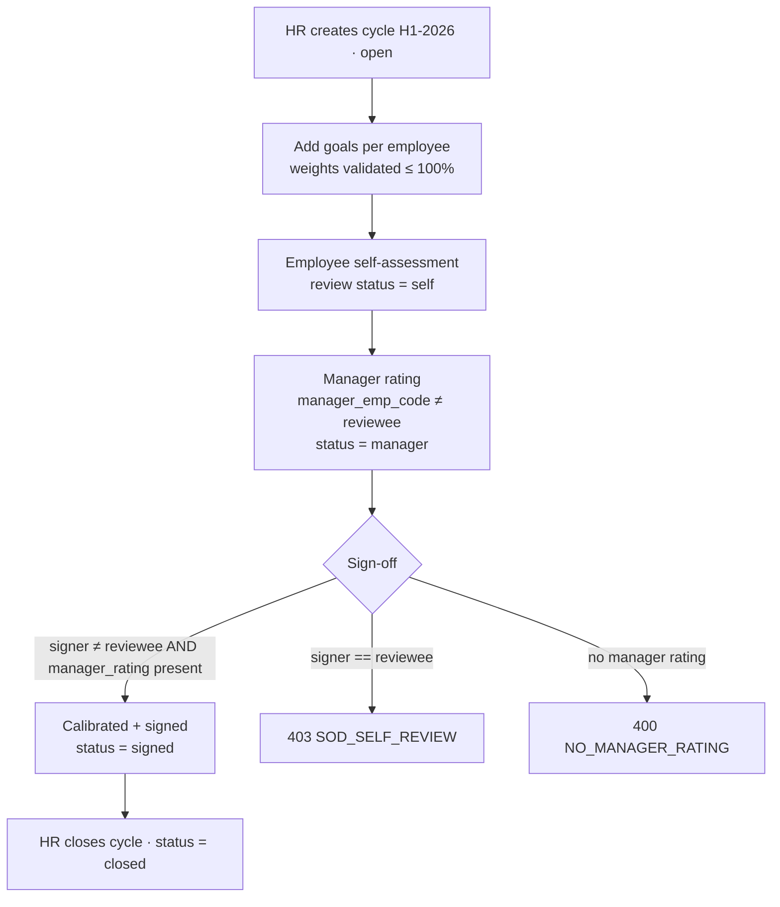

# Human Resources — Performance management (HR-3) — Process Narrative

> Note for merge: this file may be co-authored by several HR/HCM-depth agents. This section (HR-3 Performance
> management) is self-contained — keep BOTH this section and any sibling HR sections on merge.

## 1. Document control

| Field | Value |
|---|---|
| Process ID | PN-29-HR |
| Process owner | `<
>` |
| Approver | `<<CHRO / CFO>>` |
| Version | **0.1 DRAFT** |
| Effective date | `<<effective-date>>` |
| Review cadence | Each appraisal cycle + annual |
| Related RCM controls | HR-03; SoD (maker-checker on review sign-off) |
| Related plan | `docs/42-hcm-depth-plan.md` |

## 2. Purpose

To control the performance-appraisal cycle so that employee goals are set coherently, ratings are made
independently of the person being rated, and the final appraisal is signed off by someone **other than the
reviewee** — protecting the integrity of the ratings that drive pay rises, bonuses and promotions.

## 3. Scope

**In scope:** appraisal cycles (`perf_cycles`), OKR-style goals with weightings (`perf_goals`), and the
self → manager → calibration → sign-off review workflow (`perf_reviews`). Employee master is
`payroll.employees` (by `emp_code`).

**Out of scope:** payroll computation/posting (see `05-payroll.md`), time & attendance and leave (see
`25-hcm-time-labor.md`).

## 4. Roles & permissions

| Duty | Permission | Notes |
|---|---|---|
| View cycles / goals / reviews | `hr`, `hr_admin`, `exec` (or `ess` self-scoped to own rows) | Reads |
| Create cycle, goals, self/manager review | `hr`, `hr_admin` | Writes |
| Close cycle, sign off appraisal | `hr_admin`, `exec` | Elevated HR duty |

## 5. Workflow

## 6. Control matrix

| Control | Assertion | What it prevents | Enforcement |
|---|---|---|---|
| **HR-03** | Authorization / Segregation of Duties | A self-rated / self-signed appraisal inflating ratings that drive pay; incoherent goal weightings | `managerRate` rejects `manager_emp_code == emp_code` (`SOD_SELF_REVIEW`); `signReview` rejects a signer whose linked employee `== emp_code` (`SOD_SELF_REVIEW`) or a review with no manager rating (`NO_MANAGER_RATING`); `createGoal` rejects weights summing `> 100%` (`WEIGHT_EXCEEDED`) |

## 7. Endpoints (application)

| Endpoint | Permission | Purpose |
|---|---|---|
| `GET /api/hcm/performance/cycles` | read | List appraisal cycles |
| `POST /api/hcm/performance/cycles` | `hr`/`hr_admin` | Create a cycle (`open`) |
| `POST /api/hcm/performance/cycles/:id/close` | `hr_admin`/`exec` | Close a cycle |
| `GET/POST /api/hcm/performance/goals` | read / `hr`,`hr_admin` | List / add goals (weights ≤ 100%) |
| `PATCH /api/hcm/performance/goals/:id` | `hr`/`hr_admin` | Update progress / status |
| `POST /api/hcm/performance/reviews` | `hr`/`hr_admin` | Self-assessment (status `self`) |
| `POST /api/hcm/performance/reviews/:id/manager` | `hr`/`hr_admin` | Manager rating (HR-03 SoD) |
| `POST /api/hcm/performance/reviews/:id/sign` | `hr_admin`/`exec` | Calibrate + sign off (HR-03 SoD) |

## 8. Error codes

| Code | HTTP | Meaning |
|---|---|---|
| `SOD_SELF_REVIEW` | 403 | Manager rating / sign-off attempted by the reviewee |
| `NO_MANAGER_RATING` | 400 | Sign-off attempted before a manager rating exists |
| `WEIGHT_EXCEEDED` | 400 | Goal weights for an employee/cycle would exceed 100% |
| `CYCLE_CLOSED` | 400 | Goal/review create attempted on a closed cycle |

## 9. System references

- Service/controller: `apps/api/src/modules/hcm/hcm-perf.service.ts`, `hcm-perf.controller.ts`
- Schema: `apps/api/src/database/schema/hcm-perf.ts`; migration `apps/api/drizzle/0322_hcm_performance.sql`
- Web: `apps/web/src/app/(internal)/hcm/performance/page.tsx` (`/hcm/performance`)
- ToE harness: `tools/cutover/src/hcm-perf.ts` (17 checks)

## 10. Revision history

| Version | Date | Author | Change |
|---|---|---|---|
| 0.1 DRAFT | 2026-07-11 | HR-3 | Initial performance-management narrative + HR-03 control matrix |
