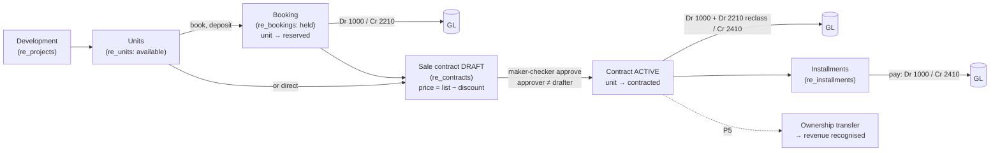

# Real-Estate Developer Sales — Process Narrative

## 1. Document control

| Field | Value |
|---|---|
| Process ID | PN-31-RESALE |
| Process owner | `<<Developer Sales / Property Controller>>` |
| Approver | `<<CFO>>` |
| Version | **0.1** |
| Effective date | `<<effective-date>>` |
| Review cadence | Annual + on significant change |
| Related | `docs/35-construction-realestate-vertical-plan.md` (Track D / P4); PN-16 (project accounting); PN-12 (revenue recognition — transfer, P5) |

## 2. Scope & context

A property **developer** sells **units** (condos/houses/land) from a **development** to buyers on **installment
plans**, with revenue recognised at **ownership transfer** (P5). This narrative covers the P4 lifecycle:
**unit inventory → booking → sale contract (maker-checker) → installments**. It is a distinct sub-ledger from
project job-costing (PN-16); it reuses the GL, `DocNumberService` and the AR/receipt posting path. The vertical
is **permission-gated** (`re_sales` / `re_contract_approve`) so a non-property tenant never sees it.

## 3. Process flow

- **Unit inventory (RE-01).** A unit's status machine is `available → reserved → contracted → transferred`.
  A **booking** is admitted only when the unit is **available** (`UNIT_NOT_AVAILABLE`) and flips it to
  *reserved*; a **contract** is admitted only when *available/reserved* (`UNIT_NOT_CONTRACTABLE`), re-checked at
  approval, and flips it to *contracted* — so a unit is never double-allocated. The availability grid
  (`GET /api/realestate/developments/:code/units`) ties to the live counts.
- **Sale contract, maker-checker (RE-02).** A contract is **drafted** with `price = list_price − discount`
  (bounds: `BAD_DISCOUNT`, `BAD_DOWN_PAYMENT`) and posts **nothing** until approved. An **independent approver**
  (`re_contract_approve`, ≠ the drafter → `SOD_SELF_APPROVAL`, **SoD R19**; draft-only → `CONTRACT_NOT_DRAFT`)
  approves it — flipping the unit to *contracted*, converting the booking, posting the **down-payment to the
  contract liability** (Dr 1000 cash + Dr 2210 reclass of the booking deposit / **Cr 2410**) and generating the
  installment schedule. The price/discount authority is segregated from the salesperson.
- **Installments (RE-03).** Each installment is paid **exactly once** (`INSTALLMENT_PAID`) for **exactly** its
  scheduled amount (`BAD_AMOUNT`), posting **Dr 1000 / Cr 2410** and idempotent per `(contract, seq)`. The
  contract read model rolls up `installments_paid` + `outstanding`, reconciling to the 2410 control.

Cash received before transfer sits in **contract liability 2410** / **customer deposits 2210** — **no revenue
is recognised** in P4; recognition + unit-cost relief happen at **ownership transfer (P5, PN-12)**.

## 4. Controls

| Control | Type | Assertion |
|---|---|---|
| **RE-01** | Preventive | Unit-inventory integrity — a unit can't be double-booked/contracted; the availability grid ties to unit states. |
| **RE-02** | Preventive | Sale-contract price/discount authority — draft-then-approve maker-checker (approver ≠ drafter, SoD R19); down-payment → contract liability on approval. |
| **RE-03** | Preventive | Installment application — pay-once, exact-amount, idempotent; buyer position + 2410 control reconcile. |

RCM controls added via `compliance/build_rcm.py` (RCM **189**; census 189/186). GL accounts reused (no new
accounts): cash **1000**, customer deposits **2210**, contract liability **2410**.

## 5. Test evidence

- `tools/cutover/src/projects.ts` (RE-01/02/03): unit grid + availability tie-out, book → reserved + re-book →
  `UNIT_NOT_AVAILABLE`, draft contract + self-approve → `SOD_SELF_APPROVAL`, approve → down-payment JE
  (1000/2210/2410) + 4-installment schedule, pay-once/exact-amount (`INSTALLMENT_PAID`/`BAD_AMOUNT`),
  `BAD_DISCOUNT`/`BAD_DOWN_PAYMENT`, `UNIT_NOT_CONTRACTABLE`.
- UAT: `docs/uat/12-real-estate-uat.md` (UAT-RE-01..03).

## 6. Out of scope (P4) / roadmap

Ownership **transfer** + revenue recognition + transfer taxes (**RE-04**), the dedicated RE **workspace/nav**,
overdue-installment **dunning**, retention/holdback, and mortgage/loan-bank integration are **P5 / fast-follow**
(`docs/35` Track D, D3–D4).

## Revision history

| Version | Date | Author | Notes |
|---|---|---|---|
| 0.2 | 2026-07-05 | Platform | **P5 — ownership transfer + revenue recognition (RE-04).** `POST /api/realestate/contracts/:no/transfer` is an **authorised** (`re_transfer`), **fully-settled-only** (`NOT_FULLY_SETTLED`), idempotent act: the deferred cash in the contract liability (2410) is recognised as **revenue** (Dr 2410 / Cr 4200) at handover and the unit's **construction cost** is relieved (Dr 5800 / Cr 1200), flipping unit + contract to `transferred`. Migration 0255 (`re_units.cost`, `re_contracts.transfer_entry_no/transferred_at`). Also the scheduled sweeps (Depth-5): `re_booking_expire` (frees lapsed bookings) + `re_installment_overdue` (worklist). RCM 187. |
| 0.1 | 2026-07-05 | Platform | Initial — real-estate developer sales P4 (units/booking/contract/installments), controls RE-01/02/03, SoD R19 (docs/35 Track D). Transfer/recognition (RE-04) + workspace deferred to P5. |
