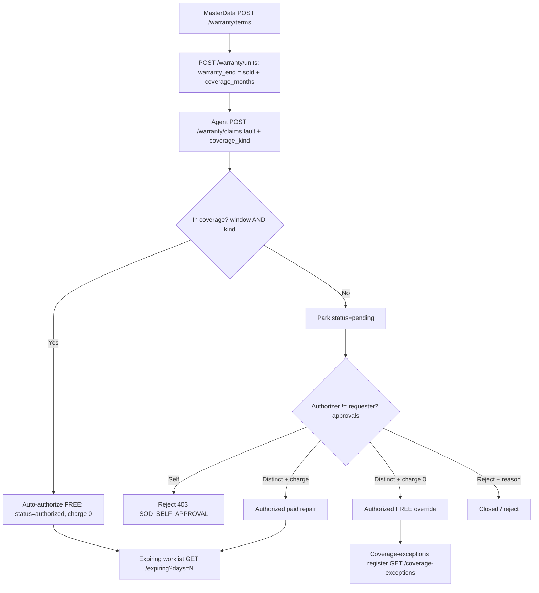

# After-Sales — Warranty & Entitlement — Process Narrative

## 1. Document control

| Field | Value |
|---|---|
| Process ID | PN-32-SVC |
| Process owner | `<<Service Manager>>` |
| Approver | `<<CFO>>` |
| Version | **0.2 DRAFT** |
| Effective date | `<<effective-date>>` |
| Review cadence | Annual + on significant change |
| Related RCM controls | SVC-01; SVC-04 (support cases / Email-to-Case completeness); SoD (requester ≠ authorizer) |
| Related policy | `compliance/policies/03-delegation-of-authority.md` |

## 2. Purpose

To define and control the warranty & entitlement lifecycle for serialized units sold to customers — so that
every warranty term, every sold unit (serial), and every warranty claim resolves to an accurate coverage
position, and so that **free warranty service or replacement goods are granted only against a valid
entitlement**. The core control (**SVC-01**) is a coverage-authorization gate: an in-coverage claim
auto-authorizes free (it is contractually covered), while any out-of-coverage claim — an expired unit, or a
fault the coverage type does not cover — can be authorized (especially free of charge) only by a **different**
user than the one who raised it, preventing unauthorized free service/goods leakage.

## 3. Scope

**In scope:** warranty-term catalogue (`POST/GET /api/service/warranty/terms`), the installed-base
serialized-unit registry with a computed warranty window (`POST/GET /api/service/warranty/units[/:id]`),
warranty-claim raise with the automatic coverage check (`POST /api/service/warranty/claims`), the
coverage-authorization maker-checker (`POST /api/service/warranty/claims/:id/authorize|reject`), and the two
detective reads — the expiring-warranty worklist (`GET /api/service/warranty/expiring?days=N`) and the
coverage-exceptions override register (`GET /api/service/warranty/coverage-exceptions`).

**Out of scope:** the subscription + SLA service spine (`/api/service/contracts|subscriptions|events`, see the
subscription/SLA narrative); any GL posting for a service-order cost (v1 posts **no** GL — a service-order
cost recognition is future work); customer/inbound sales claims on order lines (see
`21-returns-claims-refunds.md`).

## 4. References

- ISO 9001:2015 cl. 8.5.5 (post-delivery activities — incl. warranty), cl. 8.2 (customer communication).
- `compliance/Oshinei_ERP_SOX_RCM_v1.xlsx` — SVC-01.
- Code: `apps/api/src/modules/service-warranty/service-warranty.service.ts`,
  `apps/api/src/modules/service-warranty/service-warranty.controller.ts`,
  `apps/api/src/database/schema/service-warranty.ts`, migration `apps/api/drizzle/0329_service_warranty.sql`.
- ToE: `tools/cutover/src/warranty.ts` (20 checks).

## 5. Definitions & abbreviations

| Term | Meaning |
|---|---|
| Warranty term | A per-tenant offering: `coverage_months` + `coverage_type` (parts / labor / full) |
| Installed base | The serialized-unit / asset registry — a sold unit (serial, unique per tenant) tied to a customer, item, and warranty term |
| `warranty_end` | The coverage expiry, **computed** at registration as `sold_date + coverage_months` |
| In coverage | `reported_date` within `[warranty_start, warranty_end]` **and** the unit's `coverage_type` covers the claim kind (`full` covers any; else the kinds must match) |
| WCL- | Warranty-claim document-number prefix (`WCL-00001`) |
| Coverage exception | A claim authorized **free** (charge 0) that was actually **out of coverage** — an override recorded for audit sampling |

## 6. Roles & responsibilities (RACI)

Single-duty separation enforces the SVC-01 maker-checker: the person who **raises** a claim is never the
person who **authorizes/rejects** it (`authorized_by ≠ requested_by`). Reads gate `exec` / `marketing`;
catalogue + registry writes gate `masterdata`; a claim raise gates `exec`; authorize/reject gate `approvals`.
Data is RLS-scoped so a cross-tenant lookup resolves to not-found.

| Activity | Service Agent (`exec`) | MasterData (`masterdata`) | Approver (`approvals`) | Service Manager / Controller |
|---|---|---|---|---|
| Maintain warranty terms | I | **A/R** | I | C |
| Register a sold unit (installed base) | I | **A/R** | I | C |
| Raise a warranty claim | **A/R** | I | I | I |
| Authorize / reject a claim (≠ requester) | I | I | **A/R** | C |
| Review expiring warranties | R | I | I | **A/R** |
| Review coverage-exceptions register | I | I | I | **A/R** |

## 7. Process narrative

1. **Warranty-term catalogue.** MasterData creates warranty offerings (`term_code`, `name`,
   `coverage_months`, `coverage_type` parts/labor/full). A duplicate `term_code` for a tenant → `TERM_EXISTS`;
   a non-positive `coverage_months` → `BAD_COVERAGE_MONTHS`.
2. **Installed-base registration.** MasterData registers a sold unit against a term. The system **computes**
   `warranty_end = warranty_start + coverage_months` (`warranty_start` defaults to `sold_date`) and snapshots
   the term's `coverage_type` onto the unit. Serial is unique per tenant (`SERIAL_EXISTS` on duplicate); an
   unknown/inactive term → `TERM_NOT_FOUND` / `TERM_INACTIVE`.
3. **Claim raise with the automatic coverage check (SVC-01).** A service agent raises a claim against a unit.
   The system evaluates coverage: **in coverage** = `reported_date` within `[warranty_start, warranty_end]`
   **and** the unit's `coverage_type` covers the claim's `coverage_kind` (`full` covers any; otherwise the
   kinds must match). A claim number `WCL-NNNNN` is issued and the coverage result is **snapshotted**
   (`is_in_coverage`).
   - **In coverage** → the claim **auto-authorizes free**: `status='authorized'`, `disposition='repair'`,
     `charge=0`, `authorized_by = requester` (it is contractually covered — no maker-checker needed).
   - **Out of coverage** (expired, or a kind the term does not cover) → the claim parks `status='pending'`
     and **moves nothing** until an independent authorize/reject.
4. **Coverage authorization (maker-checker — the SVC-01 preventive control).** A **different** user
   (`approvals`) actions a pending claim via `…/authorize`. The authorizer **must differ** from the requester
   (`authorized_by ≠ requested_by`), else **403 `SOD_SELF_APPROVAL`** (binds even Admin) — this is what stops
   one person granting themselves free service/goods on a non-covered unit. The authorizer sets a real
   `charge` (a paid repair) or deliberately authorizes `charge=0` (a **free-service override** on a
   non-covered unit). Re-deciding a non-pending claim → `CLAIM_NOT_PENDING`. A disposition other than
   `repair`/`replace` → `BAD_DISPOSITION`.
5. **Rejection.** `…/reject` closes a pending claim (`status='closed'`, `disposition='reject'`); a reason is
   mandatory (`REASON_REQUIRED`) and the rejector must also differ from the requester (`SOD_SELF_APPROVAL`).
6. **Expiring-warranty worklist (detective).** `GET …/expiring?days=N` lists active units whose
   `warranty_end` falls within the next N days — a renewal / proactive-service worklist. Read-only.
7. **Coverage-exceptions override register (detective — the SVC-01 sample population).** `GET
   …/coverage-exceptions` lists every claim authorized **free** (charge 0) that was actually **out of
   coverage** — exactly the overrides an auditor samples to confirm each free grant was independently
   authorized. Read-only, posts nothing.

## 8. Process flow

**Swimlane description by role:** **MasterData** maintains the warranty-term catalogue and registers sold
units (the **system** computes the warranty window). A **Service Agent** raises a claim; the **system**
coverage-checks it, auto-authorizing free when in coverage and parking it pending when out of coverage. An
independent **Approver** (a *different* user) authorizes a pending claim with a charge or a deliberate free
override, or rejects it with a reason — self-authorization is blocked (`SOD_SELF_APPROVAL`). The **Service
Manager / Controller** reviews the expiring-warranty worklist and the coverage-exceptions register (free
out-of-coverage overrides) as detective oversight. All data is RLS-scoped per tenant.

## 9. Control matrix

| Step | Risk | Control | Type | RCM ID | Evidence / Record |
|---|---|---|---|---|---|
| 3 | Free service/goods granted with no entitlement check | Automatic coverage check at raise (window + kind) snapshotted to `is_in_coverage`; in-coverage → auto-free, out-of-coverage → park pending | Prev / Auto | SVC-01 | `warranty.ts` ToE (in-coverage auto-free; expired + kind-mismatch park pending) |
| 4, 5 | One person grants themselves free service/goods (self-authorization) | Maker-checker: `authorized_by ≠ requested_by` → 403 `SOD_SELF_APPROVAL` (binds Admin); reject needs a reason | Prev / Auto | SVC-01 | `warranty.ts` ToE (self-authorize 403; distinct authorizer approves) |
| 4 | A decided claim re-opened / re-charged | `CLAIM_NOT_PENDING` guard on a non-pending claim | Prev / Auto | SVC-01 | Negative-path test |
| 2 | Duplicate serial / wrong warranty window | Serial unique per tenant (`SERIAL_EXISTS`); `warranty_end` computed from the term | Prev / Auto | SVC-01 | Registration test (computed end) |
| 7 | Free out-of-coverage overrides go unreviewed | Coverage-exceptions register lists authorized-free out-of-coverage claims | Det / Manual | SVC-01 | Exceptions-register read |
| 6 | Expiring warranties missed | Expiring worklist (units within N days of `warranty_end`) | Det / Manual | SVC-01 | Expiring read |
| all | Cross-tenant disclosure | RLS-scoped reads/writes (canonical 0232 policy) | Prev / Auto | SVC-01 | RLS isolation test |

## 10. Error codes

| Code | HTTP | Meaning |
|---|---|---|
| `TERM_EXISTS` | 409 | A warranty term with that `term_code` already exists for the tenant |
| `BAD_COVERAGE_MONTHS` | 400 | `coverage_months` is not a positive integer |
| `BAD_COVERAGE_TYPE` | 400 | `coverage_type` / `coverage_kind` not one of parts/labor/full |
| `TERM_NOT_FOUND` / `TERM_INACTIVE` | 404 / 400 | Warranty term missing / disabled |
| `SERIAL_EXISTS` | 409 | Serial already registered for the tenant |
| `UNIT_NOT_FOUND` | 404 | Installed-base unit not found (or another tenant's) |
| `CLAIM_NOT_FOUND` | 404 | Warranty claim not found (or another tenant's) |
| `CLAIM_NOT_PENDING` | 400 | Authorize/reject attempted on a non-pending claim |
| `SOD_SELF_APPROVAL` | 403 | The authorizer/rejector is the claim requester (segregation of duties) |
| `BAD_DISPOSITION` | 400 | Disposition on authorize is not `repair`/`replace` |
| `REASON_REQUIRED` | 400 | A reject reason was not supplied |
| `UNKNOWN_TENANT` | 401 | Email-to-Case inbound path tenant code does not resolve |
| `BAD_INBOUND_SECRET` / `WEBHOOK_STALE` / `INBOUND_UNVERIFIED` | 401 | Email-to-Case webhook auth: bad secret / stale timestamp (replay) / unconfigured secret in production |
| `CASE_NOT_FOUND` | 404 | Support case not found (or another tenant's) |
| `CASE_NOT_ACTIVE` | 400 | Resolve/pending attempted on a case that is not new/open/pending |
| `CASE_ALREADY_CLOSED` / `CASE_CLOSED` | 400 | Close attempted on a closed case / mutate attempted on a closed case |
| `CASE_NOT_CLOSED` | 400 | Reopen attempted on a case that is not resolved/closed |

## 10b. Support Cases & Email-to-Case (SVC-4 · control SVC-04)

Beyond warranty claims, the after-sales desk runs **support cases** — the governed record of a customer request
or complaint — and an **Email-to-Case** intake so that *no inbound customer email is ever dropped* (the SVC-04
completeness control).

**Case object (`service_cases`, migration 0350).** A case has a per-tenant `case_no` (`CASE-NNNNN`), a subject +
description, a **priority** (P1–P4), an owner/**assignee**, an optional CRM contact link (`contact_email`), and a
**governed status lifecycle**: `new → open → pending → resolved → closed`, with `reopen → open`. Transitions are
enforced by the service — `assign` moves `new → open` and records the owner; `pending` parks a case waiting on the
customer; `resolve` records a resolution note and timestamp; `close` is terminal; `reopen` returns a
resolved/closed case to `open`. Illegal transitions are rejected (`CASE_NOT_ACTIVE` / `CASE_ALREADY_CLOSED` /
`CASE_NOT_CLOSED`), so a case's resolution/closure state and its audit trail are reliable. The authenticated
surface (`GET/POST /api/service/cases[/:id[/assign|pending|resolve|close|reopen|reply]]`) is gated to the service
duties (`exec`/`marketing`).

**Email trail (`case_email_messages`).** Every inbound (customer → us) and outbound (us → customer) message is
appended, deduped per tenant on the provider **Message-ID**. An outbound `reply` embeds the case's stable thread
token (`[case:svct_…]`) so the customer's reply threads straight back onto the case.

**Email-to-Case webhook (SVC-04 completeness control).** A **public, no-JWT** webhook
(`POST /api/service/email-to-case/inbound/:tenantCode`, mirroring the CRM-6 inbound rail) receives the
provider-parsed email. Authenticity is the **per-tenant email shared secret / HMAC over the raw body**
(`verifyInboundWebhook`): a configured HMAC secret *requires* a valid signature, an optional timestamp enforces a
300-second freshness window against replay (`WEBHOOK_STALE`), a bad secret is rejected (`BAD_INBOUND_SECRET`), and
in production an *unconfigured* secret is **fail-closed** (`INBOUND_UNVERIFIED`); the tenant is resolved from the
path code (`UNKNOWN_TENANT`). Each authenticated inbound is then matched deterministically — **(1)** a per-case
thread token in the reply threads onto the exact case; **(2)** else the sender address threads onto their
most-recent **open** case; **(3)** else a **new case is opened** — so no customer email is dropped. Redeliveries
are idempotent (Message-ID dedupe), and a reply onto a resolved/closed case **reopens** it. The trail never posts
to the GL (v1).

**Verification.** `tools/cutover/src/service.ts` exercises the full SVC-4 surface (manual case lifecycle,
Email-to-Case new-case-on-unmatched, thread-token + contact threading, Message-ID idempotency, reopen-on-reply,
`UNKNOWN_TENANT`, illegal-transition rejects, and RLS tenant isolation).

## 11. Revision history

| Version | Date | Author | Summary |
|---|---|---|---|
| 0.1 DRAFT | 2026-07-11 | `<<author>>` | Initial narrative — SVC-2 Warranty & Entitlement registry (warranty terms, installed base, warranty claims) with control SVC-01 (coverage-authorization maker-checker) + expiring / coverage-exceptions detective reads. Migration 0329; harness `tools/cutover/src/warranty.ts` (20 checks). |
| 0.2 DRAFT | 2026-07-11 | `<<author>>` | Added **§10b — Support Cases & Email-to-Case (SVC-4, control SVC-04, migration 0350)**: the `service_cases` object with a governed status lifecycle (new→open→pending→resolved→closed, reopen) + priority/assignee/CRM-contact link, the append-only `case_email_messages` trail (Message-ID dedupe), and the public HMAC-authenticated Email-to-Case webhook that threads a reply onto its case (thread token → sender's open case) or opens a new case so no inbound email is dropped. Added the case + inbound error-code rows. Harness `tools/cutover/src/service.ts` (SVC-4 checks). |
