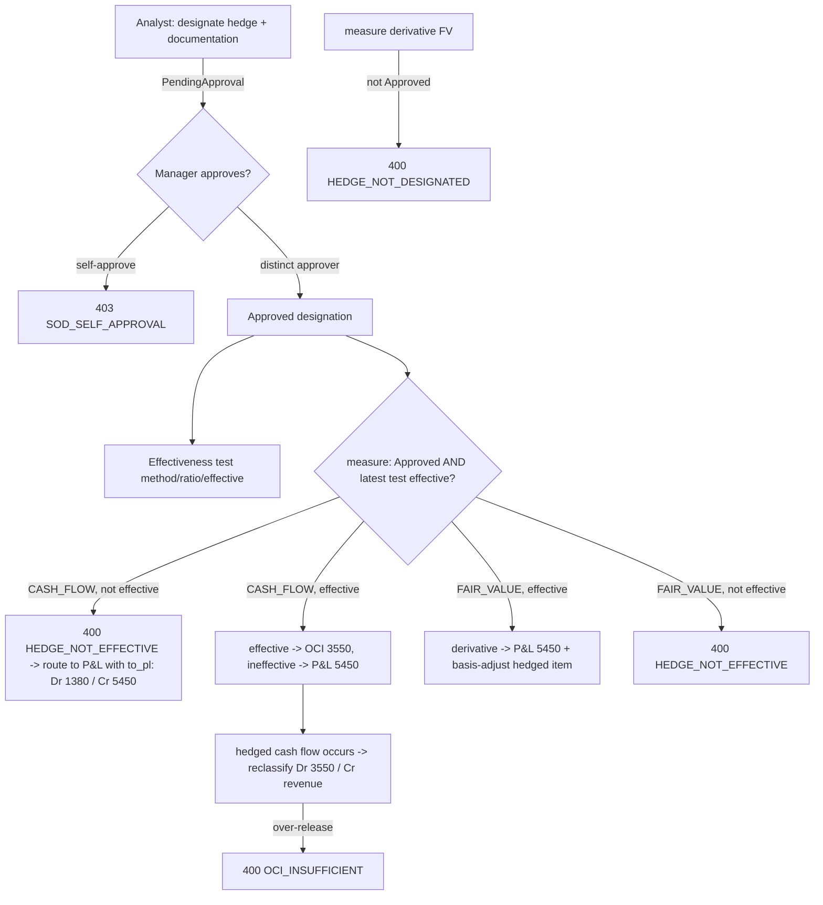

# Treasury — Financial Instruments (Debt & Borrowings) — Process Narrative

## 1. Document control

| Field | Value |
|---|---|
| Process ID | PN-33-TRE |
| Process owner | `<<Treasury / Controller>>` |
| Approver | `<<CFO>>` |
| Version | **0.3 DRAFT** |
| Effective date | `<<effective-date>>` |
| Review cadence | Per drawdown / monthly accrual + each covenant cadence · per trade / month-end investment valuation · per hedge designation / month-end remeasurement / on the hedged cash flow |
| Version note | Rev **0.3** (2026-07-12) — Track C Wave 3: Hedge accounting register (new control **TRE-04**, migration `0355`; IFRS 9 / ASC 815 designation + effectiveness + valuation maker-checker, reusing the Wave-2 OCI-reserve primitive at a new Cash-Flow Hedge Reserve 3550). Rev **0.2** (2026-07-12) — Track C Wave 2: Investment & Securities register + the reusable OCI-reserve primitive (new control **TRE-03**, migration `0354`). Rev **0.1** (2026-07-12) — Track C Wave 1: Debt & Borrowings register + EIR amortized-cost engine (new controls TRE-01 + TRE-02, migration `0353`). |
| Related RCM controls | TRE-01, TRE-02, TRE-03, TRE-04, GL-05, GL-24, TR-01 |
| Related policy | `compliance/policies/11-financial-close-policy.md` |

## 2. Purpose

Define the controlled process for recording and servicing **borrowings** (bank facilities, term loans) end to
end: setting up a credit **facility** under maker-checker, **drawing down** principal, accruing interest on an
**effective-interest (EIR) amortized-cost** basis, **repaying** principal and interest, monitoring **financial
covenants**, and maintaining a **maturity ladder**. The engine is the reusable spine on which later Track C
waves (investments, hedging) build.

## 3. Scope

- **In scope:** debt facilities, drawdowns, the periodic EIR interest accrual, repayments, covenant tracking +
  breach detection, and the maturity ladder for the debt register (Wave 1); the **investment & securities
  register** — classification (AMORTIZED_COST / FVOCI / FVTPL), a maker-checker market-price register,
  mark-to-market valuation (FVOCI → OCI reserve, FVTPL → P&L), ECL impairment, and interest/dividend income
  (Wave 2, §7bis); **hedge accounting** — designation + documentation, effectiveness testing, cash-flow hedges
  (effective portion → OCI reserve, ineffective → P&L), fair-value hedges (basis-adjust the hedged item + P&L),
  and OCI→P&L reclassification (Wave 3, §7ter). Multi-tenant (RLS), Thai-localized.
- **Out of scope (this wave):** lender cash-management integrations and net-investment (foreign-operation)
  hedges. Cash *position/forecast* is the existing TR-01 liquidity board.

## 4. References

- IFRS 9 / TFRS 9 — financial liabilities at amortized cost, effective-interest method; financial-asset
  classification (amortized cost / FVOCI / FVTPL), mark-to-market, and expected-credit-loss (ECL) impairment.
- Chart of accounts (debt): 1010 Bank, 2450 Accrued Interest Payable, 2500 Short-term Borrowings, 2550 Long-term
  Borrowings, 5900 Interest Expense. **Investments (TRE-03):** 1350 Investments–Amortized Cost, 1355 Allowance for
  Investment ECL (contra-asset), 1360 Investments–FVOCI, 1370 Investments–FVTPL, 3500 FVOCI Reserve (OCI equity),
  4700 Investment Income, 5430 Fair-value Gain/Loss (FVTPL), 5440 Investment Impairment
  (`apps/api/src/modules/ledger/ledger-constants.ts`).
- IFRS 9 / TFRS 9 · ASC 815 — **hedge accounting (TRE-04):** designation + formal documentation, prospective/
  retrospective effectiveness testing, cash-flow hedges (effective portion deferred in OCI, ineffective in
  P&L, reclassified to earnings when the hedged cash flow occurs), and fair-value hedges (derivative to P&L +
  hedged-item basis adjustment). **Hedge COA:** 1380 Derivative Asset, 2460 Derivative Liability, 3550
  Cash-Flow Hedge Reserve (OCI equity), 5450 Hedge Ineffectiveness / FV-hedge P&L.
- Posting-event registry `DEBT.DRAWDOWN` / `DEBT.INTEREST` / `DEBT.REPAY`; `INVEST.BUY` / `INVEST.INCOME` /
  `INVEST.MTM.PL` / `INVEST.MTM.OCI` / `INVEST.IMPAIR`; `HEDGE.DERIVATIVE.MTM` / `HEDGE.CF.OCI` /
  `HEDGE.RECLASSIFY` / `HEDGE.FV.BASIS` (`posting-events.ts`, GL-24).
- Permissions/SoD: `packages/shared/src/permissions.ts` (`treasury`, `treasury_approve`, SoD R23).

## 5. Definitions & abbreviations

| Term | Meaning |
|---|---|
| Facility | An approved credit line with a limit, currency, EIR and maturity; principal is drawn against it. |
| Drawdown | A borrowing taken off an approved facility; posts cash in and a borrowings liability. |
| EIR | Effective interest rate — the rate applied to the amortized-cost carrying amount each period. |
| Amortized cost / carrying | The drawdown's outstanding principal at par (reduced by principal repayments). |
| Covenant | A financial condition (e.g. DSCR ≥ 1.25) tested each cadence; a breach is a control finding. |
| Maturity ladder | Outstanding principal bucketed by time-to-maturity (liquidity view). |

## 6. Roles & responsibilities (RACI)

| Activity | Treasury Analyst (`treasury`) | Treasury Manager (`treasury_approve`) | Controller / Exec (`exec`) |
|---|---|---|---|
| Create / maintain facility, drawdown, repay, add covenants | **R** | C | A |
| Approve facility | I | **R** | A |
| Run EIR interest accrual | I | **R** | A |
| Run covenant tests / review breach worklist | C | **R** | A |
| Review debt register, maturity ladder | C | C | **R** |
| Buy investment, classify, maintain, post market prices | **R** | C | A |
| Approve investment / market price, run MTM · ECL · income accrual | I | **R** | A |
| Review investment register, portfolio, valuation ledger | C | C | **R** |
| Designate a hedge relationship + documentation, rebalance | **R** | C | A |
| Approve designation, record effectiveness test, remeasure, reclassify OCI | I | **R** | A |
| Review hedge register, OCI-movement ledger, effectiveness history | C | C | **R** |

Segregation of duties is enforced **in-app** (creator ≠ approver → `403 SOD_SELF_APPROVAL`, binding even
Admin) and flagged by **SoD R23** (`treasury` vs `treasury_approve`). Roles **TreasuryAnalyst** (maker) and
**TreasuryManager** (checker) are SoD-clean.

## 7. Process narrative

1. **Facility setup (maker).** `POST /api/treasury/facilities` records a facility (`name`, `lender`,
   `currency`, `facility_type` short-/long-term, `limit_amount`, `eir_pct`, `start_date`, `maturity_date`)
   as **PendingApproval**. `limit_amount` must be > 0 (`BAD_LIMIT`).
2. **Approval (checker).** A **different** user `POST .../:id/approve` → **Approved**. The creator approving
   their own facility is rejected `403 SOD_SELF_APPROVAL`. `POST .../:id/reject` rejects a pending facility.
3. **Drawdown.** Only an **Approved** facility may be drawn (`FACILITY_NOT_APPROVED` otherwise).
   `POST .../:id/drawdown` checks the amount against the available limit (`LIMIT_EXCEEDED`) and posts
   **Dr 1010 Bank / Cr 2500** (short-term) **or 2550** (long-term) **Borrowings** via `LedgerService.postEntry`
   (so period-lock + the GL audit trail apply). It stamps the drawdown's amortized-cost carrying amount
   (= principal) and a periodic cursor (`next_run_date` = one month out, `periods_posted` = 0).
4. **EIR interest accrual (checker, idempotent).** `POST .../:id/accrue` posts one month of effective
   interest = `round2(carrying × EIR/100/12)` per due drawdown — **Dr 5900 Interest Expense / Cr 2450 Accrued
   Interest Payable** — and advances the cursor a month. It is **idempotent**: the cursor moves per run and
   `alreadyPosted('DEBT-ACCR', drawdown+period)` guards the JE, so re-running the same `as_of` posts nothing.
   This mirrors the lease interest-unwind (LSE-01).
5. **Repayment.** `POST .../:id/repay` clears principal (**Dr 2500/2550**) and accrued interest (**Dr 2450**)
   against cash (**Cr 1010**). Guards: `REPAY_EXCEEDS_PRINCIPAL`, `REPAY_EXCEEDS_INTEREST`,
   `NOTHING_TO_REPAY`. A fully-repaid drawdown flips to `repaid`; the facility's `outstanding_principal` falls.
6. **Maturity ladder.** `GET .../maturity-ladder` buckets each facility's outstanding principal by
   time-to-maturity (0-30d / 31-90d / 91-180d / 181-365d / >365d) from an `as_of` date.
7. **Covenant tracking + breach detection (TRE-02).** `POST .../:id/covenants` defines a covenant (`metric`,
   `operator` gte/lte/gt/lt, `threshold`, `cadence`). `POST /api/treasury/covenants/test` evaluates each
   supplied reading against its threshold/operator, **persists** a `debt_covenant_tests` row with a `breached`
   flag, and returns the breaches. `GET /api/treasury/covenants/breaches` is the outstanding-breach worklist
   the controller reviews each cadence — recording the breach **is** the detective control.

## 7bis. Investment & Securities register (Track C Wave 2, TRE-03)

The investment register records **marketable securities** end to end under maker-checker, classifies each holding,
values it, and recognises its income — building the **reusable OCI-reserve primitive** (the FVOCI equity reserve
`3500`) that Wave 3 hedge accounting reuses. Module `modules/treasury-invest` (`investment.service.ts` /
`investment.controller.ts`); tables `investments`, `investment_prices`, `investment_valuations` (migration `0354`,
all tenant-scoped/RLS). Reads gate `treasury / treasury_approve / fin_report / exec`; the maker/checker split is
SoD **R23** (`treasury` vs `treasury_approve`), enforced in-app (creator ≠ approver → `403 SOD_SELF_APPROVAL`).

1. **Classification.** Every holding carries one of:
   - **AMORTIZED_COST** (held-to-collect debt, asset `1350`) — interest income accretes on the effective-interest
     (EIR) amortized-cost carrying; **not** marked to market.
   - **FVOCI** (fair value through OCI, asset `1360`) — remeasurement moves through the **OCI equity reserve
     `3500`**, not P&L.
   - **FVTPL** (fair value through P&L, asset `1370`) — remeasurement moves through P&L `5430`.
2. **Buy (maker → checker).** `POST /api/treasury/investments` records a holding (`instrument`, `classification`,
   `symbol`, `quantity`, `cost`, `eir_pct`, `trade_date`, `maturity_date`) as **PendingApproval** (`cost` > 0,
   `BAD_COST`). A **different** user `POST .../:id/approve` → **Approved**, and the buy posts **Dr `1350`|`1360`|
   `1370`** (per classification) **/ Cr `1010` Bank** via `LedgerService.postEntry`. Self-approval is rejected
   `403 SOD_SELF_APPROVAL` — so a security cannot be bought and self-approved (cash released with no independent
   check). `POST .../:id/reject` rejects a pending holding.
3. **Market-price register (maker → checker, mirrors FX-04).** `POST /api/treasury/prices` records a market price
   (`symbol`, `price_date`, `price`) — a **manual** price lands **PendingApproval**; an explicit non-manual
   `source` (a feed) is auto-approved. `POST /api/treasury/prices/approve` (a **different** user, else
   `SOD_SELF_APPROVAL`) approves it. **Only an Approved price can drive MTM** — this is the core TRE-03 valuation
   control.
4. **Mark-to-market.** `POST .../:id/revalue` values the holding at `quantity × latest Approved price` as of a
   date. An **un-approved** price is rejected `NO_APPROVED_PRICE`. The fair-value delta routes by classification:
   **FVOCI → the OCI reserve `3500`** (`Dr/Cr 1360` ↔ `Cr/Dr 3500`), **FVTPL → P&L `5430`** (`Dr/Cr 1370` ↔
   `Cr/Dr 5430`). An **AMORTIZED_COST** holding is measured at amortized cost, so MTM is rejected
   `MTM_NOT_APPLICABLE`. Each event writes an `investment_valuations` row (prior/new carrying, delta, OCI/P&L
   split) and is idempotent per `as_of`.
5. **Interest / dividend income.** `POST .../:id/accrue`. For **AMORTIZED_COST** it posts one month of EIR
   interest = `round2(carrying × EIR/100/12)` — **Dr `1350` / Cr `4700` Investment Income** — reusing the Wave-1
   periodic cursor + `alreadyPosted('INVEST-ACCR', investment+period)` guard (re-running the same period posts
   nothing; carrying accretes). For **FVOCI/FVTPL** it books a cash dividend/coupon for the supplied `amount` —
   **Dr `1010` Bank / Cr `4700`**.
6. **ECL impairment.** `POST .../:id/impair` books an expected-credit-loss provision — **Dr `5440` Investment
   Impairment / Cr `1355` Allowance** (contra-asset, `ecl` > 0 → `BAD_ECL`) — reducing the net carrying.
7. **Reads.** `GET .../investments` (register), `.../investments/:id` (holding + its valuation ledger),
   `.../portfolio` (roll-up by classification: cost, carrying, allowance, OCI reserve), `.../prices`.

## 7ter. Hedge accounting register (Track C Wave 3, TRE-04 · IFRS 9 / TFRS 9 · ASC 815)

The hedge register records **hedge relationships** end to end under maker-checker, tests their **effectiveness**,
values the hedging derivative, and applies **hedge accounting** — reusing the OCI-reserve primitive at a new
**Cash-Flow Hedge Reserve `3550`** (mirroring the Wave-2 FVOCI reserve `3500`). Module `modules/treasury-hedge`
(`hedge.service.ts` / `hedge.controller.ts`); tables `hedge_relationships`, `hedge_derivatives`,
`hedge_effectiveness_tests`, `hedge_oci_movements` (migration `0355`, all tenant-scoped/RLS). Reads gate
`treasury / treasury_approve / fin_report / exec`; the maker/checker split is SoD **R23**, enforced in-app
(creator ≠ approver → `403 SOD_SELF_APPROVAL`).

1. **Designation (maker → checker).** `POST /api/treasury/hedges` records a relationship (`hedged_item`,
   `hedging_instrument`, `hedge_type` **CASH_FLOW | FAIR_VALUE**, `hedge_ratio`, `notional`, and the formal
   `documentation` — required, `BAD_DOCUMENTATION`; a FAIR_VALUE hedge names the `hedged_item_account`
   basis-adjusted, a CASH_FLOW hedge names the `reclass_account`) as **PendingApproval**. A **different** user
   `POST .../:id/approve` → **Approved**; self-approval is rejected `403 SOD_SELF_APPROVAL`. `POST .../:id/reject`
   rejects a pending designation.
2. **Effectiveness testing.** `POST .../:id/effectiveness` records a **prospective/retrospective** test
   (`method` dollar_offset / regression / critical_terms, `ratio_pct`, `effective` bool, `as_of`) — only an
   **Approved** relationship may be tested (`HEDGE_NOT_DESIGNATED` otherwise). **The latest effective=true test
   unlocks hedge accounting.**
3. **THE CONTROL GATE.** `POST .../:id/measure` remeasures the derivative to its new fair value. **No hedge/OCI
   accounting happens until the relationship is Approved (designation) AND its latest effectiveness test is
   effective=true.** The derivative fair-value change always posts **Dr `1380` Derivative Asset** (gain) **/ Cr
   `2460` Derivative Liability** (loss); the offset routes by type:
   - **CASH_FLOW** — when Approved+effective, the **effective portion** defers in the **Cash-Flow Hedge Reserve
     `3550`** (OCI equity) and only the **ineffective portion** hits **P&L `5450`**. When the relationship is
     **not** Approved+effective the OCI path is **refused** `HEDGE_NOT_EFFECTIVE`; the caller then routes the
     whole change to P&L (`to_pl` → Dr `1380`/Cr `2460` ↔ P&L `5450`).
   - **FAIR_VALUE** — the derivative change hits **P&L `5450`** and the hedged item is **basis-adjusted** (its
     carrying account) with an offsetting P&L leg (`HEDGE_NOT_EFFECTIVE` unless Approved+effective).
   - Accounting on an **undesignated / unapproved** relationship is rejected `HEDGE_NOT_DESIGNATED`.
4. **OCI reclassification.** `POST .../:id/reclassify` (CASH_FLOW only) recycles the deferred OCI to earnings
   when the hedged cash flow occurs — **Dr `3550` / Cr the hedged-item revenue/P&L line** (`reclass_account`,
   default `4000`); over-releasing beyond the deferred reserve is rejected `OCI_INSUFFICIENT`.
5. **Rebalance.** `POST .../:id/rebalance` adjusts the `hedge_ratio` / `notional` of an Approved relationship
   (re-documented; no GL posting).
6. **Reads.** `GET .../hedges` (register), `.../hedges/:id` (relationship + derivative + effectiveness-test
   history + OCI-movement ledger).

## 8. Process flow

```mermaid
flowchart TD
  A[Analyst: create facility] -->|PendingApproval| B{Manager approves?}
  B -->|self-approve| X[403 SOD_SELF_APPROVAL]
  B -->|distinct approver| C[Approved]
  C --> D[Drawdown  Dr 1010 / Cr 2500|2550]
  D -->|over limit| L[400 LIMIT_EXCEEDED]
  D --> E[Amortized-cost carrying + cursor]
  E --> F[Monthly EIR accrual  Dr 5900 / Cr 2450]
  F -->|re-run same period| F2[idempotent: posts 0]
  F --> G[Repay  Dr 2500/2550 + 2450 / Cr 1010]
  C --> H[Define covenant]
  H --> I[Covenant test]
  I -->|pass| I1[record: not breached]
  I -->|fail| I2[record breached -> breach worklist]
  C --> J[Maturity ladder]
```

Investment & securities register (TRE-03):

```mermaid
flowchart TD
  A[Analyst: buy security + classification] -->|PendingApproval| B{Manager approves?}
  B -->|self-approve| X[403 SOD_SELF_APPROVAL]
  B -->|distinct approver| C[Approved -> buy Dr 1350|1360|1370 / Cr 1010]
  P1[Analyst: post market price] -->|manual = PendingApproval| P2{Manager approves price?}
  P2 -->|self-approve| PX[403 SOD_SELF_APPROVAL]
  P2 -->|distinct approver| P3[Approved price]
  C --> M{Revalue MTM}
  M -->|no approved price| MX[400 NO_APPROVED_PRICE]
  M -->|AMORTIZED_COST| MA[400 MTM_NOT_APPLICABLE]
  P3 --> M
  M -->|FVOCI| MO[delta -> OCI reserve 3500]
  M -->|FVTPL| MP[delta -> P&L 5430]
  C -->|AMORTIZED_COST| E[EIR interest Dr 1350 / Cr 4700, idempotent]
  C --> K[ECL impair Dr 5440 / Cr 1355]
```

Hedge accounting register (TRE-04):



## 9. Control matrix

| Control | Type | Assertion(s) | Description | Test of operating effectiveness |
|---|---|---|---|---|
| **TRE-01** | Application (Preventive) | Authorization / Accuracy / Valuation / Completeness / SoD | Debt facility + drawdown maker-checker (creator ≠ approver → `SOD_SELF_APPROVAL`), drawdown limit gate, correct Dr 1010 / Cr 2500\|2550 posting, and an **idempotent EIR amortized-cost accrual** (carrying × EIR/12 → Dr 5900 / Cr 2450). | `treasury-debt` harness (36 checks): create→self-approve blocked→distinct approver; drawdown GL + `LIMIT_EXCEEDED`; EIR schedule ties a hand-computed amortization table; re-accrue same period idempotent; repayment legs + `REPAY_EXCEEDS_PRINCIPAL`; RLS isolation. |
| **TRE-02** | Detective | Completeness / Timeliness | Covenant tracking + breach detection: a covenant test persists a `debt_covenant_tests` reading with a `breached` flag and surfaces outstanding breaches on a worklist for periodic controller review. | `treasury-debt` harness: DSCR ≥ 1.25 passes at 1.40, breaches at 1.10 (persisted), the worklist surfaces the breach; tenant isolation. |
| **TRE-03** | Application (Preventive) | Authorization / Accuracy / Valuation / Completeness / SoD | Investment & securities register: classification (AMORTIZED_COST / FVOCI / FVTPL) + buy maker-checker (creator ≠ approver → `SOD_SELF_APPROVAL`), classification-correct buy posting (Dr `1350`\|`1360`\|`1370` / Cr `1010`), a **maker-checker market-price register** where **MTM can only be driven by an Approved price** (`NO_APPROVED_PRICE`), the FVOCI→OCI-`3500` vs FVTPL→P&L-`5430` remeasurement split (amortized cost not marked, `MTM_NOT_APPLICABLE`), idempotent EIR interest income (Dr `1350` / Cr `4700`), and ECL impairment (Dr `5440` / Cr `1355`). | `treasury-invest` harness (40 checks): buy→self-approve blocked→distinct approver; classification routes to the right GL; unapproved price cannot drive MTM; FVOCI MTM lands in OCI (not P&L) vs FVTPL in P&L; EIR interest ties a hand-computed schedule + idempotent; ECL impairment; RLS isolation. |
| **TRE-04** | Application (Preventive) | Authorization / Accuracy / Valuation / Presentation / Disclosure / Completeness / SoD | Hedge accounting register (IFRS 9 / ASC 815): designation + documentation maker-checker (creator ≠ approver → `SOD_SELF_APPROVAL`), and the **two-part control gate** — no hedge/OCI accounting until the relationship is **Approved** AND its **latest effectiveness test is effective=true**. A CASH_FLOW hedge defers only the **effective portion** in the OCI reserve `3550` and the **ineffective portion** in P&L `5450`; when not effective the OCI path is refused (`HEDGE_NOT_EFFECTIVE`) and the whole change routes to P&L. A FAIR_VALUE hedge basis-adjusts the hedged item + P&L `5450`. Any accounting on an undesignated relationship is refused (`HEDGE_NOT_DESIGNATED`). Deferred OCI recycles to earnings on the hedged cash flow (Dr `3550` / Cr revenue). Derivative FV change Dr `1380` / Cr `2460`. | `treasury-hedge` harness (38 checks): designate→self-approve blocked→distinct approver; measure an unapproved relationship → `HEDGE_NOT_DESIGNATED`; with the latest test effective=false the CASH_FLOW OCI attempt → `HEDGE_NOT_EFFECTIVE` and the whole change routes to P&L vs effective=true → effective portion in OCI `3550`, ineffective in P&L `5450`; reclassification Dr `3550` / Cr `4000` + `OCI_INSUFFICIENT`; FAIR_VALUE basis adjustment (Cr `1200` / Dr `5450`); RLS isolation. |

Related: **GL-05** (all postings route through the ledger's balanced/period-locked posting), **GL-24**
(posting-event registry), **TR-01** (the cash-position/forecast board reads the same posted GL).

## 10. Inputs & outputs

- **Inputs:** facility terms (limit, EIR, maturity), drawdown/repayment amounts, covenant readings; investment
  terms (classification, symbol, quantity, cost, EIR), market prices, ECL provisions, dividend/coupon amounts;
  hedge designations (hedged item, hedging instrument, type, ratio, documentation), effectiveness-test readings,
  derivative fair values, effective/ineffective splits, and OCI reclassification amounts.
- **Outputs:** the debt register (facilities + drawdowns), the DEBT-DRAW / DEBT-ACCR / DEBT-REPAY journal
  entries, the maturity ladder, and the covenant-test / breach records; the investment register + valuation
  ledger, the INVEST-BUY / INVEST-MTM / INVEST-ACCR / INVEST-DIV / INVEST-ECL journal entries, the maker-checker
  market-price register, and the portfolio roll-up; the hedge register + effectiveness-test history + OCI-movement
  ledger, and the HEDGE-MTM / HEDGE-RECLASS journal entries.

## 11. Records & retention

`debt_facilities`, `debt_drawdowns`, `debt_covenants`, `debt_covenant_tests`; `investments`,
`investment_prices`, `investment_valuations`; `hedge_relationships`, `hedge_derivatives`,
`hedge_effectiveness_tests`, `hedge_oci_movements` (all tenant-scoped, RLS) + the underlying GL journal entries
(append-only audit trail). Retained per the financial-records retention policy.

## 12. KPIs / metrics

Total outstanding borrowings, weighted-average EIR, interest expense per period, maturity-ladder profile,
covenant headroom, and count/ageing of outstanding covenant breaches.

## 13. Exception & error handling

Debt: `BAD_LIMIT`, `NOT_PENDING`, `SOD_SELF_APPROVAL`, `FACILITY_NOT_APPROVED`, `LIMIT_EXCEEDED`, `BAD_AMOUNT`,
`NOTHING_TO_REPAY`, `NO_ACTIVE_DRAWDOWN`, `REPAY_EXCEEDS_PRINCIPAL`, `REPAY_EXCEEDS_INTEREST`,
`FACILITY_NOT_FOUND`, `COVENANT_NOT_FOUND`. Investments (TRE-03): `BAD_COST`, `BAD_QUANTITY`, `BAD_RATE`,
`NOT_PENDING`, `SOD_SELF_APPROVAL`, `INVESTMENT_NOT_APPROVED`, `INVESTMENT_NOT_FOUND`, `BAD_PRICE`,
`NO_PENDING_PRICE`, `NO_APPROVED_PRICE`, `MTM_NOT_APPLICABLE`, `NO_SYMBOL`, `BAD_ECL`. Hedge accounting
(TRE-04): `BAD_DOCUMENTATION`, `BAD_RATIO`, `BAD_NOTIONAL`, `NOT_PENDING`, `SOD_SELF_APPROVAL`,
`HEDGE_NOT_DESIGNATED`, `HEDGE_NOT_EFFECTIVE`, `BAD_HEDGE_TYPE`, `BAD_AMOUNT`, `OCI_INSUFFICIENT`,
`HEDGE_NOT_FOUND`. All surface as `json.error.code` (wrapped by `AllExceptionsFilter`).

## 14. Revision history

| Version | Date | Author | Change |
|---|---|---|---|
| 0.1 | 2026-07-12 | Treasury / Controller | Initial narrative — TRE-01 debt & borrowings register + EIR amortized-cost engine, TRE-02 covenant-breach monitor (migration 0353). |
| 0.2 | 2026-07-12 | Treasury / Controller | Added §7bis Investment & Securities register (TRE-03): classification (AMORTIZED_COST/FVOCI/FVTPL) + buy maker-checker, maker-checker market-price register (MTM only from Approved prices), MTM (FVOCI→OCI reserve 3500 / FVTPL→P&L 5430), EIR interest income, ECL impairment. New COA 1350/1355/1360/1370/3500/4700/5430/5440; INVEST.* posting events; migration 0354; harness `treasury-invest` (40 checks). The OCI-reserve primitive (3500) is reused by Wave 3 hedge accounting. |
| 0.3 | 2026-07-12 | Treasury / Controller | Added §7ter Hedge accounting register (TRE-04, IFRS 9 / TFRS 9 · ASC 815): designation + documentation maker-checker, prospective/retrospective effectiveness testing, and the two-part control gate (no OCI accounting until Approved AND effective). Cash-flow hedges defer the effective portion in the Cash-Flow Hedge Reserve 3550 (OCI) and route the ineffective portion (or, when not effective, the whole change) to P&L 5450; fair-value hedges route the derivative change to P&L 5450 and basis-adjust the hedged item; OCI→P&L reclassification on the hedged cash flow (Dr 3550 / Cr revenue). New COA 1380/2460/3550/5450 (CF_CLASSIFY 3550 financing, 1380/2460 operating); HEDGE.DERIVATIVE.MTM/CF.OCI/RECLASSIFY/FV.BASIS posting events; migration 0355; harness `treasury-hedge` (38 checks). Exception codes HEDGE_NOT_DESIGNATED / HEDGE_NOT_EFFECTIVE / OCI_INSUFFICIENT / BAD_DOCUMENTATION. |
