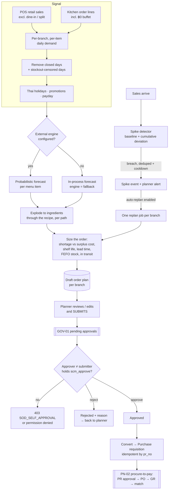

# Supply Chain Planning — Demand Forecasting & Replenishment — Process Narrative

## 1. Document control

| Field | Value |
|---|---|
| Process ID | PN-34-SCM |
| Process owner | `<<Supply-chain planner / Controller>>` |
| Approver | `<<COO / CFO>>` |
| Version | **0.1 DRAFT** |
| Effective date | `<<effective-date>>` |
| Review cadence | Nightly planning run · per demand-spike replan · per order-plan approval · monthly forecast-accuracy review |
| Version note | Rev **0.1** (2026-07-21) — docs/54 Phase 2: per-(branch, item) probabilistic demand planning + perishable-aware order optimization. New controls **SCM-01** (order-plan maker-checker), **SCM-02** (planning-job monitoring & idempotency), **SCM-03** (auditable demand-driven order sizing); migration `0459`; new permissions `scm_plan` / `scm_approve` with SoD rule **R24**. The compute engine is an optional external microservice (`services/forecast-engine`, docs/54 Phase 1); with it disabled the module plans in-process. |
| Related RCM controls | SCM-01, SCM-02, SCM-03, SCM-04, SCM-05, INV-10 (waste), EXP-01/EXP-12 (PR/receiving), GOV-01 (pending approvals), ITGC-OP-04 (job failure alerting) |
| Related policy | `compliance/policies/09-inventory-policy.md` |

## 2. Purpose

Define the controlled process by which the chain decides **how much of each ingredient to buy, for each
branch, each day** — replacing habit and fixed reorder points with a demand forecast that is measured,
explainable and independently approved before it becomes committed spend.

The economic problem is asymmetric and perishable: order too little and the branch stocks out (lost sale plus
goodwill); order too much and the surplus is thrown away at its full cost. The process therefore sizes orders
against an explicit cost trade-off rather than a service-level rule of thumb, and every proposed quantity
carries the rationale that produced it.

## 3. Scope

- **In scope:** extraction of per-(branch, item) demand history from POS and kitchen records; the Thai
  holiday / closure / payday calendar applied to that history; probabilistic demand forecasting; explosion of
  menu demand to ingredient demand through the recipe (BoM); perishable-aware order sizing against shelf life,
  lead-time variability and current FEFO stock; the Draft → approval → purchase-requisition lifecycle;
  demand-spike detection and targeted replanning; and the scenario ("what-if") tool.
- **Out of scope:** purchase-order issue, receiving and three-way match (PN-02, controls EXP-01/EXP-12) — this
  process hands off at the **purchase requisition** and posts no GL entries of its own; inter-branch transfers
  and min/max replenishment (the existing WMS replenishment path); and manufacturing MRP (PN-07).

## 4. References

- `docs/54-dynamic-scm-forecasting-plan.md` — the program plan, the mathematics (§3) and the ADRs.
- `services/forecast-engine/README.md` — the external compute service and its contract.
- `packages/shared/src/scm-engine.ts` — the wire contract (source of truth).
- PN-01 (POS sales), PN-02 (procure-to-pay), PN-17 (master data), PN-16 (projects).

## 5. Definitions

| Term | Meaning |
|---|---|
| **Planning unit** | One branch of one tenant. Sales that carry no branch fall into the untagged (NULL-branch) unit. |
| **Sample path** | One simulated future demand series. The forecaster returns many; ordering decisions are made across all of them rather than on a single average. |
| **Protection period** | Lead time + review period — the window a replenishment decision must cover before the next delivery can arrive. |
| **Order-up-to level (S\*)** | The stock position the plan aims to reach, set at the cost-optimal demand quantile. |
| **Dynamic safety stock** | S\* minus expected protection-period demand. Recomputed every run, so it moves with seasonality and lead-time variability instead of being a fixed number. |
| **Critical ratio** | Cu / (Cu + Co) — the shortage cost as a share of shortage + surplus cost. The quantile the order aims at. |
| **FEFO layer** | A quantity of stock with a known expiry date (first-expiring, first-out). |
| **Channel partition** | The rule that separates retail from dine-in demand so a dish settled through the kitchen is not also counted as a POS line. |

## 6. RACI

| Activity | Responsible | Accountable | Consulted | Informed |
|---|---|---|---|---|
| Maintain planning settings & item policies | Planner (`scm_plan`) | Controller | Head chef | Branch managers |
| Review a Draft plan, adjust quantities, submit | Planner (`scm_plan`) | Controller | Branch manager | — |
| Approve / reject a submitted plan | Approver (`scm_approve`) ≠ the submitter | Controller | Planner | Purchasing |
| Convert an approved plan to a requisition | Planner (`scm_plan`) | Controller | Purchasing | Finance |
| Investigate a demand spike | Planner | Controller | Branch manager | — |
| Monitor job health & forecast accuracy | IT Ops / Planner | Controller | — | Internal audit |

## 7. Process narrative

### 7.1 Extracting the demand signal

A planning run begins by reconstructing, for each planning unit, how much of each menu item was actually sold
per business day (Asia/Bangkok), over a configurable look-back (default 400 days).

Demand is read from **two channels, partitioned so neither dish is counted twice**. This is not a detail: when
a dine-in check is settled, the checkout copies every non-voided order line — **including the ฿0 buffet
lines** — into the POS sale tables. A naive union of the POS and kitchen tables therefore counts every dine-in
dish twice and would systematically over-order. The process instead reads:

- the **retail leg** from POS sales, *excluding* anything settled as a dine-in or split payment; and
- the **restaurant leg** from the kitchen order lines directly, which is also the only place an order that has
  not yet been paid appears.

Only SKUs that carry a recipe count as dish demand, so service charges and synthetic split-bill lines can
never enter the signal. Dine-in orders carry no branch of their own, so they are attributed to the outlet
named in settings (`dine_in_branch_id`); when that is unset the demand pools in the untagged unit, and the
share that did so is reported on every run so the misconfiguration is visible rather than silent.

Two classes of day are then removed from the fitted history: days the branch was **closed** (a configured
weekday or a dated closure), and days flagged as **stocked out**. A stockout is a supply cap, not observed
demand — leaving those zeros in teaches the forecast that demand fell, which suppresses the next order and
prolongs the stockout.

### 7.2 Forecasting demand

Each (branch, menu item) series is forecast over the planning horizon (default 14 days). Series are not all
alike — a daily staple and an occasional special need different treatment — so each is classified by how often
it sells and how variable those sales are, and routed to a model suited to that pattern (seasonal, intermittent
or sparse). The Thai public-holiday calendar, tenant promotions and the local pay cycle are supplied as inputs
so the forecast anticipates them rather than being surprised.

The forecaster returns a **distribution**, not a single number: many simulated future paths, from which any
quantile can be read. This is what makes cost-based ordering possible in §7.4.

Where the external compute engine is disabled or unreachable, the run degrades to an in-process forecast and
says so on the plan (`engine: fallback`). Planning never stops because an optional service is down.

### 7.3 Exploding menu demand to ingredients

Ordering happens at ingredient level, but the signal (seasonality, holidays) lives at menu level. Each menu
item's forecast is therefore exploded through its recipe, allowing for yield and preparation waste, to give
ingredient demand.

The explosion is applied **to each simulated path**, not to summary quantiles. Quantiles are not additive — the
95th percentile of a total is not the sum of the 95th percentiles — and combining them would both misstate the
number and destroy the fact that a busy Songkran evening lifts every dish at once.

### 7.4 Sizing the order

For each ingredient the process computes what to order today against:

- the **cost of being short** (lost margin plus goodwill) versus the **cost of surplus** (purchase cost less
  salvage, plus disposal) — their ratio sets the demand quantile the order aims at;
- **lead time and its variability**, taken from that item's own recent receipt history where enough
  observations exist, otherwise from the supplier or item master;
- **shelf life**, so the plan never buys more than can be sold within the goods' own life;
- **current stock by remaining life** (the FEFO layers) and quantities already **in transit** on open POs; and
- ordering constraints — minimum order quantity, pack size, and any fixed cost per order.

Each proposed line records the reasoning behind it: the model used, expected fill rate, expected waste and
lost sales, the per-day order-up-to and safety-stock levels, and any cap that was applied. A reviewer can
therefore see *why* a number was proposed, which is what makes the quantity reviewable at all.

Quantities returned by the external engine are validated and **clamped** before they are stored, so a faulty
or compromised compute service cannot place an absurd quantity in front of a hurried approver.

### 7.5 Approval and hand-off to purchasing — control SCM-01

A run never produces an order. It produces a **Draft** plan per branch.

1. The planner reviews the Draft, adjusts any line quantity, and **submits** it. The plan moves to
   *PendingApproval* and appears in the GOV-01 pending-approvals centre with its value and age.
2. An **approver** acts on it. Approval requires the `scm_approve` duty, which is a single-purpose permission
   no broad module grant confers, and the approver **must be a different person from the submitter** —
   self-approval is refused (`SOD_SELF_APPROVAL`). Because nightly plans are created by the scheduler rather
   than a person, the "maker" for this test is the human who *submitted*, never the system that created it.
3. Rejection requires a reason and returns the plan to the planner, who can adjust and resubmit.
4. Only an **approved** plan may be **converted**, which raises a **purchase requisition** through the normal
   purchasing process — this module never writes a purchase order directly. The requisition number is stamped
   on the plan, so converting twice cannot raise two requisitions.

From that point the requisition follows the existing procure-to-pay controls (PN-02): approval thresholds,
purchase order, receiving and three-way match. **This process posts no journal entries.**

### 7.6 Demand spikes and replanning — control SCM-02

Demand does not only change overnight. Each (branch, item) series carries a running baseline of its normal
level and variability, plus a cumulative-deviation detector that catches a slow drift as well as a sudden
jump. An observation is judged **against the baseline as it stood before that day** — scoring it after folding
it in would let a large spike inflate its own reference and hide itself.

When a series breaches its threshold (subject to a minimum-volume floor, so small-number noise is ignored) an
event is recorded, the planner is notified, and — if the tenant has enabled automatic replanning — **one**
replan job is queued for that branch covering all of its spiking items. A replan is an ordinary, narrower
planning run: it produces a Draft plan that still requires the same independent approval.

Two dedupe mechanisms keep this proportionate: an event is unique per (branch, item, business day), and a
cooldown suppresses repeat firing. One viral evening therefore produces one event and one replan job, not
forty.

### 7.7 Scheduling, idempotency and failure handling — control SCM-02

The nightly plan and the spike scan are scheduled like any other recurring job. Both are **idempotent by
construction**: at most one non-failed nightly run can exist per tenant per business day (enforced by the
database, not by convention), and the spike scan advances a per-series watermark so it only ever folds in
business days it has not already processed — running it hourly and running it daily give the same result.

Job failures are handled by the shared queue: retry with backoff, then dead-letter with an operations alert
and an administrator notification. A failed run records the full underlying error so the cause is diagnosable
afterwards rather than appearing as an unexplained absence of a plan.

### 7.8 Scenario planning

Planners can ask "what if?" — a bounded, synchronous evaluation over a handful of items with an adjusted
demand multiplier, service level or horizon (for example, doubling demand for a festival). Scenarios are
advisory: they compute and return, and **write nothing**.

### 7.9 Forecast reconciliation hierarchy (docs/58 Track C · C1)

Per-(branch, item) forecasts are produced independently, so their roll-ups do not naturally sum coherently
across item→category→total or branch→region→company. To prepare for coherent multi-level views and
reconciliation (Track C), a planner can **declare an aggregation structure** as governed master data:
`PUT /api/scm-planning/hierarchy` accepts, per axis (`branch` or `item`), a set of nodes each naming its
parent (branch → region → company, region rows tagged `group`). The service validates the declaration is a
forest — unique node codes, every parent resolvable, no cycle (a violation is rejected `SCM_HIERARCHY_INVALID`)
— and stores it in `scm_forecast_hierarchy` (tenant-scoped, RLS). Where a tenant declares nothing, the
**forest is synthesized** from the native structure — one *Total* root over one leaf per active branch, or
one leaf per item category — so Track C stays off (docs/54 behaviour) until a tenant opts in. `GET
…/hierarchy/forest?axis=` returns the assembled forest (source `declared` or `synthesized`) that the
reconciliation step (C2, forthcoming) consumes. This is **definition only**: it introduces no new control
(reconciliation is a forecast-quality property; SCM-01/02/03 still govern the run and its approval) and does
not yet change any forecast number.

### 7.10 Promotion & price-effect demand (docs/56 Track A · A1) — control SCM-04

Forecasts respond to more than the calendar: a governed **promotion** lifts demand, and the planner should
order to the promoted level, not the baseline. On each planning run the API assembles the promo signal
**server-side** (`ScmPromoExtractService`) from the tenant's **approved, active, date-ranged** `promotions`
(category-scoped) under RLS — a per-`(menu sku, business day)` `promo_flag`/`discount` regressor over the
history and the horizon. Crucially this is **never taken from the run request**: a run cannot assert a promo
that does not exist in the governed data, so a fabricated or ungoverned promo has no way into the forecast
(**control SCM-04**, preventive). The forecast engine consumes the regressor — Prophet fits it as a learned
coefficient (generalizing the existing payday regressor); the intermittent/bootstrap paths apply a
capped multiplicative uplift (`U_MAX`, so a fat-fingered discount cannot plant an absurd path). Each forecast
persists its **attribution** (promo uplift %, the regressors used) onto `scm_demand_forecasts`, so a reviewer
can see that a line's lift is the approved weekend promo — and tie it back to its source — rather than a
trend. Advisory what-ifs run with `scenario=true` and are barred from the auto-convert path; a production run
is always `scenario=false`. Price elasticity is a later phase (A2); A1 carries the promo/discount lever.

### 7.11 Coherent forecast reconciliation (docs/58 Track C · C2)

Independent per-(branch, item) forecasts do not naturally sum to a coherent chain total. Track C adds a
**reconciliation step** between forecasting and order sizing: on each engine-backed run the API sends the
forecast engine an aggregation forest (currently a bottom-up TOTAL over the branch's menu series, using the
hierarchy declared in §7.9 or the synthesized default), and the engine returns a **reconciled** result per
node — leaves *and* aggregates — that sum coherently, reconciled on the sample paths (not the quantiles,
which are not additive). The API then explodes the **reconciled leaf** paths to ingredients. For bottom-up
the leaves are unchanged (so branch order quantities are unaffected) while the aggregates now equal their
children exactly, giving the planner a coherent multi-level view. A **trust boundary** applies: the API
checks the returned aggregate really equals the sum of its leaves within tolerance and, on any violation,
falls back to the base forecast rather than persisting an incoherent one. This is a forecast-quality
property, not a new authority — it introduces **no new control** (SCM-01/02/03 still govern the run and its
approval) and changes no GL posting. Top-down and the optimal MinT reconciliation are later phases (C3/C4).

### 7.12 Multi-echelon supply-network master data (docs/57 Track B · B1)

The docs/54 planner sizes each `(branch, ingredient)` in isolation. A chain that stocks through a central
kitchen or distribution centre (DC) can do better — pooling the safety buffer one tier up meets the same
branch service level with materially less system inventory. Track B models that topology explicitly; **B1
lands the governed master data it needs**, definition only (the two-echelon optimizer is B2). A planner
declares the supply network as a directed graph of **nodes** (`supply_nodes`: a `supplier` (echelon 0),
`central_kitchen`/`dc` (echelon 1), or `branch` (echelon 2, linked to the intra-tenant `branches` row) with
its holding cost and service-time commitment) and **lanes** (`supply_lanes`: a directed edge carrying that
lane's lead-time mean/σ, unit cost, MOQ, pack size and fixed order cost) through `POST /api/scm-network/
nodes|lanes`. Both tables are tenant-scoped (migration 0463, canonical 0232-form RLS loop + leading
`(tenant_id, …)` index); every mutation carries a combined `(id, tenant)` guard so an id is never assumed to
belong to the caller, and a lane's endpoints must both be the caller's own nodes. `GET
/api/scm-network/topology` assembles the active nodes + lanes and **validates** them: `kind`↔`echelon`
consistency, at most two stocking echelons (a third tier is rejected `ECHELON_DEPTH_EXCEEDED`), each lane
steps down exactly one echelon and no node is multi-sourced, the graph is acyclic (`NETWORK_NOT_DAG`), and
every branch is reachable from a supplier through a DC (else `UNREACHABLE_BRANCH`). The API never trusts a
topology from the engine — it is validated here before any optimize call. B1 introduces **no new control**
(SCM-05/SCM-06 arrive with the optimizer and allocation in B2/B3) and posts no GL entries; it is topology
definition that a later network run will consume.

### 7.13 Own-price elasticity (docs/56 Track A · A2)

A promotion is not only a calendar flag — it is a **price cut**, and how much demand a price move buys is
the item's **own-price elasticity** ε. A2 estimates it and puts it to work in the advisory scenario tool.
The signal is server-derived: `ScmPromoExtractService` now emits, per menu sku per business day, the
**effective price** (the item's base price reduced by any governed promotion's discount that day), so a
promotion's price cut becomes the price *variation* over history — never taken from the run request. The
engine estimates ε as the slope of an **OLS log-log fit** of demand on price over the observed history
(stockout-censored days excluded), gated by an **identifiability floor**: unless there are enough paired
observations, real price movement, and a credible fit (r²), it returns **ε = null** — a spurious elasticity
is never emitted. A credible ε (clamped to a sane band) is returned in the forecast attribution; the run
persists it to `scm_price_elasticity` (migration 0464, tenant-scoped) via `ScmElasticityService`, keyed by
`(tenant, item[, branch])` and readable at `GET /api/scm-planning/elasticity`. The **scenario what-if**
gains an optional `price_multiplier`: for each menu item it applies `demand × (price_multiplier)^ε` (with no
credible ε on file the response is 1 — unchanged), so a planner can ask "what if we raise this price 10%?"
and see the demand — and the order — respond. This is **advisory only** (scenario persists nothing and never
becomes an order) and introduces **no new control**; ε is a forecast-quality input governed by the same
SCM-01/02/03 as the run. Cannibalization across sibling items is the next phase (A3).

### 7.14 Cannibalization & halo — cross-price elasticity (docs/56 Track A · A3)

A price move on one item rarely stays with that item: cut the price of one dish and a similar dish beside
it may sell less (**cannibalization**), while some pairings sell *more* together (**halo**). A3 models this
as a **category-scoped cross-price elasticity** γ_{a,b} = ∂log(demand_a)/∂log(price_b), estimated API-side
(`ScmCrossElasticityService`) from the same governed data a run already extracts — per-item demand and the
server-derived effective price — using the **same log-log OLS with the same identifiability floor** as the
own-price elasticity (γ = null when not identified, so a spurious cross term is never emitted). Crucially it
is estimated **only for sibling pairs that share an `item_categories` category** — never the full
cross-product — which keeps it tractable and meaningful (a drink's price should not "explain" an unrelated
ingredient). A run persists the credible pairs to `scm_cross_elasticity` (migration 0470, tenant-scoped);
`GET /api/scm-planning/cross-elasticity` lists them. The **scenario what-if** now composes both effects: for
each item in the what-if whose price moved, its demand responds through its own ε **and** the cross-elasticity
of every sibling whose price also moved in that scenario — total exponent `ε_i + Σ γ_{i,j}`, so
`demand_i × (price_multiplier)^(ε_i + Σ γ_{i,j})`. γ>0 (substitutes) offsets the own-price lift of a price
cut; γ<0 (complements) reinforces it. With nothing on file the response is 1 (unchanged). **Advisory only**,
**no new control** — the same forecast-quality governance as A2. This completes Track A's demand-shaping
levers (promo, own-price, cross-price); attribute-based cold-start (A4) is a later wave.

### 7.15 Two-echelon network replenishment plans (docs/57 Track B · B2) — control SCM-05

The topology declared in §7.12 becomes actionable in B2: a planner runs a **two-echelon network plan** for
one item across the supplier → DC → branch network, and the plan pools the safety buffer at the DC rather
than carrying it at every branch. `POST /api/scm-network/plans/run {item_code}` builds the plan; it draws
each branch's demand paths through **scm-planning's public `demandPathsFor` seam** (loose coupling — it calls
the documented service API, never reaches into another module's tables) and calls the B2a
`/v1/optimize-network` engine route (guaranteed-service base-stock + risk pooling, §1.3–§1.4) when
`SCM_ENGINE_URL`/`SCM_ENGINE_SECRET` are set and demand paths exist; otherwise it runs an **in-process
fallback** — independent per-branch base-stock `B = μ·(L+R) + z·σ·√(L+R)` with the DC echelon the plain sum
of its branches (no pooling), safe and auditable, and the plan records which path produced it. Every engine
base-stock/order quantity is **zod-validated and clamped** before persistence — the §7.4 engine trust
boundary extended to the network, so a faulty or compromised engine cannot plant an absurd order. Plans and
their per-node lines persist (`scm_network_plans` / `scm_network_plan_lines`, migration 0474, canonical
0232-form RLS loop + leading `(tenant_id, …)` index) as **Draft** — never actionable.

A network run never produces an order; it produces a **Draft** plan governed by **control SCM-05**
(preventive), the same maker-checker spine as an order plan (§7.5):

1. The planner reviews the Draft and **submits** it (`scm_plan`); the plan moves to *PendingApproval* and
   appears in the GOV-01 pending-approvals centre.
2. An **approver** holding `scm_approve` acts on it, and **must be a different person from the submitter** —
   self-approval is refused (`SOD_SELF_APPROVAL`). The "maker" is the human who *submitted*, bound to the
   submitter rather than `created_by`, because nightly runs are created by the scheduler. Approval reuses the
   existing SoD rule **R24** (`scm_plan` build vs `scm_approve` approve) — B2 introduces **no new SoD rule**.
3. Only an **Approved** network plan may be **converted**: the DC's supplier-facing order rolls up to a
   **purchase requisition** through the existing `ProcurementService.createPr` seam (reason `SCM-NET`),
   **idempotent by `pr_no`** — converting twice returns the first requisition, never a second.

Track B posts **no journal entries** of its own and touches no golden-master money path; like §7.5 it ends
at a maker-checker'd requisition, from which the normal procure-to-pay controls (PN-02) take over.
Allocation-policy governance on DC shortage (SCM-06) and the full DRP branch→DC→supplier roll-up build on
this spine in B3/B4.

### 7.16 Warm-start / model registry (docs/59 Track D · D2)

Fitting a Prophet model is the expensive step of a planning run — a cmdstan child process per (branch,
item) series. For a settled series whose demand history has not changed since it was last fitted, that refit
buys nothing: the same window produces the same model. D2 caches each series' fitted model so a run whose
**training window is unchanged reuses the cached fit and only samples** from it, skipping both the primary
fit and the backtest refit. This is a **compute optimization only** — it changes no forecast number, no
order quantity and no plan lifecycle, and introduces **no new control** (the forecast-accuracy detective
control SCM-07 belongs to D4, not D2).

The flow rides the existing engine boundary. On each run the API loads any cached fit for the series
(`ScmModelCacheService`, under RLS) and **ships it in the `/v1/forecast` payload** as an optional
`warm_start:{params, fit_hash}` — the engine stays stateless and DB-free (docs/54 §2.1). The engine computes
a `fit_hash` fingerprint over the training window (the fitted dates, the demand values and the regressor
columns); when the supplied hash **matches**, it deserializes the cached fit (`prophet.serialize.
model_from_json`) and reuses it, else it refits from scratch. Either way it returns the model's state as an
optional `fitted_state:{params, fit_hash, fit_wape}` in the response, which the API **upserts** back into
the cache. On a warm hit the engine skips the backtest, so the API **carries the cached `fit_wape` forward**
onto the persisted forecast — the accuracy figure stays meaningful across reuse runs rather than going
blank.

Reuse is bounded by **two independent staleness guards, both fail-safe toward refitting** — a stale model is
never silently trusted:

1. **`fit_hash` mismatch** — the training window changed materially (a new business day, an amended promo
   calendar, a day reclassified as a stockout), so the fingerprint no longer matches and the series is
   refit.
2. **Refit cadence** — a cached fit older than `scm_settings.refit_cadence_days` (default 14, range 1–90) is
   force-refit even when the window is unchanged, so a model can never drift arbitrarily far from a fresh
   fit. The cadence is a new additive setting on the scm-planning settings surface (`GET`/`PUT
   /api/scm-planning/settings`), validated in `ScmExtractService.upsertSettings`.

**Determinism is preserved.** Prophet's MAP fit plus the reseeded sampling mean a warm reuse reproduces the
cold fit **byte-for-byte** for the same inputs, so an API retry stays safe (docs/54's `seeded_rng`
invariant). A **corrupt cache entry fails closed to a refit** rather than an error — an unreadable serialized
fit is treated as a cache miss.

The cached fits persist in a new tenant table **`scm_model_cache`** (migration `0475`) — one row per
(tenant, branch, item) carrying the serialized `model`, `fit_params` (jsonb), the `fit_hash`, the `fit_wape`,
the `training_from`/`training_to` window and `fitted_at`. It follows the `scm_settings` shape: the canonical
0232-form RLS loop (excluding `audit_expectations`), a leading `(tenant_id, branch_id, item_id)` index and a
`coalesce(branch_id, 0)` unique index (NULL-branch = tenant default). The same migration adds the additive
`scm_settings.refit_cadence_days` column. Like the rest of Track D, D2 posts **no journal entries** and
touches no golden-master money path.

### 7.17 Cold-start / analog forecasting for new items (docs/56 Track A · A4)

A brand-new SKU has almost no sales history, so it cannot be fitted the ordinary way — but it is rarely
*unlike everything already on the menu*. A4 lets such an item borrow the demand **shape** of established
similar items until it has built enough of its own history, and it is explicit about the borrowing so a
reviewer is never misled into treating a borrowed forecast as an observed one.

The donor selection is server-side and by construction. When the run assembles the per-series requests
(`scm-analog.ts analogDonors`, wired into `ScmRunService.runWithEngine`), a **too-new** series — one whose
dense history is shorter than the Prophet floor (56 days) — is matched to **established same-branch
siblings** (items at the same branch with ≥ 90 days of history), capped at **5 donors**. The branch is the
signal that matters most here: it drives the weekly rhythm, the payday bump and the holiday pattern the new
item will share. (Category/attribute-nearest refinement — pairing on price band, unit and item attributes —
is a noted future enhancement; A4 ships the branch heuristic.) The donor series ids ride the existing,
already-reserved `analog_of` field on the per-series forecast input — **no contract change** and **no
version bump** (the engine contract stays `'2'`).

In the engine, the analog branch (`forecasting.py _analog_paths`) fires only when **all** hold: `analog_of`
is set, the item's own fitted history is below the 56-day Prophet floor, **and** at least one donor is
present; otherwise the series routes normally. The whole run is a **two-phase fan-out** — non-analog donor
series are forecast first, then the analog series are forecast with a map of their donors' results, a pure
pre-pass — so a request with no `analog_of` anywhere is byte-identical to the pre-A4 behaviour. When it
fires, the engine pools the donors' **normalized** sample-path shapes (each donor de-levelled to its own
mean) and rescales the pooled shape to the new item's **own observed baseline** where it has one, else to
the donors' mean level. The result is flagged **`analog`** in `attribution.regressors_used`, which persists
through `saveForecast` onto `scm_demand_forecasts.regressorsUsed`, so the planner and any reviewer can see
at a glance that the line is a *borrowed* forecast rather than an observed one, and drop back to their own
judgement accordingly. A4 introduces **no new control** (it is a forecast-quality path governed by the same
SCM-01/02/03 as any other run), no migration and no GL posting; `analog` was already an allowed
`regressors_used` member, so nothing on the wire moved.

### 7.18 Shared engine result cache across replicas (docs/59 Track D · D3)

The forecast engine is stateless by design and scales horizontally to N replicas, but its per-request
idempotency **result cache** (`service.py` `ResultCache`) was in-process, so a retry that landed on a
*different* replica recomputed the solve. D3 makes that cache optionally **shared via Redis**, reusing the
`common/rate-limit-store.ts` fail-open shape: with `SCM_ENGINE_REDIS_URL` (or the existing
`REALTIME_REDIS_URL`) set, `ResultCache` reads Redis first then the in-process store and write-throughs to
both under the idempotency key already carried on every request (TTL `SCM_ENGINE_CACHE_TTL_S`, default 900s);
unset **or Redis unreachable** falls straight back to the current per-process TTL/LRU path, so CI,
single-node and PGlite runs need no Redis. This is **infrastructure only** — it changes no forecast number,
no wire contract, no plan lifecycle and adds **no control**, no migration and no GL. It is an operational
scale-out lever recorded here for completeness (ops/deployment notes carry the replica wiring).

## 8. Process flow

## 9. Control matrix

| Control | Type | Frequency | Description | Evidence |
|---|---|---|---|---|
| **SCM-01** | Preventive · Automated | Per plan | An order plan is built and submitted by a planner but can only be approved by a different user holding `scm_approve`; self-approval is refused. Only an approved plan converts, and conversion raises a purchase requisition through the purchasing API, idempotently. Engine quantities are clamped before storage. | Order plans with maker/checker identities, the GOV-01 queue entry, the linked requisition number |
| **SCM-02** | Detective/Preventive · Automated | Per scheduled run | Planning jobs ride the shared queue (retry → dead-letter → ops alert). A duplicate nightly enqueue plans exactly once (database-enforced); the spike scan is watermarked so any cadence is idempotent; spike events are deduped per day with a cooldown. | Plan-run register (status, engine, error), spike-event register, background-job rows |
| **SCM-03** | Preventive/Detective · Automated | Per planning run | Demand is extracted by channel partition so a dine-in dish is counted once; closed and stockout days are excluded; menu demand is exploded per scenario; order size respects shelf life, lead-time variability and FEFO stock; every line records its rationale. The shelf-life cap holds even when the external engine is unavailable. | Demand forecasts per run with accuracy, order-plan lines with full rationale |
| **SCM-04** | Preventive · Automated | Per planning run | Promo/price forecast inputs are governed and auditable: the `promo_flag`/`discount` regressors on a production run are **server-derived** from the tenant's approved `promotions` under RLS (never the request body), so a fabricated promo cannot inflate a forecast. Advisory what-ifs are `scenario`-flagged and barred from auto-convert; a per-day uplift cap plus the order clamp bound any residual lift; each forecast persists its promo attribution. | Demand forecasts carrying promo/price attribution tied to approved promotions |
| **SCM-05** | Preventive · Automated | Per network plan | A two-echelon (network) replenishment plan is built and submitted by a planner (`scm_plan`) but can only be approved by a **different** user holding `scm_approve` (SoD **R24**, reused); self-approval is refused (`SOD_SELF_APPROVAL`), the maker bound to the submitter. Engine base-stock/order quantities are clamped before storage. Only an approved plan converts, rolling the DC's supplier order up to a purchase requisition through the purchasing API, idempotently by `pr_no`. | Network plans with maker/checker identities, the GOV-01 queue entry, the linked requisition number |
| INV-10 | — | Per waste event | Waste/spoilage capture feeds the observed spoilage rate used to calibrate planning. | Waste log by reason |
| GOV-01 | Detective | Continuous | Submitted plans appear in the unified pending-approvals monitor with their age. | Pending-approvals worklist |

**Segregation of duties.** Rule **R24** flags any user holding both `scm_plan` (build/edit plans) and
`scm_approve` (approve them). The `Planner` role is seeded with `scm_plan` only. The in-application
maker ≠ checker test is the operative control regardless of the permissions held.

## 10. Inputs & outputs

| Inputs | Outputs |
|---|---|
| POS sales + kitchen order lines (demand) | Per-(branch, item) demand forecasts with accuracy |
| Recipes / BoM (menu → ingredient) | Draft order plans with per-line rationale |
| FEFO stock layers, branch stock, open purchase orders | Approved plans → purchase requisitions |
| Item master + per-(branch, item) policies (shelf life, service level, costs) | Demand-spike events + replan runs |
| Thai holiday calendar, branch closures, pay cycle | Planning-run register (status, engine, errors, metrics) |
| Waste log (observed spoilage) | Scenario results (advisory, not persisted) |

## 11. Records & retention

| Record | Retention |
|---|---|
| Planning runs + demand forecasts | 90 days by default (configurable); pruned by the nightly job |
| Order plans + lines (approved / converted) | Retained with the purchasing record — the audit trail for committed spend |
| Draft plans never submitted | Pruned with their run |
| Demand baselines + spike events | Retained (baselines are running state; events are the replan audit trail) |
| Status-log entries for each plan transition | Per the standard document audit-trail retention |

## 12. KPIs

| KPI | Purpose |
|---|---|
| Forecast accuracy (WAPE) per branch/item | Is the forecast good enough to act on? Trend it monthly. |
| Waste cost from expiry/spoilage vs plan expectation | Did the plan's expected waste materialise? A persistent gap means the cost inputs are wrong. |
| Stockout / fill rate | The other half of the trade-off — a low waste figure bought with lost sales is not a win. |
| Plan approval lead time (submit → approve) | A stale queue is a control breakdown and a stockout risk. |
| Share of demand in the untagged branch unit | Should be ~0 once dine-in attribution is configured. |
| Spike events per week, and how many led to a replan | Detector tuning: too many is noise, zero is a threshold set too high. |

## 13. Exception handling

| Exception | Handling |
|---|---|
| External engine unavailable / not configured | Run continues in-process (`engine: fallback`); the shelf-life cap still applies. Only one of the two engine settings present raises a one-time misconfiguration alert. |
| Engine returns an unexpected response | The response is rejected, the run fails with the reason recorded, and the queue retries then dead-letters with an ops alert. |
| Engine returns an implausible quantity | Clamped before storage and flagged on the line. |
| Item has no recipe / no shelf life recorded | The item is excluded from ingredient planning; shelf life can be suggested from receipt history and applied deliberately. |
| Dine-in branch attribution unset | Demand pools in the untagged unit; the share is reported on every run so it is visible. |
| Plan submitted with no positive quantity | Rejected (`PLAN_EMPTY`). |
| Approver is the submitter | Refused (`SOD_SELF_APPROVAL`); under the SME control profile, permitted only with a recorded justification. |
| Plan already converted | Re-conversion returns the original requisition number; no second requisition is raised. |

## 14. Revision history

| Version | Date | Author | Change |
|---|---|---|---|
| 0.1 | 2026-07-21 | Supply-chain / Planning | Initial narrative — docs/54 Phase 2: per-(branch, item) probabilistic demand planning and perishable-aware order optimization. New controls SCM-01/02/03, migration `0459`, permissions `scm_plan`/`scm_approve`, SoD rule R24, harness `cutover/scm.ts` (20 checks). |
| 0.10 | 2026-07-23 | Supply-chain / Planning | Added §7.17 — cold-start / analog forecasting for new items (docs/56 Track A · A4): a too-new series (dense history < the 56-day Prophet floor) borrows the pooled, normalized demand shape of **established same-branch siblings** (≥ 90 days, capped at 5 donors — `scm-analog.ts analogDonors`, wired into `ScmRunService.runWithEngine`) via the already-reserved `analog_of` per-series input, and the engine (`forecasting.py _analog_paths`) rescales the pooled shape to the new item's own baseline seed (else the donors' mean level). The run is a two-phase fan-out (donors first, then analog series) so a request with no `analog_of` is byte-identical to before; the forecast is flagged **`analog`** in `attribution.regressors_used` and persists to `scm_demand_forecasts.regressorsUsed` so a reviewer sees it is borrowed, not observed. **Contract unchanged, no version bump** (stays `'2'`; `analog_of` and the `analog` flag were already reserved); category/attribute-nearest donor refinement is a future enhancement. Added §7.18 — shared engine result cache across replicas (docs/59 Track D · D3): the engine's in-process `ResultCache` becomes optionally Redis-shared via `SCM_ENGINE_REDIS_URL` (or `REALTIME_REDIS_URL`) + `SCM_ENGINE_CACHE_TTL_S` (default 900), reusing `rate-limit-store.ts`'s fail-open shape (unset or Redis down ⇒ per-process path). Both are forecast-quality / infrastructure paths — **no new control**, no migration, no GL, no golden-master path. A4: engine pytest (borrow+flag / no-donor fallback / ignored-when-history-sufficient / two-phase) + `scm` harness; D3: engine pytest (cross-replica share / fail-open without or with a Redis error). |
| 0.9 | 2026-07-23 | Supply-chain / Planning | Added §7.16 — warm-start / model registry (docs/59 Track D · D2): a planning run ships each series' cached Prophet fit as an optional `warm_start:{params, fit_hash}` on `/v1/forecast`; the engine computes a `fit_hash` over the training window and, on a match, reuses the serialized fit (skipping BOTH the primary fit and the backtest refit) else refits, returning `fitted_state:{params, fit_hash, fit_wape}` the API upserts to `scm_model_cache` (migration `0475`, canonical 0232-form RLS + leading `(tenant_id, branch_id, item_id)` index + `coalesce(branch_id,0)` unique). Two fail-safe staleness guards — `fit_hash` mismatch (window changed) and `refit_cadence_days` age (default 14, additive `scm_settings` column) — force a refit; a warm hit carries the cached `fit_wape` forward. Determinism preserved (warm reuse ≡ cold fit byte-for-byte); a corrupt cache entry fails closed to a refit. Compute-only — **no new control** (SCM-07 is D4), no GL, no golden-master path. Harness `cutover/scm.ts` +4 D2 checks (57/57, `scm-mfg` shard); engine pytest warm-start reproducibility / refit-on-window-change / corrupt-cache fallback. |
| 0.8 | 2026-07-23 | Supply-chain / Planning | Added §7.15 — two-echelon network replenishment plans (docs/57 Track B · B2): `POST /api/scm-network/plans/run {item_code}` builds a Draft plan pooling the safety buffer at the DC — via scm-planning's public `demandPathsFor` seam and the B2a `/v1/optimize-network` route (GSM base-stock + risk pooling), or an in-process fallback (`B=μ·(L+R)+z·σ·√(L+R)`, DC = Σ, no pooling); every engine quantity zod-validated + clamped; persisted to `scm_network_plans`/`scm_network_plan_lines` (migration 0474, canonical RLS + tenant-leading index) as Draft. New control **SCM-05** (network-plan maker-checker): submit → approve by a DIFFERENT `scm_approve` holder (self-approval `SOD_SELF_APPROVAL`, maker bound to submitter; SoD **R24** reused, no new rule) → convert rolls the DC order up to a PR via the existing `ProcurementService.createPr` seam (reason `SCM-NET`, idempotent by `pr_no`). No GL, no golden-master money path. Harness `cutover/scm.ts` +8 B2 checks (`scm-mfg` shard). |
| 0.4 | 2026-07-22 | Supply-chain / Planning | Added §7.11 — coherent forecast reconciliation (docs/58 Track C · C2): the API sends a bottom-up aggregation forest and explodes the reconciled leaf paths (coherence trust-boundary → degrade to base). No new control (SCM-01/02/03 unchanged), no GL/schema change. Harness `cutover/scm.ts` +1 C2 check. |
| 0.7 | 2026-07-22 | Supply-chain / Planning | Added §7.14 — cannibalization & halo cross-price elasticity (docs/56 Track A · A3): `ScmCrossElasticityService` estimates γ_{a,b}=∂log(demand_a)/∂log(price_b) API-side by log-log OLS with the A2 identifiability floor, CATEGORY-SCOPED to `item_categories` siblings only (never the full cross-product); a run persists credible pairs to `scm_cross_elasticity` (migration 0470); `GET /api/scm-planning/cross-elasticity`. The scenario what-if composes own ε + Σ sibling γ (`demand × price^(ε+Σγ)`). Advisory only, no new control. apps/api vitest +7 (estimator) & `cutover/scm.ts` +3 A3 checks. |
| 0.6 | 2026-07-22 | Supply-chain / Planning | Added §7.13 — own-price elasticity (docs/56 Track A · A2): `ScmPromoExtractService` emits a governed effective price (base × (1−discount)) so a promo's price cut identifies ε; the engine estimates ε by an OLS log-log fit with an identifiability floor (ε=null when not identified), returned in attribution; the run persists it to `scm_price_elasticity` (migration 0464) via `ScmElasticityService` (`GET /api/scm-planning/elasticity`); the scenario what-if gains `price_multiplier` applying `demand × (price)^ε`. Advisory only, no new control. Harness `cutover/scm.ts` +4 A2 checks; engine pytest +7. |
| 0.5 | 2026-07-22 | Supply-chain / Planning | Added §7.12 — multi-echelon supply-network master data (docs/57 Track B · B1): governed `supply_nodes`/`supply_lanes` (migration 0463, canonical RLS + tenant-leading index) via `POST /api/scm-network/nodes\|lanes`, and `GET /api/scm-network/topology` assembling + validating the two-echelon DAG (kind↔echelon, ≤2 stocking echelons, single-sourcing, acyclic, branch reachability). Definition only — no new control (SCM-05/06 arrive with the optimizer in B2/B3), no GL. New `modules/scm-network` bounded context. Harness `cutover/scm.ts` +8 B1 checks. |
| 0.3 | 2026-07-22 | Supply-chain / Planning | Added §7.10 — promotion & price-effect demand (docs/56 Track A · A1): server-derived promo/discount regressors from approved `promotions` under RLS (never client input), Prophet `add_regressor` + capped Croston/bootstrap uplift, attribution persisted on `scm_demand_forecasts` (migration 0462). New control **SCM-04** (promo-forecast governance) in the control matrix. Harness `cutover/scm.ts` +3 A1 checks. |
| 0.2 | 2026-07-22 | Supply-chain / Planning | Added §7.9 — forecast reconciliation hierarchy (docs/58 Track C · C1): declare/synthesize aggregation structures via `scm_forecast_hierarchy` (migration `0461`) and `GET/PUT/DELETE /api/scm-planning/hierarchy(/forest)`. Definition only — no new control (SCM-01/02/03 unchanged), no forecast-number change yet (reconciliation lands with C2). Harness `cutover/scm.ts` +4 C1 checks. |
