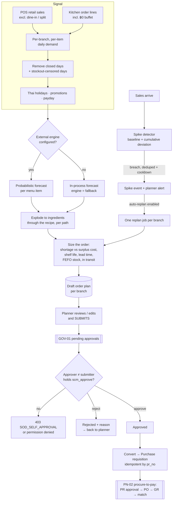

# Supply Chain Planning — Demand Forecasting & Replenishment — Process Narrative

## 1. Document control

| Field | Value |
|---|---|
| Process ID | PN-34-SCM |
| Process owner | `<<Supply-chain planner / Controller>>` |
| Approver | `<<COO / CFO>>` |
| Version | **0.1 DRAFT** |
| Effective date | `<<effective-date>>` |
| Review cadence | Nightly planning run · per demand-spike replan · per order-plan approval · monthly forecast-accuracy review |
| Version note | Rev **0.1** (2026-07-21) — docs/54 Phase 2: per-(branch, item) probabilistic demand planning + perishable-aware order optimization. New controls **SCM-01** (order-plan maker-checker), **SCM-02** (planning-job monitoring & idempotency), **SCM-03** (auditable demand-driven order sizing); migration `0459`; new permissions `scm_plan` / `scm_approve` with SoD rule **R24**. The compute engine is an optional external microservice (`services/forecast-engine`, docs/54 Phase 1); with it disabled the module plans in-process. |
| Related RCM controls | SCM-01, SCM-02, SCM-03, INV-10 (waste), EXP-01/EXP-12 (PR/receiving), GOV-01 (pending approvals), ITGC-OP-04 (job failure alerting) |
| Related policy | `compliance/policies/09-inventory-policy.md` |

## 2. Purpose

Define the controlled process by which the chain decides **how much of each ingredient to buy, for each
branch, each day** — replacing habit and fixed reorder points with a demand forecast that is measured,
explainable and independently approved before it becomes committed spend.

The economic problem is asymmetric and perishable: order too little and the branch stocks out (lost sale plus
goodwill); order too much and the surplus is thrown away at its full cost. The process therefore sizes orders
against an explicit cost trade-off rather than a service-level rule of thumb, and every proposed quantity
carries the rationale that produced it.

## 3. Scope

- **In scope:** extraction of per-(branch, item) demand history from POS and kitchen records; the Thai
  holiday / closure / payday calendar applied to that history; probabilistic demand forecasting; explosion of
  menu demand to ingredient demand through the recipe (BoM); perishable-aware order sizing against shelf life,
  lead-time variability and current FEFO stock; the Draft → approval → purchase-requisition lifecycle;
  demand-spike detection and targeted replanning; and the scenario ("what-if") tool.
- **Out of scope:** purchase-order issue, receiving and three-way match (PN-02, controls EXP-01/EXP-12) — this
  process hands off at the **purchase requisition** and posts no GL entries of its own; inter-branch transfers
  and min/max replenishment (the existing WMS replenishment path); and manufacturing MRP (PN-07).

## 4. References

- `docs/54-dynamic-scm-forecasting-plan.md` — the program plan, the mathematics (§3) and the ADRs.
- `services/forecast-engine/README.md` — the external compute service and its contract.
- `packages/shared/src/scm-engine.ts` — the wire contract (source of truth).
- PN-01 (POS sales), PN-02 (procure-to-pay), PN-17 (master data), PN-16 (projects).

## 5. Definitions

| Term | Meaning |
|---|---|
| **Planning unit** | One branch of one tenant. Sales that carry no branch fall into the untagged (NULL-branch) unit. |
| **Sample path** | One simulated future demand series. The forecaster returns many; ordering decisions are made across all of them rather than on a single average. |
| **Protection period** | Lead time + review period — the window a replenishment decision must cover before the next delivery can arrive. |
| **Order-up-to level (S\*)** | The stock position the plan aims to reach, set at the cost-optimal demand quantile. |
| **Dynamic safety stock** | S\* minus expected protection-period demand. Recomputed every run, so it moves with seasonality and lead-time variability instead of being a fixed number. |
| **Critical ratio** | Cu / (Cu + Co) — the shortage cost as a share of shortage + surplus cost. The quantile the order aims at. |
| **FEFO layer** | A quantity of stock with a known expiry date (first-expiring, first-out). |
| **Channel partition** | The rule that separates retail from dine-in demand so a dish settled through the kitchen is not also counted as a POS line. |

## 6. RACI

| Activity | Responsible | Accountable | Consulted | Informed |
|---|---|---|---|---|
| Maintain planning settings & item policies | Planner (`scm_plan`) | Controller | Head chef | Branch managers |
| Review a Draft plan, adjust quantities, submit | Planner (`scm_plan`) | Controller | Branch manager | — |
| Approve / reject a submitted plan | Approver (`scm_approve`) ≠ the submitter | Controller | Planner | Purchasing |
| Convert an approved plan to a requisition | Planner (`scm_plan`) | Controller | Purchasing | Finance |
| Investigate a demand spike | Planner | Controller | Branch manager | — |
| Monitor job health & forecast accuracy | IT Ops / Planner | Controller | — | Internal audit |

## 7. Process narrative

### 7.1 Extracting the demand signal

A planning run begins by reconstructing, for each planning unit, how much of each menu item was actually sold
per business day (Asia/Bangkok), over a configurable look-back (default 400 days).

Demand is read from **two channels, partitioned so neither dish is counted twice**. This is not a detail: when
a dine-in check is settled, the checkout copies every non-voided order line — **including the ฿0 buffet
lines** — into the POS sale tables. A naive union of the POS and kitchen tables therefore counts every dine-in
dish twice and would systematically over-order. The process instead reads:

- the **retail leg** from POS sales, *excluding* anything settled as a dine-in or split payment; and
- the **restaurant leg** from the kitchen order lines directly, which is also the only place an order that has
  not yet been paid appears.

Only SKUs that carry a recipe count as dish demand, so service charges and synthetic split-bill lines can
never enter the signal. Dine-in orders carry no branch of their own, so they are attributed to the outlet
named in settings (`dine_in_branch_id`); when that is unset the demand pools in the untagged unit, and the
share that did so is reported on every run so the misconfiguration is visible rather than silent.

Two classes of day are then removed from the fitted history: days the branch was **closed** (a configured
weekday or a dated closure), and days flagged as **stocked out**. A stockout is a supply cap, not observed
demand — leaving those zeros in teaches the forecast that demand fell, which suppresses the next order and
prolongs the stockout.

### 7.2 Forecasting demand

Each (branch, menu item) series is forecast over the planning horizon (default 14 days). Series are not all
alike — a daily staple and an occasional special need different treatment — so each is classified by how often
it sells and how variable those sales are, and routed to a model suited to that pattern (seasonal, intermittent
or sparse). The Thai public-holiday calendar, tenant promotions and the local pay cycle are supplied as inputs
so the forecast anticipates them rather than being surprised.

The forecaster returns a **distribution**, not a single number: many simulated future paths, from which any
quantile can be read. This is what makes cost-based ordering possible in §7.4.

Where the external compute engine is disabled or unreachable, the run degrades to an in-process forecast and
says so on the plan (`engine: fallback`). Planning never stops because an optional service is down.

### 7.3 Exploding menu demand to ingredients

Ordering happens at ingredient level, but the signal (seasonality, holidays) lives at menu level. Each menu
item's forecast is therefore exploded through its recipe, allowing for yield and preparation waste, to give
ingredient demand.

The explosion is applied **to each simulated path**, not to summary quantiles. Quantiles are not additive — the
95th percentile of a total is not the sum of the 95th percentiles — and combining them would both misstate the
number and destroy the fact that a busy Songkran evening lifts every dish at once.

### 7.4 Sizing the order

For each ingredient the process computes what to order today against:

- the **cost of being short** (lost margin plus goodwill) versus the **cost of surplus** (purchase cost less
  salvage, plus disposal) — their ratio sets the demand quantile the order aims at;
- **lead time and its variability**, taken from that item's own recent receipt history where enough
  observations exist, otherwise from the supplier or item master;
- **shelf life**, so the plan never buys more than can be sold within the goods' own life;
- **current stock by remaining life** (the FEFO layers) and quantities already **in transit** on open POs; and
- ordering constraints — minimum order quantity, pack size, and any fixed cost per order.

Each proposed line records the reasoning behind it: the model used, expected fill rate, expected waste and
lost sales, the per-day order-up-to and safety-stock levels, and any cap that was applied. A reviewer can
therefore see *why* a number was proposed, which is what makes the quantity reviewable at all.

Quantities returned by the external engine are validated and **clamped** before they are stored, so a faulty
or compromised compute service cannot place an absurd quantity in front of a hurried approver.

### 7.5 Approval and hand-off to purchasing — control SCM-01

A run never produces an order. It produces a **Draft** plan per branch.

1. The planner reviews the Draft, adjusts any line quantity, and **submits** it. The plan moves to
   *PendingApproval* and appears in the GOV-01 pending-approvals centre with its value and age.
2. An **approver** acts on it. Approval requires the `scm_approve` duty, which is a single-purpose permission
   no broad module grant confers, and the approver **must be a different person from the submitter** —
   self-approval is refused (`SOD_SELF_APPROVAL`). Because nightly plans are created by the scheduler rather
   than a person, the "maker" for this test is the human who *submitted*, never the system that created it.
3. Rejection requires a reason and returns the plan to the planner, who can adjust and resubmit.
4. Only an **approved** plan may be **converted**, which raises a **purchase requisition** through the normal
   purchasing process — this module never writes a purchase order directly. The requisition number is stamped
   on the plan, so converting twice cannot raise two requisitions.

From that point the requisition follows the existing procure-to-pay controls (PN-02): approval thresholds,
purchase order, receiving and three-way match. **This process posts no journal entries.**

### 7.6 Demand spikes and replanning — control SCM-02

Demand does not only change overnight. Each (branch, item) series carries a running baseline of its normal
level and variability, plus a cumulative-deviation detector that catches a slow drift as well as a sudden
jump. An observation is judged **against the baseline as it stood before that day** — scoring it after folding
it in would let a large spike inflate its own reference and hide itself.

When a series breaches its threshold (subject to a minimum-volume floor, so small-number noise is ignored) an
event is recorded, the planner is notified, and — if the tenant has enabled automatic replanning — **one**
replan job is queued for that branch covering all of its spiking items. A replan is an ordinary, narrower
planning run: it produces a Draft plan that still requires the same independent approval.

Two dedupe mechanisms keep this proportionate: an event is unique per (branch, item, business day), and a
cooldown suppresses repeat firing. One viral evening therefore produces one event and one replan job, not
forty.

### 7.7 Scheduling, idempotency and failure handling — control SCM-02

The nightly plan and the spike scan are scheduled like any other recurring job. Both are **idempotent by
construction**: at most one non-failed nightly run can exist per tenant per business day (enforced by the
database, not by convention), and the spike scan advances a per-series watermark so it only ever folds in
business days it has not already processed — running it hourly and running it daily give the same result.

Job failures are handled by the shared queue: retry with backoff, then dead-letter with an operations alert
and an administrator notification. A failed run records the full underlying error so the cause is diagnosable
afterwards rather than appearing as an unexplained absence of a plan.

### 7.8 Scenario planning

Planners can ask "what if?" — a bounded, synchronous evaluation over a handful of items with an adjusted
demand multiplier, service level or horizon (for example, doubling demand for a festival). Scenarios are
advisory: they compute and return, and **write nothing**.

## 8. Process flow

## 9. Control matrix

| Control | Type | Frequency | Description | Evidence |
|---|---|---|---|---|
| **SCM-01** | Preventive · Automated | Per plan | An order plan is built and submitted by a planner but can only be approved by a different user holding `scm_approve`; self-approval is refused. Only an approved plan converts, and conversion raises a purchase requisition through the purchasing API, idempotently. Engine quantities are clamped before storage. | Order plans with maker/checker identities, the GOV-01 queue entry, the linked requisition number |
| **SCM-02** | Detective/Preventive · Automated | Per scheduled run | Planning jobs ride the shared queue (retry → dead-letter → ops alert). A duplicate nightly enqueue plans exactly once (database-enforced); the spike scan is watermarked so any cadence is idempotent; spike events are deduped per day with a cooldown. | Plan-run register (status, engine, error), spike-event register, background-job rows |
| **SCM-03** | Preventive/Detective · Automated | Per planning run | Demand is extracted by channel partition so a dine-in dish is counted once; closed and stockout days are excluded; menu demand is exploded per scenario; order size respects shelf life, lead-time variability and FEFO stock; every line records its rationale. The shelf-life cap holds even when the external engine is unavailable. | Demand forecasts per run with accuracy, order-plan lines with full rationale |
| INV-10 | — | Per waste event | Waste/spoilage capture feeds the observed spoilage rate used to calibrate planning. | Waste log by reason |
| GOV-01 | Detective | Continuous | Submitted plans appear in the unified pending-approvals monitor with their age. | Pending-approvals worklist |

**Segregation of duties.** Rule **R24** flags any user holding both `scm_plan` (build/edit plans) and
`scm_approve` (approve them). The `Planner` role is seeded with `scm_plan` only. The in-application
maker ≠ checker test is the operative control regardless of the permissions held.

## 10. Inputs & outputs

| Inputs | Outputs |
|---|---|
| POS sales + kitchen order lines (demand) | Per-(branch, item) demand forecasts with accuracy |
| Recipes / BoM (menu → ingredient) | Draft order plans with per-line rationale |
| FEFO stock layers, branch stock, open purchase orders | Approved plans → purchase requisitions |
| Item master + per-(branch, item) policies (shelf life, service level, costs) | Demand-spike events + replan runs |
| Thai holiday calendar, branch closures, pay cycle | Planning-run register (status, engine, errors, metrics) |
| Waste log (observed spoilage) | Scenario results (advisory, not persisted) |

## 11. Records & retention

| Record | Retention |
|---|---|
| Planning runs + demand forecasts | 90 days by default (configurable); pruned by the nightly job |
| Order plans + lines (approved / converted) | Retained with the purchasing record — the audit trail for committed spend |
| Draft plans never submitted | Pruned with their run |
| Demand baselines + spike events | Retained (baselines are running state; events are the replan audit trail) |
| Status-log entries for each plan transition | Per the standard document audit-trail retention |

## 12. KPIs

| KPI | Purpose |
|---|---|
| Forecast accuracy (WAPE) per branch/item | Is the forecast good enough to act on? Trend it monthly. |
| Waste cost from expiry/spoilage vs plan expectation | Did the plan's expected waste materialise? A persistent gap means the cost inputs are wrong. |
| Stockout / fill rate | The other half of the trade-off — a low waste figure bought with lost sales is not a win. |
| Plan approval lead time (submit → approve) | A stale queue is a control breakdown and a stockout risk. |
| Share of demand in the untagged branch unit | Should be ~0 once dine-in attribution is configured. |
| Spike events per week, and how many led to a replan | Detector tuning: too many is noise, zero is a threshold set too high. |

## 13. Exception handling

| Exception | Handling |
|---|---|
| External engine unavailable / not configured | Run continues in-process (`engine: fallback`); the shelf-life cap still applies. Only one of the two engine settings present raises a one-time misconfiguration alert. |
| Engine returns an unexpected response | The response is rejected, the run fails with the reason recorded, and the queue retries then dead-letters with an ops alert. |
| Engine returns an implausible quantity | Clamped before storage and flagged on the line. |
| Item has no recipe / no shelf life recorded | The item is excluded from ingredient planning; shelf life can be suggested from receipt history and applied deliberately. |
| Dine-in branch attribution unset | Demand pools in the untagged unit; the share is reported on every run so it is visible. |
| Plan submitted with no positive quantity | Rejected (`PLAN_EMPTY`). |
| Approver is the submitter | Refused (`SOD_SELF_APPROVAL`); under the SME control profile, permitted only with a recorded justification. |
| Plan already converted | Re-conversion returns the original requisition number; no second requisition is raised. |

## 14. Revision history

| Version | Date | Author | Change |
|---|---|---|---|
| 0.1 | 2026-07-21 | Supply-chain / Planning | Initial narrative — docs/54 Phase 2: per-(branch, item) probabilistic demand planning and perishable-aware order optimization. New controls SCM-01/02/03, migration `0459`, permissions `scm_plan`/`scm_approve`, SoD rule R24, harness `cutover/scm.ts` (20 checks). |
