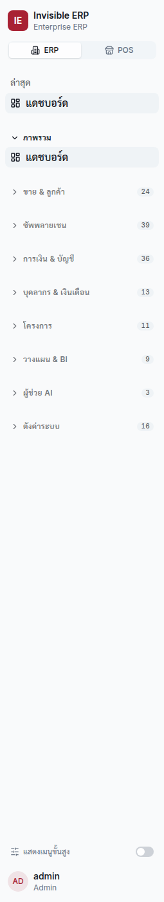
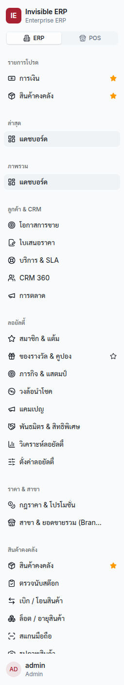
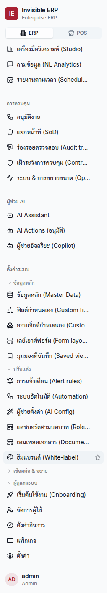
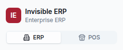

# 00 · Getting Started

**Status: DRAFT v0.2 · 2026-07-16** · *v0.2: SME industry menu — documented the industry-trimmed sidebar a new SME company starts with (docs/50 B1) and the "แสดงเมนูที่ซ่อนไว้" self-service reveal toggle (docs/50 B2).*

This chapter covers everything you need for your very first login: signing in,
changing your starter password, setting up two-factor authentication (MFA),
finding your way around, and logging out.

---

## 1. Signing in for the first time

**Screen:** `/login` · **Required role:** none (everyone)

1. Open your web browser and go to your organisation's Invisible ERP address.
   You will land on the **Sign in** (**เข้าสู่ระบบ**) page.
2. In **Username** (**ชื่อผู้ใช้**), type the username your administrator gave you.
3. In **Password** (**รหัสผ่าน**), type your password. To check what you typed, click
   the **eye icon** (👁) at the right of the field to reveal it (**แสดงรหัสผ่าน**); click
   again to hide it. The same show/hide toggle appears on every password field (sign-up,
   change-password, and when an administrator sets a user's password).
4. Click **Sign in** (**เข้าสู่ระบบ**).

**Expected result:** You are taken to your home dashboard. Staff go to
`/dashboard`; customer-portal users go to `/portal/dashboard`.

> **Note — wrong details:** If the username or password is incorrect you will
> see *Invalid username or password* (**Username หรือ Password ไม่ถูกต้อง**).
> Check Caps Lock and try again, or ask your administrator to reset your password.

[screenshot: login page with username and password fields]

> **Creating a brand-new company?** On the self-serve **Sign up** page you choose your
> **business type** (restaurant, retail, distribution, services, or general). Your
> company starts with a **chart of accounts tailored to that industry** — the right
> accounts switched on and named in your industry's language — so your books are
> meaningful from day one. You can change or extend it later under **Onboarding →
> Industry packs**. See *General Ledger → Your industry chart* for details.
>
> **Getting your data in — the quick path.** After signing up (and completing the
> **Onboarding** checklist at `/onboarding`), you don't have to key everything by hand:
> - **Fill in your company profile** (legal name, tax ID, address, VAT) so it prints on
>   receipts and tax documents — see [Administration](./11-administration.md).
> - **Bulk-load your master data** from a spreadsheet at `/master-data` — your **menu
>   (POS)**, inventory items, vendors, customers and price lists. Download the template,
>   fill in the required columns, and import (see *Administration → Bulk import*). For a
>   restaurant, importing the **เมนูอาหาร (Menu Items)** sheet is the fastest way to load
>   your whole menu at once.
> - **Enter your opening balances** (if you're moving from another system) at
>   `/accounting → ยอดยกมา` — you can paste your prior trial balance straight from Excel
>   (see [General Ledger → Opening balances](./06-general-ledger.md)).

---

## 2. Forced password change (first login)

The first time you sign in — or whenever an administrator resets your password —
the system will **require you to choose a new password** before you can do
anything else.

**Screen:** `/change-password` · **Required role:** any signed-in user

1. After signing in, you are sent automatically to **Set New Password**
   (**ตั้งรหัสผ่านใหม่**).
2. In **Current Password** (**รหัสผ่านปัจจุบัน**), type the password you just
   used to sign in.
3. In **New Password** (**รหัสผ่านใหม่**), type a new password. It must be at
   least **8 characters** and must be **different** from your current one.
4. In **Confirm New Password** (**ยืนยันรหัสผ่านใหม่**), type the new password
   again.
5. Click **Save New Password** (**บันทึกรหัสผ่านใหม่**).

**Expected result:** Your password is updated and you are taken to `/dashboard`.

> **Note — common errors:**
> - *New password must be at least 8 characters* (`WEAK_PASSWORD`).
> - *Current password is incorrect* (`BAD_CURRENT_PASSWORD`).
> - *New password must differ from current* (`SAME_PASSWORD`).

[screenshot: change-password form]

---

## 3. Setting up two-factor authentication (MFA)

Staff with **sensitive duties** must protect their account with a second factor:
a **6-digit code** that changes every 30 seconds, generated by an authenticator
app on your phone (Google Authenticator, Microsoft Authenticator or Authy).

**Who must do this:** Admins, and anyone with finance, approvals, user-admin or
sensitive master-data duties (e.g. *FinancialController*, *GlAccountant*,
*ApClerk*, *ArClerk*, *AccessAdmin*). Cashiers, customers and view-only users are
exempt.

If MFA is required for your account, you will be prompted to enrol after login
(you may also reach it from **Settings**, `/settings` → **MFA Policy** tab).

### To enrol in MFA

1. Install an authenticator app on your phone if you don't have one.
2. Open the MFA setup screen. The system shows a **QR code** (and a text
   **secret** as a backup).
3. In your authenticator app, choose *Add account → Scan QR code* and scan the
   code on screen. (If you can't scan, type the secret manually.)
4. Your app now shows a **6-digit code** that refreshes every 30 seconds.
5. Type the current 6-digit code into the **Verification code** box on screen and
   click **Enable / Verify**.

**Expected result:** MFA is enabled. From now on, each login asks for a code.

> **Note:** If the code is rejected (*Invalid TOTP code* / **รหัส OTP ไม่ถูกต้อง**,
> code `MFA_INVALID`), wait for the next code (your phone clock may be a few
> seconds off) and try again.

### Logging in once MFA is on

1. Enter username and password as usual and click **Sign in**.
2. When asked, open your authenticator app and type the current **6-digit code**.
3. Click **Sign in** again.

> **Note:** If you submit without a code you will see *TOTP code required*
> (**ต้องใส่รหัสยืนยันสองชั้น (OTP)**, code `MFA_REQUIRED`). Lost your phone?
> Contact your administrator to reset MFA on your account.

[screenshot: MFA QR code and 6-digit verification field]

---

## 4. Finding your way around (navigation)

After login you see the **app shell**: a side navigation menu, a top bar, and the
main content area.

- The **side menu** lists only the modules **you have permission for**. If you
  cannot see a menu item, you do not have access to it — this is normal.
- The **command palette** (press the search/keyboard shortcut, or click the
  search box) lets you jump straight to any screen by name — and now also **finds
  records**: type a customer, vendor or product name/code and pick the matching
  **ข้อมูล (Records)** result to open it directly. You only ever see record types
  you already have permission for.
- Each screen address in this manual (e.g. `/orders`) is what appears at the end
  of your browser address bar.
- A **floating AI helper** (the round **🤖 button** in the bottom-right corner)
  is available on every screen: click it to ask about sales, stock, finance or
  purchasing and get answers from live data, without leaving the page. Use the
  **⤢ expand** icon to open the full assistant at `/assistant`. The button only
  appears if your account may use the assistant.

Common starting points by role:

| Your role | You'll mostly use |
|-----------|-------------------|
| Cashier / Sales | `/pos`, `/orders` |
| Customer (portal) | `/portal/pos`, `/portal/dashboard` |
| Warehouse | `/inventory`, `/lots`, `/mobile-scan` |
| Procurement / Buyer | `/procurement` |
| Accountant | `/accounting`, `/finance`, `/ar`, `/creditors` |
| Manager / Executive | `/dashboard`, `/executive`, `/planner` |
| Admin | `/admin/users`, `/settings`, `/sod` |

### Workspaces — ERP and POS

The back office is split into two **workspaces**, chosen with the **ERP | POS toggle** at the top of the
side menu:

- **POS** — front-of-house / store operations: the POS till, tables, kitchen display (KDS), menu, POS
  control (park/approve), card terminals & shift totals, delivery channels, loyalty, branches.
- **ERP** — back office: procurement, inventory & warehouse, finance & general ledger, payroll, tax,
  manufacturing, planning, CRM, and administration.

Switching workspace only changes which menu groups are shown — it does **not** change your permissions.
A few items used by both (price & promotions, loyalty, branches, e-Tax/fiscal, approvals, AI, settings)
appear in **both** workspaces.

- **Where you land:** you start in the workspace that matches your role — front-line POS staff (e.g.
  Cashier, POS Supervisor) land in **POS**; back-office and dual-role users (and Admin) land in **ERP**.
  Your last choice is remembered.
- **Each workspace has its own home dashboard:** **ERP → `/dashboard`** (business/finance overview) and
  **POS → `/pos-home`** (store overview — today's sales, bill count, average ticket, top items, sales by
  payment method, open tills, and recent bills). Switching workspace takes you to its home.
- **Search is global:** the command palette searches every screen you can access (regardless of the
  active workspace) **and** your customer/vendor/product records — type a name or code and open the match.
- **Menus are grouped into foldable domains:** within each workspace the side menu is organised into a small
  set of top-level **domains**. In ERP these are *ภาพรวม*, *ขาย & ลูกค้า*, *ซัพพลายเชน*, *การเงิน & บัญชี*,
  *บุคลากร & เงินเดือน*, *โครงการ*, *วางแผน & วิเคราะห์*, plus the shared *ผู้ช่วย AI* and *ตั้งค่าระบบ*; POS shows
  *ขายหน้าร้าน* (with *ขาย & ออเดอร์ · โต๊ะ & ครัว · กะ & ควบคุม* sub-sections) and *ร้าน & อุปกรณ์*
  (*ร้าน & การจัดส่ง · อุปกรณ์ & การชำระเงิน · วิเคราะห์ร้านอาหาร*).
- **Click a domain heading to fold/unfold it.** Each domain collapses, and **only the domain you're currently
  in opens automatically** when you load the app — the rest start collapsed (a small number badge shows how
  many items are inside), so the menu stays short and scannable. Your open/closed choices are remembered and
  **follow you across devices**. Big domains are further split into **sub-sections**: e.g. *ขาย & ลูกค้า* holds
  *ลูกค้า & CRM · ลอยัลตี้ · ราคา & สาขา*; *ซัพพลายเชน* holds *สินค้าคงคลัง · จัดซื้อ · การผลิต*; and **การเงิน & บัญชี**
  keeps the PEAK-style **cycle** sub-sections — *รายรับ–รายจ่าย · สมุดบัญชี & แยกประเภท · ธนาคาร & กระทบยอด ·
  งบ & วิเคราะห์การเงิน · ระหว่างบริษัท & สกุลเงิน · ภาษี* (advanced/infrequent ones start collapsed).
- **"แสดงเมนูขั้นสูง" (Show advanced):** a toggle at the bottom of the side menu hides expert/infrequent areas
  by default — the **การควบคุม & ตรวจสอบ** (Controls) domain and the *ปรับแต่ง*, *เชื่อมต่อ & ขยาย* and
  *ระหว่างบริษัท & สกุลเงิน* sub-sections. Turn it on to reveal them. (Anything you've pinned to Favourites or
  can find via search stays reachable regardless of this toggle.)
- **"แสดงเมนูที่ซ่อนไว้" (Show hidden menus — SME companies only):** an SME company's menu is trimmed to its
  **business type** at creation (e.g. a restaurant doesn't see โครงการ; a wholesaler doesn't see the POS
  domains) and only its daily-work groups start open — so your first login shows the ~15 items you actually
  use. If your business grows into a hidden area, flip this toggle (bottom of the side menu, next to
  แสดงเมนูขั้นสูง) to reveal every hidden domain yourself — no administrator needed. Search (⌘K) and
  Favourites always reach hidden items, and any group you open/close yourself stays the way you left it,
  synced across your devices.
- **"เริ่มต้นใช้งาน" (Getting started) on the dashboard:** while your company is still being set up, the ERP
  home (*แดชบอร์ด*) shows a **first-run panel** at the top with your onboarding checklist and a completion
  bar. Each unfinished step (*set up branding*, *pick a theme*, *choose your language*, *add your first
  product*, *record your first sale*, *invite a teammate*) **deep-links to the screen where it gets done**,
  and you can tick it off in place. The panel **disappears automatically** once every step is complete (or
  for users without onboarding access) — the full checklist and industry packs stay at `/onboarding`.
- **"สิ่งที่ต้องทำวันนี้" on the dashboard:** the ERP home (*แดชบอร์ด*) leads with an **action launcher** — live,
  clickable cards for *pending approvals*, *AP payment requests awaiting approval*, *overdue receivables*,
  and *low stock* — each opening the exact screen (and finance tab) where the work is done. Cards you have
  no permission for simply don't appear.
- **Favourites & recent:** hover any menu item and click the **★ star** to pin it to a **รายการโปรด**
  (Favourites) group at the top of the side menu; click the star again to unpin. A **ล่าสุด** (Recent)
  group automatically lists the last few screens you opened. Both only show items you can access in the
  current workspace. Your **favourites, the fold-state of every domain/sub-section, and the "show advanced"
  toggle follow you across devices** (saved to your account); the **Recent** list is per-device.

| Favourites & Recent | Foldable Settings |
|---|---|
|  |  |

> **Note:** The **Customer Portal** (`/portal/...`) is a separate experience for customer/shop users and
> is not part of the ERP/POS toggle.

---

## 5. Switching language

The interface defaults to **Thai**. English text exists for most labels. Use the
language switcher in the top bar / settings to change the display language. Page
addresses and the steps in this manual stay the same in either language.

> **Note:** This manual shows English wording first with the Thai label in
> brackets so you can match it on screen regardless of the current language.

---

## 6. Understanding roles & permissions

Your **role** determines your default set of **permissions**. An administrator
can also fine-tune your permissions individually.

- **Broad roles:** *Admin* (everything), *Sales*, *Customer*, *Warehouse*,
  *Procurement*, *Planner*.
- **Single-duty roles** (one job each, designed to avoid conflicts of interest):
  *Cashier*, *PosSupervisor*, *ArClerk*, *ApClerk*, *Buyer*,
  *WarehouseOperator*, *InventoryController*, *StockCounter*, *GlAccountant*,
  *FinancialController*, *MasterDataAdmin*, *PricingManager*, *CreditManager*,
  *ReturnsClerk*, *AccessAdmin*, *ExecutiveViewer*.

> **Note — conflicting duties are blocked.** The system enforces *segregation of
> duties*. For example, the person who **creates** a journal entry cannot also
> **approve** it, and a buyer who raises a purchase order cannot also pay the
> supplier. See [Administration](./11-administration.md) and
> [Approvals](./10-approvals.md).

---

## 7. Logging out

1. Open the user menu in the top bar (or the **Sign Out** / **ออกจากระบบ** link).
2. Click **Sign Out** (**ออกจากระบบ**).

**Expected result:** Your session ends and you return to the `/login` page.

> **Note:** For security, sessions also expire automatically after a period of
> inactivity. If you are unexpectedly returned to the login page, simply sign in
> again.

---

**Next:** Go to the chapter for your role — for example
[Sales & POS](./01-sales-and-pos.md) or [Customer Portal](./02-customer-portal.md).
